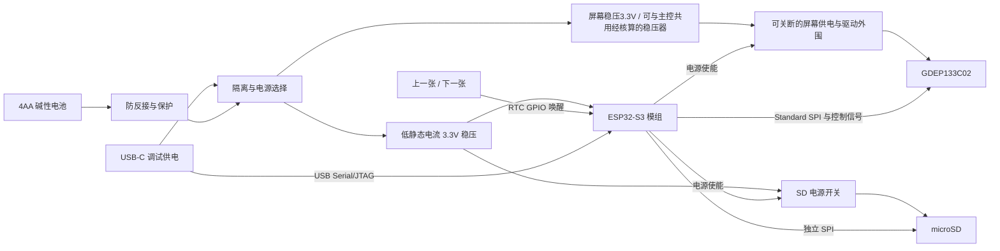

# GDEP133C02 彩色电子纸相框设计方案

设计日期：2026-09-30。更新日期：2026-10-01。状态：屏幕资料与设计决策已闭环，可进入最小驱动原型；最小驱动板KiCad工程已修复，ERC/DRC零违规并完成实际打开验证，制造文件为审阅包；功率参数及硬件实测未验收。

## 1. 需求基线与结论

本方案对应 [原始任务](../task/09-30-01.md)，并以讨论中确认的更正为准：屏幕改为 **13.3 寸 GDEP133C02**，不再使用原任务中的 GDEP100E01、10 寸尺寸及淘宝商品作为选型依据。

建议采用 **ESP32-S3 模组 + 自制 Standard SPI 电子纸驱动电路（首版） + microSD + 两个换图按键 + 4AA 一次性电池**。平时保持画面、主控深睡，按键唤醒后完成一次换图再休眠。电脑负责照片预处理，首版设备离线运行。

已取得屏幕外围原理图、该型号源码及关键器件参考值。自制PCB的成本与可行性仍取决于适用版本、模式绑带及安全上下电的核实。不能把“QSPI 接口”理解为 ESP32-S3 几根线直接接裸屏，也不沿用此前 GDEP100E01 的 T2001 驱动结论。

| 项目 | 方案 | 状态 |
| --- | --- | --- |
| 屏幕 | GDEP133C02，13.3 寸 | 已购买尚未到货；标签/FPC及版本待核对 |
| 屏幕通信 | 首版单线 Standard 4-wire SPI；Quad 后续可选 | 用户已接受BS0/BS1=H/H、D/C接地；原图冲突保留记录 |
| 刷新行为 | 纯手动；不自动24h刷新、不强制180s间隔 | 用户已确认；与厂家建议的适用边界待确认 |
| 主控 | ESP32-S3；首选 ESP32-S3-WROOM-1-N16R8 模组 | 芯片已确认；模组选型为设计默认 |
| 照片导入 | 电脑预处理，拷入 SD 卡 | 用户已确认 |
| 切换 | 上一张、下一张，按键唤醒 | 用户已确认按键；两个按键为设计默认 |
| 使用频率 | 按每天 2 次完整换图预算 | 用户确认每天 1–2 次 |
| 电池 | 一次性电池；首版 4AA 碱性串联 | 形式已确认；规格为待验证默认 |
| 续航 | 180 天免换电池，预留容量余量 | 用户目标，未验证 |
| PCB / 软件 | KiCad 设计、嘉立创生产；原生 ESP-IDF | 用户已确认 |
| 结构 | PETG 分件打印，适配 220×220 mm 平台 | 分件已确认；材料和布局为设计默认 |
| 工程位置 / 版本管理 | PCB、结构及其他项目工程均位于当前项目目录下，统一使用 Git 管理 | 用户已确认 |
| 使用环境 | 室内、默认横向桌面摆放 | 设计默认 |

总体方案由设计文档定义。2026-10-01开始实施最小驱动板KiCad硬件，当前CAD连接/规则检查和实际打开验证已通过，生产放行及实物验收待完成，见[工程记录](../../hardware/pcb/gdep133c02-driver/README.md)；整机PCB、固件、照片转换工具和结构CAD仍为后续交付物。首版不加入无线传图、自动轮播、前光或机内充电。

## 2. 屏幕资料与驱动可行性

### 2.1 已核查的公开参数

| 参数 | 厂家页面标注 | 使用方式 |
| --- | --- | --- |
| 尺寸 / 分辨率 | 13.3 寸 / 1600×1200 | 应用逻辑画布默认横向 1600×1200 |
| 颜色 | 黑、白、红、黄、蓝、绿 | 应用索引0–5须映射原生半字节0、1、3、2、5、6（黑白红黄蓝绿） |
| 接口 / 连接器 | QSPI / 60Pin | 产品有Quad能力标注，首版采用已审阅源码的Standard SPI；60Pin仍需完整电源外围 |
| 外形 | 208.8×284.7×0.85 mm | 页面数值，横向包络暂按 284.7×208.8 mm 预留 |
| 有效区 | 202.8×270.4 mm | 横向有效区暂按 270.4×202.8 mm 理解 |
| 工作温度 | 0–50℃ | 最小驱动验证先在室温进行 |

来源：[GDEP133C02 官方产品页](https://www.good-display.com/blank7.html?productId=559)。上述为页面核查结果，未代替完整规格书和实物测量。外形坐标、有效区偏移、FPC 位置及弯折空间必须按机械图确认，不能根据两个矩形的差值假设边缘对称。

### 2.2 自制驱动路线

厂家有 [规格书入口](https://www.good-display.com/companyfile/1533.html)、[ESP32-133C02 参考原理图入口](https://www.good-display.com/companyfile/2036.html)，以及屏幕产品页中的 ESP32 示例入口。配套板公开说明支持 ESP-IDF / Arduino、QSPI 和 SD 卡：[参考板资料](https://www.good-display.com/product/1223.html)。旧参考板页面已标注 EOL 并推荐后继型号；本项目只将资料作为参考，不采购该成品板，也不混用不同屏幕版本的文件。

**当前资料审阅边界（2026-10-01）：**已审阅用户的29页规格书与原生ESP-IDF示例，并取得1页屏幕外围电路、Rev2.0开发板手册、TPS22913与TCN75A数据手册。资料、哈希、60Pin核对表和参考器件表见[归档说明](../../hardware/reference/gdep133c02/README.md)，详细审阅及闭环矩阵见[PCB方案2.4](pcb.md#24-用户提供资料的审阅结果与闭环判定)。没有编译/烧录或硬件实测，不用包内旧build证明可复现。

主要外围电路缺失已消除。图中使用面板控制脚驱动分立正负压/电荷泵/TFT_VCOM电路，无额外独立专用升压控制IC；不沿用其他屏幕T2001方案。参考输入经开关后分配VDD/VDDIO/AVDD，前级选择稳压3.3V，绝不直连4AA原电池或USB5V。关键被动器件采购参数和全轨安全放电仍需补齐。

**阶段A资料与设计决策已闭环（用户接受，2026-10-01）。** 首版Standard SPI固定BS0/BS1接受控VDD、D/C#接GND；DRVN2不接外部支路，VNCP_3P5V经0Ω接VBB_3P5V。以现有规格书及原生示例初始化为基线，使用面板内置VCOM。参考图绑带冲突保留为历史差异，不再等待厂家解释后才能推进原型。依据、关机流程及各项状态见[PCB方案2.4.5](pcb.md#245-用户接受的设计基线与闭环判定)。

正常关机采用刷新完成 → POF并正确等待BUSY → 深睡 → 接口断电安全处理 → 关闭输入。资料p22的串口停止到输入掉电间隔大于10µs，原型起点设1ms；不把该间隔当全部高压放电时间。异常掉电没有厂家安全保证，仍须在原型阶段验证。

下一步进入自制最小驱动原型与原生IDF验证。到货标签/FPC与连接器匹配、关键器件采购参数、六色/角标/照片、温度初始化、全轨关断及异常恢复作为实施验收项，不标为已完成。取得显示及峰值/能量记录后集成整机KiCad PCB；本次方案闭环不代表生产放行。

用户已确定纯手动刷新；手册p23建议间隔至少180s、每24h至少刷新一次。保留手动行为，不加入自动刷新或强制节流；这仍是长期静态显示/快速手动切图的厂家适用说明与残影/寿命验证项。给厂家的具体问题已列入归档说明，未发送消息。

## 3. 整机硬件架构



屏幕外围输入选择稳压3.3V；内部正负高压仍由驱动外围生成。共用还是独立3.3V稳压器须核算并发峰值、干扰、漏电和压降后冻结。

### 3.1 主控、存储与接口

- 首选 ESP32-S3-WROOM-1-N16R8：16 MB Flash、8 MB PSRAM。模组便于首版布板和调试；最终以完整型号核对封装与引脚。[乐鑫模组规格书](https://www.espressif.com/sites/default/files/documentation/esp32-s3-wroom-1_wroom-1u_datasheet_en.pdf)
- Standard SPI 屏幕和 SPI SD 分别使用两个通用 SPI 控制器，减少片选、总线模式及供电状态之间的耦合；不占用模组的 Flash / PSRAM 总线。
- 卡槽采用 microSD，首版支持 FAT32，优先验证 8–32 GB 卡。不默认支持 exFAT 或带电插拔，用户在设备休眠时更换卡。
- PSRAM 存放应用帧数据；DMA 传输使用经过 ESP-IDF 能力检查的缓冲区。不能假设任意 PSRAM 地址都能直接作为 DMA 缓冲，优先以内部 SRAM 小块缓冲分段发送。
- 预留 USB-C、BOOT、RESET、UART 调试焊盘和电流测量断点。LED 只短时亮灯，不设置常亮电源灯。

GPIO 在原理图阶段分配，约束先固定：保留 USB D-/D+、避免启动绑带冲突、避免模组存储占用脚、两个换图按键使用可深睡唤醒的 RTC GPIO。首版屏幕采用MOSI/MISO/SCLK、两个独立片选及共用RESET/BUSY；模式绑带/D/C按PCB方案固定，厂家GPIO示例不直接等于最终模组映射。

### 3.2 电池与稳压

首版选用四节同品牌、同批次、同状态 AA 碱性电池串联，安装在带盖可更换电池仓。串联提高电压，容量 Ah 不乘四；可用能量需要积分测量。

主控 3.3V 电源优先选择低静态电流同步降压器：输入工作与耐压覆盖四节新电池最高电压及 USB 5V，初选至少 8V 输入等级；主控支路3.3V输出按不低于500mA峰值能力筛选；屏幕规格书峰值最大987.4mA，不能用500mA定型整机共用稳压器，必须覆盖屏幕、MCU及SD并发与余量，并确认电流测量边界。电池截止点必须高于降压器失去稳压和屏幕供电无法完成刷新的条件。若实测显示所需截止点使容量损失过大，再评估升降压方案，不强行耗尽电池。

屏幕支路从稳压3.3V经受控开关进入参考外围，生成所需电源，设置硬件使能默认关闭、必要的放电路径和去耦。负载开关、电源 IC 及保护器件均核查关断漏电。USB 调试时通过电源选择/隔离电路供电，不能直接并联 USB 与电池；尤其要保证任何插拔顺序下都不向一次性电池充电。USB-C 两个 CC 引脚按受电端要求设置，采用标准 5V，不要求 PD。

电池 ADC 分压采用可控开关，避免长期分压漏电。启动时读取电压，具备硬件原型后用等效负载测压降；刷新启动阈值由电池内阻、最低温度、屏幕峰值负载和稳压器要求联合确定，并设置恢复迟滞。阈值不足时保留已有画面、短时提示低电量，不启动新刷新。意外断电无法保证画面完整，固件不能承诺掉电时完成高压放电；硬件关断行为也必须验证。

### 3.3 待机电流预算

以下为整机电池端 ≤30 μA 的设计预算，不是器件实测结果；各支路需折算到电池端。

| 项目 | 电池端预算 |
| --- | ---: |
| 主控深睡及其稳压转换 | 15 μA |
| 稳压器静态电流、电源选择和保护 | 8 μA |
| 屏幕、SD 关断漏电及其他漏电 | 7 μA |
| 合计 | 30 μA |

待机前停止并卸载 SD、执行屏幕规定的休眠/关断/放电过程，将跨断电域信号设置为厂家允许的安全状态，再断外设电源。SD 上拉电阻随 SD 电源域供电，检查 MCU 信号、调试接口及 ESD 器件是否反向供电。电源使能默认状态由电阻保证，不能只依赖软件初始化。

## 4. 半年续航计算与判定

### 4.1 计算边界

统一在**电池端**测量：刷新能量包含主控启动、读卡、转换/打包、屏幕初始化、传输、完整刷新、状态保存及最终关断，已经包含转换损耗。不再额外重复除以电源效率。

设 `E_refresh` 为一次完整换图的电池端能量（J），`P_sleep` 为待机平均功率（W），`E_available` 为指定电池、温度及截止条件下可用能量（Wh）：

```text
N = 180 × 2 = 360 次
T = 180 × 24 = 4320 小时
E_load = N × E_refresh / 3600 + T × P_sleep
验收条件：E_load ≤ 0.70 × E_available
```

按整段 4320 小时计待机稍偏保守；精确模型可扣除换图时间。30% 容量留作老化、温度、个体差异和偶尔多次切换余量，不能把同一项降额重复计算。

### 4.2 仅用于设计的算例

假设平均电池电压 5V、待机 30 μA，则半年待机耗能为 `5 × 30e-6 × 4320 = 0.648 Wh`。

| 假设单次换图能量 | 360 次换图耗能 | 加待机总能量 | 预留 30% 后所需电池可用能量 |
| --- | ---: | ---: | ---: |
| 10 J | 1.000 Wh | 1.648 Wh | ≥2.354 Wh |
| 30 J | 3.000 Wh | 3.648 Wh | ≥5.211 Wh |
| 60 J | 6.000 Wh | 6.648 Wh | ≥9.497 Wh |

例如，**假设**一组电池在实际负载与截止条件下有 8 Wh 可用能量，留出 30% 后可支出 5.6 Wh，则单次换图应不超过 `(5.6−0.648)×3600/360 ≈ 49.5 J`。8 Wh 不是本项目的测量结果或电池厂商保证值，刷新时间和实际功耗也尚未知。

AA 碱性电池容量随负载和截止电压变化，不能用包装上的 mAh 直接保证续航。[Energizer AA 放电资料](https://data.energizer.com/pdfs/E91_Max_NA.pdf)

### 4.3 实测方法

在电池输入处用电流分析仪或分流电阻加示波器采样，积分 `V(t)×I(t)`；测量至少 10 次不同照片的完整换图，记录均值、最大值及刷新时间。峰值测试须涵盖 SD 初始化、主控启动和屏幕刷新，避免只使用万用表平均读数。

分别测量外设关闭的待机电流、USB 拔除后漏电、新电池和接近截止电池的电压跌落。可编程电源模拟电压及串联内阻用于筛查，但不能替代实际电池放电。用实际电池、接近使用场景的间歇负载测定可用能量；加速测试须记录恢复效应和温度带来的误差。

若 4AA 不满足预算，先排查漏电、优化启动和传输，再提出更大的一次性电池组供用户选择；不私自降低每天换图次数或把半年目标写为达成。半年验证可先用能量预算判定，再做长期运行复核。

## 5. ESP-IDF 软件设计

### 5.1 工程与模块

使用原生 ESP-IDF、CMake 和 `idf.py`，目标为 `esp32s3`。驱动验证阶段选择能支持首版Standard SPI和所需休眠API 的具体 ESP-IDF 正式版本，固定版本/提交、依赖与 `sdkconfig.defaults`；网页的 `stable` 地址用于查阅，不作为可复现版本号。用户提供的厂家示例为原生ESP-IDF 4.4.4；先在干净环境验证该基线，升级正式版本时记录驱动/API改动，不直接沿用旧构建产物。

| 模块 | 职责 / 接口边界 |
| --- | --- |
| `board` | GPIO、电源使能、硬件版本、USB 调试配置 |
| `epd` | 初始化、提交帧、等待刷新完成、规定的关机流程；上层不直接操作屏幕命令 |
| `photo_store` | FAT32 挂载、照片索引、头部/长度/校验检查、读取帧 |
| `buttons` | 唤醒来源、30 ms 去抖、上一张/下一张事件 |
| `power_manager` | 电压检查、外设供电、异常清理、进入深睡 |
| `app_state` | NVS 保存最后成功照片标识与数据格式版本 |
| `main` | 单次换图状态机与短时错误提示 |

驱动刷新返回值只有在确认厂家定义的完成状态后才记为成功；超时上限依据源码、规格书和实测制定。固件状态是“最后一次报告成功的照片”，不是画面经过光学验证的证明。

### 5.2 照片预处理与最小数据接口

电脑端工具输入常见 JPEG/PNG，处理 EXIF 方向后缩放到横向 1600×1200，默认保持比例并留白，不默认裁切。将颜色映射到屏幕六色，采用误差扩散抖动；调色板应按实际样张调整，而不是假定屏幕颜色等同于纯 RGB 色值。

首版设计应用自有 `.epf` 格式，与屏幕传输编码分离。固定 v1 头部为 32 字节，小端整数：

| 字段 | 长度 | 约定 |
| --- | ---: | --- |
| magic | 4 字节 | ASCII `EPF1` |
| version / header_size | 各 2 字节 | 1 / 32 |
| width / height | 各 2 字节 | 1600 / 1200 |
| pixel_format / orientation | 各 1 字节 | 1（4bpp 索引）/ 0（逻辑横向） |
| reserved | 2 字节 | 写 0 |
| payload_size | 4 字节 | 960000 |
| payload_crc32 | 4 字节 | CRC-32/ISO-HDLC，仅覆盖像素数据 |
| reserved | 8 字节 | 写 0 |

像素按逻辑从左到右、从上到下排列，每字节高半字节为前一像素，低半字节为后一像素；应用索引 0–5 依次代表黑、白、红、黄、蓝、绿，6–15 为无效值。数据量为 `1600×1200×4/8 = 960000` 字节，约 937.5 KiB。这是应用约定，**与屏幕原生格式分离**；`epd`层按已审阅源码完成上述色码映射，转换到原生1200×1600并分给两控制器各480000字节；方向、拼接及混色像素仍需角标/实物测试。

SD 根目录下的 `/photos` 存放 ASCII 文件名，例如 `0001.epf`、`0002.epf`，按文件名字典序排列。转换工具输出已经完整校验的文件，用户复制完成后安全弹出卡。设备在启动屏幕刷新前完成文件头、精确文件长度、CRC 和像素有效性检查；避免文件读取到一半才发现数据损坏。首版一次读入一张应用帧，验证实际驱动内存峰值后再确定是否需要额外传输缓存。

设备不接受直接拷入的 JPEG/PNG，这是首版的明确使用约定；照片转换工具需随固件一起交付，不能把预处理留给用户手工操作。

### 5.3 换图状态机

```text
唤醒/上电 → 判断按键与复位原因 → 检查电量 → 上电并挂载 SD
→ 确定目标照片 → 读入并校验 → 屏幕初始化及传输
→ 等待完整刷新 → 屏幕规定的关机过程 → 保存成功照片标识
→ 卸载 SD 并断外设电源 → 配置按键唤醒 → 深睡
```

初次上电显示第一张；正常换电后重显最后成功照片，照片已删除时选择第一张。按键事件在读取完成后循环选择上一张/下一张；只有一张时不重复刷新。用户已确认不设置24h自动刷新或180s强制间隔；手册建议冲突见2.2，不能因此宣称长期保持或快速连续换图的可靠性已经验证。相册内容变化后按文件名恢复位置，不只存数组下标。刷新期间不排队重复按键，不设置长按连续翻图，两键同时按下不触发换图。

按键采用常供电域外部上拉、按下接地，在对应 ESP-IDF 版本中使用 ESP32-S3 RTC GPIO 的 EXT1 任意低电平唤醒。深睡唤醒后按 API 要求解除 RTC 引脚状态。正常休眠前等待按键释放，避免长按导致立即反复唤醒。[ESP-IDF 休眠文档](https://docs.espressif.com/projects/esp-idf/en/stable/esp32s3/api-reference/system/sleep_modes.html)

若某键超过 5 秒仍被按住，本次深睡暂不为该键启用唤醒，另一键仍可唤醒；下次正常启动后重新检测并恢复。两键均卡住时关闭按键唤醒并深睡，需 RESET 或换电恢复，以避免无限耗电。该策略在固件测试时验证。

### 5.4 异常处理与用户反馈

| 情况 | 行为 |
| --- | --- |
| 缺卡、挂载失败、空目录 | 保留画面，LED 短闪 2 次后休眠 |
| 目标文件无效 | 跳过无效候选，每次请求最多检查 10 个，范围内无可用文件则短闪 3 次；修复卡后再试 |
| 电压/负载检查不足 | 不刷新，短闪 4 次后休眠 |
| 初始化失败、刷新超时 | 按已确认的安全流程清理，短闪 5 次；不自动循环重试，保留旧成功索引 |
| 刷新成功但 NVS 写入失败 | 短闪 6 次；清理并休眠，换电后可能恢复为旧照片 |
| 刷新中断电 | 可能出现不完整画面；恢复电源后执行厂家允许的完整刷新，不做未知的局刷恢复 |

LED 仅用于反馈，不能为提示错误而额外刷新屏幕。上电/异常恢复先读取复位原因；对反复欠压复位设置有界重试/锁定策略，避免开机即反复启屏。无线模块不初始化。NVS 只在成功换图后写入，不在每个按键边沿写入。

## 6. PCB 设计与生产

使用 KiCad 完成原理图、PCB 和生产文件准备，生产仍交由嘉立创。PCB 工程存放在当前项目的 `hardware/pcb/` 下，并纳入本项目 Git 管理；具体目录与版本约定见第 11 节。开始设计前检查本机 KiCad 安装情况并记录实际版本，以该版本创建和验证原生工程。

采用四层板，推荐层次为顶层信号/器件、完整地、主要电源、底层信号。主控稳压和屏幕开关电源分别布局，缩小开关节点与大电流回路；屏幕SPI与其参考地保持连续。最终线宽、间距、铜厚和叠层按生产工艺校核，不在资料缺失时定阻抗值。

连接器区优先按屏幕 FPC 出线定位，主控/电池连接器避开弯折空间。模组天线按乐鑫要求留净空，即使首版不使用 Wi-Fi，也不擅自忽略模组布局约束。[ESP32-S3 硬件设计指南](https://documentation.espressif.com/esp-hardware-design-guidelines/en/latest/esp32s3/index.html)

测试点至少包括电池输入、主控 3.3V、每路屏幕电源、SD 电源、使能、复位、屏幕SPI关键控制信号及 GND。串联调试电阻位置按参考电路及信号测试预留；高压测试点明确标识，避免与普通逻辑探点混淆。

屏幕外围参考器件表已归档；正式BOM需补完整采购参数和器件/封装审核，不能直接把参考表用于生产。器件选择时记录厂家料号、关键电气参数、替代约束及嘉立创/LCSC 料号；屏幕电源器件不能只按封装匹配替代。优先常见 0603 被动器件及方便手工返修的封装，精细间距 FPC 和模组考虑 SMT 装配。

生产前输出：

- KiCad 完整原生工程（`.kicad_pro`、`.kicad_sch`、`.kicad_pcb`）、项目专用符号/封装库、ERC/DRC 报告及被豁免问题说明。
- Gerber、钻孔、板框和生产层说明。
- BOM、贴片坐标 CPL、装配图和极性/连接器触点说明。
- 调试固件、烧录步骤、供电限制和首次上电检查表。
- PCB STEP 用于结构干涉检查。

BOM 与 CPL 的位号必须一致，检查坐标原点、顶底层、旋转和装配预览；费用以实际提交文件的报价为准，不引用猜测价格。[嘉立创 BOM 要求](https://jlcpcb.com/help/article/bill-of-materials-for-pcb-assembly)、[BOM/CPL 准备说明](https://jlcpcb.com/help/article/advice-for-bom-and-cpl-files-preparation)

## 7. 3D 打印结构

默认横向桌面使用，屏幕横向包络暂为 284.7×208.8 mm；整框长边还需加边框，必然超过 220 mm，不能把外框作为常见打印机上的单件。

前框分为四个边框模块，长边中部再拆分，确保**每个模块连同定位舌、支撑和打印摆放空间均不超过 220×220 mm**；背板分四块并以连接条加固。背面独立支架用螺丝固定，支撑脚和电池位置共同校核重心。先打印接头与边缘承托试片，再打印完整外框。

前框、连接条和背板采用 PETG；M3 螺丝配嵌件或捕获螺母用于框架连接。定位柱/榫槽承担对位，螺丝提供固定，装配载荷不传给屏幕。拼装间隙暂取 0.3–0.5 mm 作为试片起点，经实际打印收缩校准；不是屏幕尺寸公差。

屏幕在厂家允许的周边非显示区域柔性承托，设置薄泡棉/硅胶垫及限位，避免点压、扭曲或挤压有效区和封边。不得按有效区居中假设直接确定承托位置。背板与屏幕之间预留均匀支撑与线路空间，PCB 使用独立螺柱固定；厚度最终由最高器件、电池仓、FPC 弯曲半径和支撑件共同决定。

背面区域布局为：FPC 附近放驱动 PCB、电池仓靠下、外缘布置 SD 与 USB 开口、侧边布置两枚按键。电池盖单独开启，不要求换电时拆屏；SD 卡、RESET 与 USB 在组装后可达。默认不添加透明前盖，以减少反光和压屏风险；若后续需要防尘保护，重新验证间隙与固定方式。

结构设计工程存放在当前项目的 `mechanical/` 下，并纳入同一个 Git 仓库。机械交付包含可编辑 CAD、装配 STEP、按打印方向导出的 STL/3MF、螺丝清单和装配顺序；不能仅提交 STL 而遗漏可编辑源工程。结构设计工具尚未选定，开始建模前确定工具与版本并记录，确保源工程能够在本机重新打开。

装配顺序为框架试拼 → 支撑垫 → 屏幕 → 无拉力连接 FPC → PCB 与电池仓 → 背板 → 支架。不得用螺丝拧紧来矫正翘曲外框。

## 8. 实施阶段与验收

| 阶段 | 工作 / 交付物 | 进入下一阶段的门槛 |
| --- | --- | --- |
| A：资料与决策（已闭环） | 已取得规格书、外围图、源码及核对表；用户接受设计基线 | 可进入B；到货匹配、完整采购参数及实测按对应阶段验收 |
| B：最小驱动 | 限流电源、自制驱动原型、ESP32-S3、原生 ESP-IDF 色块/照片程序 | 色码/方向正确，刷新与安全关机可重复，记录能量及峰值 |
| C：整机硬件 | KiCad PCB 工程、4AA 供电、SD、按键、深睡 | 满足输入范围/瞬态供电；待机目标与防反灌测试通过 |
| D：软件与结构 | 转换工具、相册固件、分件框架及装配资料 | 照片导入/切换可用，结构无干涉/屏幕点压，换电不拆屏 |
| E：续航与可靠性 | 电池放电记录、重复刷新及长期运行记录 | 实测能量满足半年预算和余量，异常无无限重试 |

本次已完成阶段A的资料与设计决策闭环，不代表B–E实施或实测完成。首次完整 PCB 打板安排在 B 的关键驱动风险消除之后；最小驱动原型本身允许使用自制转接/驱动板。

验证用例：

1. **显示：**六色色块、水平/垂直线、四角标记及多张人物/风景照片；检查扫描方向、色码、边缘、控制器拼接和刷新结果。室温至少 100 次完整换图，无固件死锁；不宣称此测试证明屏幕寿命。
2. **照片格式：**验证转换工具与固件对头部、CRC、长短文件、错误尺寸/版本和非法像素的处理；被拒绝文件不得启动屏幕刷新。
3. **交互：**首末张循环、一张照片、同时按键、抖动、长按和刷新中按键；一次有效按键只换一次，休眠后不立即循环唤醒。
4. **存储：**缺卡、空目录、坏卡、坏文件、读卡中拔卡、删除最后照片、换卡；异常进入有界清理流程。用户流程仍要求休眠时换卡。
5. **电源：**新电池与近截止电池的刷新峰值、各支路漏电、USB/电池所有插拔顺序、防反接及 USB 不给电池充电；用电池端实测值核算续航。
6. **恢复：**传输前、刷新中、状态写入时断电；恢复后能显示合法照片，索引最多回到上次成功记录。测试必须先确认厂家允许的断电恢复方法。
7. **结构：**实际 220 mm 平台切片可放下所有件、接头试片、FPC 弯折/插接、PCB STEP 干涉、电池盖和接口可达、支架稳定性及全框平整度。
8. **构建：**记录锁定版本，在 ESP-IDF 环境执行 `idf.py set-target esp32s3` 和 `idf.py build`，生成可烧录固件；本次只有文档，不以该命令作为已通过检查。
9. **工程恢复：**从 Git 检出一个发布版本，在记录的 KiCad 版本中重新打开 PCB 源工程，并在选定的结构工具中重新打开结构源工程；确认自定义库、引用文件和硬件/结构版本完整匹配，执行 ERC/DRC 并重新导出制造与打印文件。

## 9. TODO 与阻塞关系

| 优先级 | 待确认项 | 完成方式 | 阻塞阶段 |
| --- | --- | --- | --- |
| P0（接屏验收） | 到货GDEP133C02标签/FPC及实际版本匹配 | 到货核对；不匹配时复核现有基线 | B、首次接屏 |
| P1（电路审核） | SI2/SI3未用输入处理、连接器及跨域接口状态 | BS/D/C及DRVN2已按用户接受基线固定；其余逐脚审核 | B、电路冻结 |
| P0（电气验收） | 已采用正常关机流程的波形、异常掉电及残压/恢复 | 全轨/BUSY实测；异常掉电无厂家安全保证 | B、电源定型 |
| P0（驱动验收） | 初始化、刷新完成条件、波形/温度处理及双控制器实现 | 以已审阅源码和规格书为基线，修正驱动并执行最小显示验证 | B、固件驱动 |
| P0 | 实际面板OTP/波形/温度初始化匹配；文件使用条件 | 采用现有初始化与面板内置VCOM；到货及原型验证 | 安全接屏、自制路线 |
| P0 | 原生ESP-IDF示例可复现及驱动修正 | 已解包审阅IDF4.4.4代码；干净构建与最小运行验证待做 | B |
| P1 | 纯手动与≥180s/每24h刷新建议的适用冲突 | 用户行为保持；厂家解释及长期残影/寿命验证 | 使用边界、可靠性 |
| P1 | 刷新时间、单次能量、峰值与异常关断行为 | 台架测量与记录 | C、电池定型 |
| P1 | 4AA 有效能量、最低启动电压与剩余容量 | 实际电池负载/内阻/温度测试 | E、半年续航结论 |
| P1 | 主控稳压器、屏幕电源器件、电源选择、负载开关型号 | 基于实测筛选并审核数据手册 | C、BOM |
| P1 | 最终 GPIO、DMA 缓冲方式、ESP-IDF 固定版本 | 结合驱动/模组约束与编译验证 | C、D |
| P1 | 有效区偏移、FPC 机械图、屏幕允许承托位置 | 机械图、厂家要求及实物复核 | D、结构定型 |
| P2 | 最终框架尺寸/厚度、外观、材料打印参数 | 实物试装和切片试片 | D |
| P2 | 结构设计工具及版本、KiCad 本机安装与版本 | 开工前检查安装并记录工具版本，验证项目目录中的源工程可重新打开且依赖齐全 | C、D、工程归档 |
| P2 | 物料单价、PCB/SMT/打印成本、交期 | 正式 BOM 与文件报价 | 批量决策 |

成本台账至少分开列屏幕、主控、驱动外围、电源、SD/接口、PCB/SMT、打印件和原型返工；单台自制可能受起订量与返工影响，不能只将 ESP32-S3 芯片价与商家驱动板价比较。

## 10. 资料核查记录

核查日期：2026-09-30；附件审阅/网上补齐更新：2026-10-01；网页内容会更新，后续归档附件时登记独立版本。本文来源链接均为厂家/平台官方资料。

| 来源 | 本文用途 | 当前核查范围 |
| --- | --- | --- |
| GDEP133C02 官方产品页 | 型号、QSPI、外形及有效区参数 | 已查网页并审阅用户29页规格书；实物未到 |
| GDEP133C02 规格书入口 | 获取详细电气与机械参数 | 已审附件Rev1.0；见PCB方案2.4 |
| ESP32-133C02 原理图与参考板页面 | 自制电路和示例获取路径 | 外围电路与原生源码已审；模式/拓扑决策已接受，版本匹配与构建转实施验收 |
| 乐鑫模组、硬件设计与休眠资料 | 模组选型、接口约束和按键唤醒 | 公开资料；按锁定 IDF 版本复核 API |
| Energizer E91 放电资料 | 电池容量与负载关系 | 公开典型数据；本项目电池待测 |
| 嘉立创 BOM/CPL 说明 | 后续生产文件要求 | 公开说明；下单时复核工艺与供应 |

已确认的用户需求、设计默认和待实测结论在各节分别标注。屏幕资料与设计决策已闭环；后续先完成最小原型验收；续航和结构尺寸须以原型及实物复核为准。

## 11. 工程目录与 Git 管理

项目根目录为 `/Users/rhys/tw/26/09/album`，已有 Git 仓库。后续 PCB 工程、结构设计工程、固件及工具都在该目录下组织，统一管理，不另建 PCB 或结构的嵌套 Git 仓库。以下为后续工程创建时采用的布局；本次更新文档不代表这些工程已创建。

```text
album/
├── docs/
│   ├── task/                  # 需求与任务
│   └── design/overview.md     # 总体设计
├── hardware/
│   ├── pcb/                   # KiCad 原生工程及项目专用库
│   └── reference/             # 可归档的硬件参考资料及版本记录
├── mechanical/                # 可编辑结构工程、装配与项目引用文件
├── firmware/                  # 原生 ESP-IDF 工程
├── tools/                     # 照片预处理及其他项目工具
└── releases/                  # 正式生产/打印/固件交付包与版本清单
```

### 11.1 源工程保存

- PCB 原理图、布局、板框及工程配置直接保存为 KiCad 原生文件，归档在 `hardware/pcb/`。自定义 `.kicad_sym` 符号库、`.pretty/` 封装库、项目级 `sym-lib-table` / `fp-lib-table` 及必要的 3D 模型随工程一起管理；项目专用库和模型优先使用 `${KIPRJMOD}` 相对引用，避免依赖个人全局库或绝对路径。
- 结构工程连同引用零件、参数和装配文件保存在 `mechanical/`。PCB STEP 作为结构引用时记录对应硬件版本；路径优先使用项目内相对路径，避免依赖个人桌面或下载目录。
- 在对应工程说明中记录 KiCad、结构工具和 ESP-IDF 的实际版本、打开/构建方法及导出步骤。KiCad 跨版本升级单独记录，并在升级后重新检查工程、库引用及 ERC/DRC 结果；以实际验证过的版本作为发布基线。

### 11.2 版本与生产归档

- Git 跟踪可编辑源工程、项目库、设计文档、固件/工具源码、必要的参考资料及测试记录；二进制 CAD 源文件也必须保留，不能因无法逐行比较而忽略。二进制工程以单人串行编辑为默认，发生并行修改时先在 CAD 工具中核对，避免直接拼接文件。
- 根据实际工具生成的文件维护根目录 `.gitignore`，排除缓存、自动备份、锁文件、临时导出和可再生成的编译目录；KiCad 的个人界面状态 `.kicad_prl` 与自动备份目录不作为设计源文件提交。不能使用会误排除 `.kicad_pro`、`.kicad_sch`、`.kicad_pcb` 或项目库的宽泛规则。个人照片不纳入仓库，测试使用可公开的样例。
- 日常修改按明确目的提交，说明变更内容及验证结果。PCB、结构与固件的相关接口变化在同一个仓库中关联记录，例如安装孔、接口位置、GPIO 和电源时序。
- 每次正式打板或打印时，在 `releases/<版本>/` 归档实际交付文件。打板包包含 Gerber、钻孔、BOM、CPL、装配图及检查记录；打印包包含 STL/3MF、装配 STEP、打印参数及零件清单；固件包包含烧录文件和说明。临时预览导出不作为发布包。
- 发布清单记录源工程提交号、硬件/结构/固件版本、工具版本及交付文件校验值；归档后用 Git 标签标记该次交付。正式发布包保持不变，修订时创建新版本，保证可以追溯实际生产或打印使用的文件。

工程验收除电气和结构检查外，还要求 Git 中的源工程能够重新打开，且发布清单能对应到同一次硬件、结构和固件设计。

### 11.3 工具路线变更记录

2026-10-01：PCB 设计工具改回 KiCad，保留嘉立创生产、当前项目目录及统一 Git 管理约定。此前生成的 `hardware/pcb/examples/skill-demo/` 是 EasyEDA 技能初始化示例，仅作为历史试验保留，不作为正式相框 PCB 工程；后续正式设计新建 KiCad 原生工程，不依赖 EasyEDA 技能或客户端。
