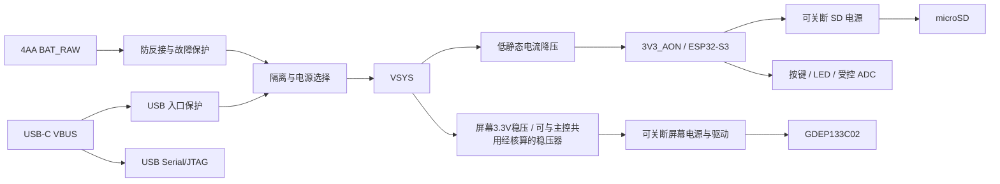

# GDEP133C02 相框 PCB 设计与实现方案

2026-10-09 v0.6改版：普通电阻扩大0805，R17拆为R17/R50两只200kΩ，当前104个装配件；详见[改版审查](../../hardware/pcb/gdep133c02-driver/docs/国内采购与手焊改版-v0.6.md)。当前ERC/DRC/未连接/一致性为0，工程模式GUI更新预览通过，无重复新增器件；v0.6制造文件位于hardware/pcb/gdep133c02-driver/releases/jlc-cn-review-v0.6-domestic-2026-10-09，仅保留当前包。

历史v0.5实现记录（不作为当前数量/GUI验收）：P4增加R49（0Ω/0805）与TP25/TP26，R13保留在Q7栅极侧，见[GDRC调试说明](../../hardware/pcb/gdep133c02-driver/docs/gdrc-debug.md)。正式工程已改为v0.5直供手焊版，103个装配件；P1删除L4/L5，以铜线连接，并将开关后的VIN/AVDD/EPD_3V3合并为EPD_3V3；移除17只0Ω与U6/U7接口隔离，U5采用TPS22917DBVR/SOT-23-6，C36=1nF接CT与芯片VIN，J2.16 NC。三页原理图与PCB已同步、补线和重新铺铜，ERC/DRC0。本文后续厂家参考器件和历史资料表保留来源身份；本次P1改版见[直供说明](../../hardware/pcb/gdep133c02-driver/docs/p1-supply.md)。当前实装以[简化记录](../../hardware/pcb/gdep133c02-driver/docs/current-configuration.md)及[新版接口约定](../../hardware/pcb/gdep133c02-driver/docs/interface-power-state.md)为准，旧TPS22913及隔离接法不再是当前BOM。GUI当前版本实际打开已通过，硬件验收未完成，制造包仍为审阅。

设计日期：2026-10-01。资料审阅更新：2026-10-01。状态：方案设计；已审阅用户提供的屏幕规格书与 ESP-IDF 示例，已补齐公开屏幕外围电路，资料与设计决策已闭环，可进入最小驱动原型阶段；到货与电气验收未完成；已修复最小驱动板 KiCad 工程，ERC/DRC零违规、未连接与原理图一致性问题均为零；FPC焊盘尺寸已核对，原理图和PCB实际打开验证完成，已导出制造审阅包；连接器实物配接及功率参数验收未完成，尚未生产放行；未编译/烧录示例，未进行电气实测。

当前实施依据为本文与正式工程记录。需求基线：[总体设计](overview.md)。本文细化 PCB 的实现路径、接口和阶段门槛，供后续 agent 实施；不将待确认电路写成已验证设计。需求变更须同步总体设计、硬件接口记录和对应测试。

## 1. 范围、基线与完成条件

| 项目 | 固定需求或设计默认 |
| --- | --- |
| 屏幕 | GDEP133C02，13.3 寸，1600×1200，六色；屏幕已购买尚未到货；实际标签/FPC/后缀及版本待核对 |
| 主控 | ESP32-S3；默认 ESP32-S3-WROOM-1-N16R8 |
| 存储与显示 | 独立 SPI microSD 与屏幕总线，不占用模组存储总线；首版已确认采用单线 Standard 4-wire SPI；Quad 仅为后续可选项，不阻塞首版（见 2.4） |
| 交互 | 上一张、下一张，两枚按键深睡唤醒；短时状态 LED |
| 电源 | 默认 4AA 一次性碱性电池；USB-C 标准 5V 调试供电；无充电 |
| 功耗 | 电池端待机 ≤30 μA；每天 2 次完整换图，180 天，保留 30% 可用能量余量 |
| 工程与生产 | KiCad 原生工程，四层 PCB，嘉立创制造；统一使用本项目 Git |
| 首版边界 | 离线照片，原生 ESP-IDF；不加入无线传图、自动轮播、前光或机内充电 |

PCB 必须支持屏幕完整刷新、照片读取、按键唤醒、受控外设供电、电池检测、烧录调试和故障清理。半年续航是实测判定目标，不是元件选型即可保证的指标。照片格式、相册行为和错误闪灯编码沿用总体设计第 5 节，不在 PCB 文档另定义一套协议。

最终硬件完成条件为：原生源工程可恢复；ERC/DRC 与人工电路审核完成；制造文件检查通过；实物供电、显示、存储、唤醒和异常测试通过；电池端能量符合预算。文档完成与硬件完成分别记录。

## 2. 首要工作：屏幕资料闭环

### 2.1 资料获取与归档

先确认实际采购屏幕标签、后缀、FPC 标识和对应版本。资料入口如下，不能因页面型号相同就假定所有附件相互匹配：

- [GDEP133C02 产品页](https://www.good-display.com/blank7.html?productId=559)。
- [GDEP133C02 规格书入口](https://www.good-display.com/companyfile/1533.html)。
- [ESP32-133C02 参考原理图入口](https://www.good-display.com/companyfile/2036.html)。
- [参考板与程序资料入口](https://www.good-display.com/product/1223.html)。旧板页面标有 EOL，参考资料不构成购买成品板的要求。

2026-10-01 已审阅用户放入 `docs/raw/` 的规格书和源码包，并从厂家获取屏幕外围原理图和新版开发板手册，详见 2.4。新增资料、60Pin核对表、参考器件表与校验清单归档在 [hardware/reference/gdep133c02](../../hardware/reference/gdep133c02/README.md)。已取得的是完整屏幕外围单页电路，不是整块参考板 MCU/SD/USB/输入稳压原理图。原始文件保留在用户提供的位置，不重复复制大型源码构建缓存。后续优先获取公开附件；缺失、受限或版本不明时列出需要用户向厂家取得的具体文件，不自行发送邮件或消息。新增资料只在允许归档的情况下存入 `hardware/reference/gdep133c02/`，否则记录获取路径、使用限制与校验值，不将受限内容公开提交。

每份资料登记：文件名、适用屏幕/参考板版本、资料自身版本、来源 URL、获取日期、SHA-256、许可/归档条件、已审阅范围。网页更新时间不等于附件版本。源码还需登记框架、依赖、波形/查找表来源、完整性及移植限制。

### 2.2 实施前必须形成的核对表

| 核对表 | 必填信息 | 未完成时阻塞 |
| --- | --- | --- |
| 60Pin 逐脚表 | 1–60 每脚名称、方向、电压域、功能、连接对象、未用脚处理、规格书页码及原理图对应位置 | FPC 符号、电路定型 |
| 连接器表 | 间距、接触面、插入方向、Pin 1、FPC 厚度、锁扣形式、厂家料号与机械图 | 封装、采购、结构接口 |
| 电源/时序表 | 每路电压和容差、峰值、时序、允许纹波、启动/关断/放电要求、掉电行为 | 屏幕供电、首次上电 |
| 驱动表 | 控制器数量、首版Standard SPI数据线与控制线、逻辑电平、BUSY 极性、复位、刷新完成条件、温度及波形处理 | GPIO 冻结、固件驱动 |
| 器件表 | 专用 IC、电感、二极管、MOSFET、关键电容的料号、参数、来源、替代限制及可采购性 | BOM、原型、打板 |

对照规格书、原理图和源码交叉检查，冲突须记录依据及采用决策；本次按用户接受的2.4.5基线推进，后续厂家说明或实物差异触发对应设计复核。屏幕 60Pin 不能直接按普通 SPI 屏连接；未知电压不得接上裸屏试验。若专用器件、必要波形或合法使用文件不可获得，则记录自制路线阻塞，重新讨论选屏，不擅自换型号。

### 2.3 最小驱动先于整机集成

使用 ESP32-S3 开发板、与匹配参考电路一致的自制转接/驱动原型和限流台式电源，先检查无屏电源，再接屏验证六色色块、四角、水平/垂直线和照片。在原生 ESP-IDF 下证明初始化、传输、刷新完成判断及安全关机可重复；记录波形、峰值、刷新时间和能量。开发板待机电流不能代替最终板待机验收。

允许先制作最小自制驱动板；首次完整相框 PCB 打板必须在关键驱动风险消除后进行。若厂家示例使用 Arduino，审阅和移植必要驱动逻辑，不以 Arduino 示例运行作为原生 ESP-IDF 验收。

### 2.4 用户提供资料的审阅结果与闭环判定

**结论（用户接受，2026-10-01）：屏幕资料与设计决策已闭环，可进入最小驱动原型阶段。** 以现有GDEP133C02规格书、原生示例和外围拓扑为实施基线，固定接法与正常关机流程见2.4.5。到货版本核对、采购参数、电路审核和电气测试转为对应实施阶段的验收项；不再以等待厂家解释作为资料阶段的前置条件。资料齐全、可编译和实物驱动成功是三个不同门槛，不能用包内旧二进制替代后两项验证。

#### 2.4.1 文件清单及审阅范围

| 文件 | 版本与内容 | 本次审阅 |
| --- | --- | --- |
| [GDEP133C02.pdf](../raw/GDEP133C02.pdf) | 29 页；第 2 页标记 2024/05/30、Revision 1.0；第 5 页内嵌机械图另有自身修订记录 | 提取全篇文字，并实际查看机械/扫描方向、接口模式、DC 参数、Standard SPI 协议、上下电时序和方框图图像 |
| [GDEP133C02-ESP32 code example.zip](<../raw/GDEP133C02-ESP32 code example.zip>) | 内层目录 `GDEP133C02-ESP32 code example (2026420)/GDEP133C02/`；2070 个 ZIP 条目，含大量 build 缓存 | 检查整个包目录；审阅 `main/pindefine.h`、`comm.c`、`GDEP133C02.c/.h`、`main.c`、CMake、sdkconfig、依赖锁与构建描述；未执行厂家代码 |

原始文件 SHA-256：

```text
GDEP133C02.pdf
8dc98251254777c2bfa6046e393a840e0d373077009aa6869ee23efe13a20490
GDEP133C02-ESP32 code example.zip
a683485a58c6159f7788ab4339c91d902bce8f21089203a9d877a5669afb1f96
```

文件由用户提供；用户已确认新增资料从[商家提供的厂家产品页](https://www.good-display.cn/product/503.html)下载。采购实物适用版本与使用/再分发许可仍按归档记录核对。ZIP 未发现独立原理图、PCB、外围 BOM、README 或 LICENSE；PDF 第 27 页只是 PCBA 方框图，不是可复现电源电路。源码目录名有 2026 更新标记，但 build 文件主要为 2025 时间，不能认为旧固件已经覆盖现有源码。

#### 2.4.2 已确认的硬件信息

以下页码均为 PDF 页码，也与页脚页码一致；这是文档事实，尚非实物验证结果。

| 项目 | 已确认内容与依据 | 尚缺内容 |
| --- | --- | --- |
| 分辨率与机械 | 第 4 页原生 1200(H)×1600(V)；外形 208.8×284.7 mm；第 5 页有实际 FPC 位置、截面及焊指尺寸图 | 实物版本匹配、连接器原厂封装图、允许承托区域复核 |
| 连接器 | 第 6 页给出 `196070-60041`，60Pin、0.5 mm 间距；第 9 页图示 Pin 1/60 和金手指朝下 | 料号供应商/采购渠道、锁扣/触点型号与板侧观察方向逐一核对；不能据“朝下”直接任选下接连接器 |
| 逻辑与模拟输入 | 第 6 页 VDD 2.3–3.6V、AVDD 2.3–6V；第 11 页 VDD 工作范围 2.4–3.6V，典型 3.3V | 第 12 页指出 2.4V 下限不适用于高负载图案；实际刷新最低输入、VDDIO 连接和所有轨容差须复核 |
| 高压与外围 | 第 11 页 VGH 26–28V、VGL −21 至 −19V；第 21–22 页含 VDDP/VDDN、VGP/VGN、源极及 VCOM 时序 | 外围拓扑/器件参考值已补（2.4.4）；稳定性、纹波、放电与掉电恢复仍需核实 |
| 忙状态/复位 | 第 6–8 页 BUSY_N 低为忙、高为空闲，要求上拉到 VDDIO；RES# 低有效 | 参考图上拉2kΩ；两个控制器忙关联及命令后BUSY置忙/释放判据仍待验证 |
| 电流与时间 | 第 11 页浪涌最大 844.5mA，高负载峰值最大 987.4mA；高负载平均最大 511.5mA；第 23 页 25℃刷新典型 12s | 参考电路的测量供电边界、全温/图案最坏值、真实电池端能量；12s 不是保证最大值或超时上限 |
| 休眠 | 第 12 页给出 `0x07` + `0xA5` 深睡命令，典型深睡 0.70μA | 该命令与 POF、输入断电的完整先后关系和异常中断策略 |

VDD/AVDD 最大工作电压不能作为允许连接四节新 AA 的依据；AVDD 标称上限 6V 也不能证明新电池组可直连。页 11 的待机电流 6.58μA 与待机功率 0.876μW 在 3.3V 下不一致，测量边界/笔误需厂家解释，不能据此推导整板待机。

60Pin 定义已取得。已按第6–7页及新增外围图形成60行逐脚核对表，后续生成符号并逐网复核连接对象；以下分组便于后续核对，不代替逐脚电路审核：

| 管脚 | 信号 |
| --- | --- |
| 1–7 | VCOMBD_M、RESEC、GDRC、RESEN、GDRN、RESEP、GDRP |
| 8–12 | GND、AVDD、VDD、NC、VCC（LDO 输出，非外接逻辑输入） |
| 13–19 | VDDP、VDDP、NC、VDDN、VDDN、VCC1、VDDIO |
| 20–26 | TSCL、TSDA、BS0、BS1、RES#、BUSY_N、D/C# |
| 27–32 | CSB_M、SCL、SI0、SI1、SI2、SI3 |
| 33–41 | DRVP、FBP、GND、VCOMBD_S、DRVN、FBN、REG_VGN、DRVN2、VNCP_3P5V |
| 42–47 | VSPH、VSPL、VSPL2、VSPHI、VSPLI、VSPL2I |
| 48–53 | VSNH、VSNL、VSNL2、VSNL2I、VSNLI、VSNHI |
| 54–60 | FPL_VCOM、TFT_VCOM、VBB_3P5V、NC、CSB_S、VGH、VGL |

NC 11/15/57 按规格书保持不连接，也不互相短接。RESE/GDR/DRV/反馈脚说明表明存在外部功率器件与控制环路，不能只补几只电容就视为完整驱动。

#### 2.4.3 接口及原生 ESP-IDF 示例结论

- `dependencies.lock` 标记 IDF **4.4.4**、target **esp32s3**；旧 `build/project_description.json` 标记 **v4.4.4-dirty**。已有 CMake 工程和源代码，原生 IDF 路线有依据，但环境改动和二进制对应源码不能证明；本机本次未配置该版本并重新编译。
- `pindefine.h`：CS0=GPIO18、CS1=GPIO17、CLK=GPIO9、D0=GPIO41、D1=GPIO40、D2=GPIO39、D3=GPIO38、BUSY=GPIO7、RESET=GPIO6、LOAD_SW=GPIO45。仅为厂家示例映射；新取得外围图 SW_C 控制 U5 输入开关，但该 GPIO 与具体参考板连接还需版本核对，GPIO45 还需按模组绑带约束审查，不能直接当最终电源使能脚。
- `comm.c:20–36` 使用 SPI3_HOST、10MHz、8bit 命令；仅连接 data0/data1，quadwp/quadhd 均为 −1，未见 QUAD 事务标志。**实际源码为单线写/独立读线的 Standard 4-wire SPI，而非四数据线 QSPI。** 定义 D2/D3 并不等于使用四线传输。PDF 第 8 页 BS1/BS0=H/H 为默认 Standard 4-wire SPI，页 13/17 也说明该协议；尚缺明确的 Quad 切换命令和 Quad 时序，不能由接口名称推断。
- 两个片选对应 PDF Pin 27 CSB_M 和 Pin 58 CSB_S；有共用复位、BUSY，源码能同时选择两个控制器写共有命令，分别写图像。`pic_display_test()` 按原生 1200×1600，每行 600 字节分为两段各 300 字节，总计各控制器 480000 字节，合计 960000 字节。物理左右/上下与横向应用转换必须以角标实测，不能从注释推定。
- `GDEP133C02.h` 的重复色字节为黑 0x00、白 0x11、黄 0x22、红 0x33、蓝 0x55、绿 0x66，对应原生半字节色码 **0、1、2、3、5、6**。应用 `.epf` 索引黑/白/红/黄/蓝/绿 **0、1、2、3、4、5** 必须映射为 **0、1、3、2、5、6**；应用横向 1600×1200 约定保持不变。
- 源码 `epdDisplay()` 是 PON(0x04) → DRF(0x12,0x01) → POF(0x02,0x00)，每步等待 BUSY 高；复位低/高各 20ms。已有初始化寄存器和值，未发现独立 LUT/波形附件或显式波形上传流程；规格书第12页明确VCOM已设置在面板IC内；首版使用面板内置VCOM及现有初始化，不另寻或覆盖VCOM值。OTP/波形与温度处理作为到货及最小显示验收项，不标为已验证。

用户已确认首版采用厂家示例对应的单线 Standard SPI；原生 ESP-IDF 用这一模式实现最小验证与正式固件。Quad 不再阻塞首版，后续启用时单独取得命令、绑带和时序依据；D2/D3只按已确认未用处理或作为不装调试预留，不能强行分配四线总线。

示例不能原样作为相框固件，至少需处理以下问题：

1. `checkBusyHigh/Low()` 空循环无超时/让出调度，可能永久卡死；命令后只查高电平还可能在 BUSY 尚未拉低时提前返回，需按时序约束及实测实现有界等待。
2. SPI 手动控制两片选，却未显式将 `spics_io_num` 设置为 −1；结构默认零值需按锁定 IDF 语义检查，防止误使用 GPIO0 自动片选。分段接收函数的 `rxlength` 使用剩余总量而非当前块长度也需修正，读状态不能直接信任。
3. `main.c` 仅将 LOAD_SW 拉高，结束 `while(1)`，未撤销供电或进入 MCU 深睡；示例未发 `0x07/0xA5`，POF 不等于关闭外部输入。GPIO 配置启用输出上拉也不代替板级默认关闭电阻。
4. 棋盘格将重复色字节直接执行 `(color1 << 4) | color2`；对于不同颜色组合会污染高半字节，需改用单像素色码并遮罩。测试图必须同时验证两像素不同色，不能只看大块颜色。
5. 示例虽含 USB/TinyUSB 源文件及旧配置，主流程仅显示内置图案；没有相框所需的 SD 相册、按键、欠压、错误恢复、整机休眠或对应功耗验证。也不能把旧 sdkconfig 直接视为 N16R8 最终配置。

#### 2.4.4 网上补齐的资料与电路结论

归档见 [参考资料说明](../../hardware/reference/gdep133c02/README.md)、[manifest.json](../../hardware/reference/gdep133c02/manifest.json)、[逐脚表](../../hardware/reference/gdep133c02/pin-map.csv) 和 [参考器件表](../../hardware/reference/gdep133c02/reference-bom.csv)。人工整理表是审核输入，不替代原图或实际网表。

| 新取得资料 | 确认内容 | 使用边界 |
| --- | --- | --- |
| [屏幕外围电路](../../hardware/reference/gdep133c02/ESP32-133C02-screen-peripheral-V1.0.pdf) | 13.3E6 V1.0，创建2024-05-08、更新2024-07-17，1页；负载开关、正负压、VGH/VGL电荷泵、TFT_VCOM、TCN75A和60Pin连接完整可见 | [厂家附件](https://v4.cecdn.yun300.cn/100001_1909185148/Schematic%20for%20ESP32-133C02.pdf)。不含MCU/SD/输入稳压；IL附件下载哈希相同，不能当另一版本证据 |
| [开发板手册](../../hardware/reference/gdep133c02/EN-ESP32-133C02-Rev2.0.pdf) | Rev2.0，2026-03-12，23页；GPIO、双片选共享控制以及3.3V/刷新/储存建议 | [厂家附件](https://v4.cecdn.yun300.cn/100001_1909185148/EN-ESP32-133C02.pdf)。新版日期不证明适用于到货面板或2024电路 |
| [TI TPS22913](https://www.ti.com/lit/ds/symlink/tps22913.pdf) | U5高有效，工作输入1.4–5.5V、最大连续2A；B/C型号有输出放电 | 不是稳压器；关断其输出不等于所有屏幕高压已放完；DSBGA需要对应封装/装配审核 |
| [Microchip TCN75A](https://ww1.microchip.com/downloads/en/DeviceDoc/21935c.pdf) | U4工作2.7–5.5V，I²C，关断电流最大2µA | 应在受控屏幕3.3V域；不是常供电传感器，也未证明初始化已正确读温 |

**输入路径已收敛为稳压3.3V方案。** 厂家外围参考图以磁珠分支供电；当前v0.5为BENCH_3V3经U5直接到EPD_3V3，逻辑与功率采用同网铜线支路，保留两只100µF电容；屏幕AVDD/VDD/VDDIO引脚都接EPD_3V3。手册p23要求屏幕3.3V。因此本项目由前级稳压3.3V供给该外围，不能把4AA原电池或USB5V接到EPD_VDD。外围图未显示前级降压器；最终共享还是独立稳压支路需按987.4mA屏幕峰值、MCU/SD并发负载与测量边界选型。

图中没有额外独立的专用升压控制IC，面板GDR/RESE/DRV/反馈脚驱动分立电源电路。主要参考件为：Q1/Q4 DMN3065LW-7、Q8 DMP3068L-7、Q3 MMBT3906、Q6 MMBT3904、Q7 PJA3433；D1/D2 MBR230S1F-7、D3/D5/D6 BAT54S、D4 B0530W；L1–L3 15µH。U1/U2/U3实为200mΩ电流采样电阻，不是待找专用IC。具体拓扑须逐网从原图录入，不能从器件列表拼接电路。电容耐压/介质/有效容量、电感饱和电流/DCR和部分器件完整采购信息尚缺，参考值不构成生产BOM。

关键逐脚连接已补：Pin12 VCC连接Pin18 VCC1，并接C7；13/14为VDDP、16/17为VDDN；源极对42/45、43/46、44/47、48/53、49/52、50/51分别相连。BUSY上拉R1=2kΩ到VDDIO。TSCL/TSDA接TCN75A并以4.7kΩ上拉EPD_3.3V，地址脚接地；传感器随屏幕断电，不另占MCU I²C总线。NC11/15/57不连接；连接器固定焊脚61/62不计入60Pin信号。

连接器有两个不同参考料号：规格书`196070-60041`，外围图`FPC-05FB-60PH20`。[P-TWO系列页](https://www.p-two.com/index.php?do=prod&id=748)和[TI参考BOM](https://www.ti.com/lit/df/tidrd16/tidrd16.pdf)补齐前者厂商线索；[XUNPU系列页](https://www.xunpu.com.cn/product/413.html)和[嘉立创C2856839](https://jlcpcb.com/partdetail/XUNPU-FPC_05FB60PH20/C2856839)补齐后者采购线索。厂商系列和采购页不能替代精确型号焊盘图、接触面/厚度实物验证，不能默认两者同封装可互换。

**参考图差异与采用决策：**单页图R24/R25均为0Ω到GND，对应图内9bit 3-wire模式；规格书p6/8/13及8bit单线示例支持Standard SPI。用户接受以规格书为模式依据：BS0/BS1均接受控VDD，D/C#接GND，不复制两只BS接地电阻。原图不修改，疑似图纸错误留作追溯记录，不声称厂家已解释。

DRVN2没有外部支路、VNCP_3P5V经0Ω连接VBB_3P5V的处理也见[微雪官方13.3寸驱动板电路p1](https://files.waveshare.com/wiki/13.3inch%20e-Paper%20HAT%2B/13.3inch_e-Paper_HAT%2B.pdf)。这支持其为所选电源拓扑的设计选择，属于工程交叉印证，不是佳显对到货批次的保证。用户接受沿用该拓扑；不自行补独立VNCP电荷泵，实测负压及显示结果作为原型验收。

#### 2.4.5 用户接受的设计基线与闭环判定

决策日期：2026-10-01。用户明确接受现有依据完成方案闭环；此处的“闭环”指资料及设计决策完成，允许推进最小原型，不代表厂家确认、硬件通过或生产放行。

| 项目 | 采用基线 | 后续验收 |
| --- | --- | --- |
| 首版通信 | 8bit单线Standard SPI；BS0/BS1接受控VDD，D/C#接GND；不使用Quad | 原型验证命令、读回、两片选及拼接；SI2/SI3未用输入处理由电路审核确认 |
| DRVN2及负压拓扑 | Pin40不接外部支路；Pin41经R16=0Ω接Pin56，沿用现有TFT_VCOM电源 | 测VNCP_3P5V/VBB_3P5V与显示结果；不视为不同产品可直接互换 |
| 面板与初始化 | 现有GDEP133C02 Rev1.0规格书及用户原生示例；面板内置VCOM，不覆盖 | 到货核对标签/FPC/机械接口，最小显示测试覆盖OTP/波形及温度初始化；不匹配时复核基线 |
| 正常关机 | 完整刷新结束 → POF(0x02,0x00) → 正确等待BUSY完成 → 深睡(0x07,0xA5) → 接口进入断电安全状态 → 关闭屏幕输入 | 同步测BUSY、输入及各高压轨；深睡之后重新上电需完整初始化 |
| 异常掉电 | 不保证软件清理能够执行；禁止无限重试 | 原型阶段核对欠压、MCU复位、超时、信号反灌与恢复；没有厂家安全保证，不能标为已通过 |
| 刷新行为 | 纯手动，无自动24h刷新或180s强制间隔；保留厂家建议差异 | 后续长期保持及快速手动换图评估残影/寿命；用户行为不因资料建议自动变更 |
| 工程与采购 | KiCad，自制最小驱动原型，前级稳压3.3V及受控外围 | 连接器匹配、被动器件完整参数、稳压并发峰值、ERC/DRC及人工电路审核在相应阶段完成 |

关机流程的依据是规格书p22的POF/BUSY/电源衰减图，以及p12的深睡命令；将两者组合为本项目采用流程，不能说成厂家已提供整套异常关断保证。p22标注串口停止活动到VDD/AVDD下降间隔大于10µs；原型固件采用1ms间隔作为起点并核对实际波形。这不是全部高压轨的放电时间。BUSY等待须处理命令后的置忙延迟与释放，设有界超时，不只读一次高电平或用固定20ms代替关机完成判定。各轨放电/残压及失电恢复仍须测量。

[针对GDEP133C02的开源驱动说明](https://github.com/philippwaller/esphome-epaper-spectra6-133)提供深睡后控制外部开关的实现交叉参考，并明确要求验证负载开关关断行为；不作为厂家硬件安全认证，也不更换本项目原生IDF路线。

资料状态：**已闭环，可进入阶段B**。构建、烧录、到货核对、全轨波形、功耗及异常恢复均为**未完成的实施验收项**。必要时向厂家补问清单保留在[参考资料说明](../../hardware/reference/gdep133c02/README.md#给厂家的具体确认清单)，不再作为上述采用决策的前置条件；未发送消息。

## 3. 原理图分块与电路实现

原理图按电源入口、常供电主控、屏幕、存储、交互与检测划分层级页。以下网络名作为功能契约；屏幕内部轨按归档原理图和逐脚表命名，适用版本及安全时序按已采用基线实现，并在原型阶段验收。



### 3.1 电池入口与 USB 电源选择

电池使用防呆、有极性标识的连接器，电池仓通过线束连接。设置防反接和故障电流保护；器件按电池短路能力、启动峰值和线束耐流选择，不能仅用串联电阻代替保护。四节新电池最大电压按所选电池资料及实测确定，不能按标称 6V 作为最高输入。

默认采用有反向阻断的双源隔离/选择电路，电池保护后与 USB 保护后汇入 `VSYS`。实现器件可以是满足漏电预算的电源选择 IC 或独立反向阻断支路，冻结时只保留经过计算与验证的一种方案。必须保证两路源不会互相充电，也不会从电池向 USB VBUS 回灌。仅使用单个 MOSFET 时需分析体二极管，不能假设关断即双向隔离。

USB 为调试使用；若电路按较高电压选源导致电池仍供电，应在操作说明明确，并提供可断开电池的调试方式。不得依赖切换过程完全无缝：验证供电跌落、复位及屏幕恢复行为。插拔全部组合包括无电池、满电池、近截止电池、反接电池、USB 先插/后插、任一路突然移除。

USB-C 受电端两个 CC 分别配置标称 5.1 kΩ 的 Rd，不短接 CC1/CC2，不要求 PD。USB 两种插头方向均可传数据。输入电容、限流/浪涌及外设峰值须符合实际 USB 源允许电流；无电流能力检测时按适用 USB 默认供电约束设计，不能把 5V 自动视为可取任意电流。未知屏幕负载不得仅凭 USB 口能力保证刷新。

### 3.2 常供电 3.3V

`VSYS` 经低静态电流同步降压生成 `3V3_AON`，供应主控、按键上拉及必需的常供电控制逻辑。候选器件输入等级至少 8V，并覆盖实际最大输入和瞬态；输出峰值能力至少 500 mA，最终按主控、SD 和相关屏幕负载同时工作时的最大值及瞬态重新校核。500 mA 是筛选下限，不是已确认整机需求。

选择时填写：工作/绝对最大输入、低输入稳压能力、轻载效率、静态电流定义、反馈分压耗流、限流、软启动、输出电容范围、关断及反向导通行为。核算电感饱和/有效值电流、电容直流偏压后的有效容量和耐压；补偿与布局遵循所选器件参考设计。主控附近放置局部去耦，电源测量点设在模组供电脚附近。

新取得规格书显示屏幕峰值最大 987.4mA（第 11 页，见 2.4）。**500mA 只适用于主控支路初筛，不能用于整机共用 3.3V 电源定型。** 若屏幕由同一降压器供电，其容量须覆盖该屏幕峰值、主控和 SD 的并发负载及设计余量；若独立供电，则屏幕稳压、开关、连接器与入口路径各自覆盖对应峰值。选型前先确认表中电流测量节点，电池侧不能直接等同于 3.3V 侧电流。

4AA 低电量时是否仍能降压稳压取决于占空比、损耗和屏幕要求。确定截止点后测量可用电池能量；若损失过大，再评估升降压并记录变更。不得以芯片 UVLO 代替应用刷新启动阈值。

### 3.3 ESP32-S3、启动与调试

默认模组 ESP32-S3-WROOM-1-N16R8；模组电源、启动、存储占用脚和封装按[乐鑫模组规格书](https://www.espressif.com/sites/default/files/documentation/esp32-s3-wroom-1_wroom-1u_datasheet_en.pdf)核对，板级连接与布局参考[硬件设计指南](https://documentation.espressif.com/esp-hardware-design-guidelines/en/latest/esp32s3/index.html)。不按其他后缀模组替代。

预留 BOOT 按键、RESET 按键、UART TX/RX/GND 焊盘。EN 的上拉及复位延时按官方推荐和实测电源爬升确定；BOOT 不被外设意外拉低。USB D-/D+ 保留专用脚，USB ESD 和可调串联元件靠近相应连接位置。首版使用原生 USB Serial/JTAG，不增加常供电 USB-UART 芯片。

不配置常亮电源灯。外接 UART 的逻辑电压与地必须匹配，调试器不得通过 RX/TX 给关机板供电。保留供电断点用于分离模组电流与其他支路；无线功能不初始化，但仍遵守模组天线净空。

### 3.4 屏幕电源与 60Pin 连接

完整复制并审核匹配参考电路中的必要驱动功能，再优化布局及受控供电；不从产品接口名称推测内部高压。屏幕外围的 `EPD_VDD` 固定采用前级稳压3.3V，不直接来自 `VSYS`。共用主控稳压器或独立屏幕稳压器须通过并发负载、压降/浪涌、漏电和干扰核算后冻结；两种实现都必须将全部屏幕电路与温度传感器置于可关断支路。

`EPD_PWR_EN` 为板级高有效请求，硬件下拉使其在复位、未烧录和深睡默认关闭。如果驱动 IC 使能极性相反，在硬件转换并保持该板级契约。默认关闭必须通过电源入口控制和器件状态实现，不能只依赖软件。需要关断的所有屏幕轨都计入支路，不能留下常开升压器。

按资料设计各轨启动、关断及放电；放电方式和电阻/开关的功耗必须计算。断电期间屏幕SPI、复位及 BUSY 等信号需保持允许状态，必要时使用带断电隔离的缓冲/电平转换器。串联电阻只能改善信号或限流，不能自动满足反向供电要求。掉电安全性分析必须覆盖 MCU 先复位而屏幕仍在刷新的情况。

BUSY_N 按参考图采用2kΩ到屏幕 VDDIO 的外部上拉，不拉到常供电 MCU 域；屏幕失电后的 MCU 输入浮空或隔离状态在接口表定义。首版Standard SPI固定BS0/BS1接受控VDD、D/C#接GND；Pin40 DRVN2不接外部支路，Pin41经R16=0Ω接Pin56。SI2/SI3不作首版数据线，未用输入处理在原型电路审核中核对，不作为等待Quad资料的阻塞。正常关断统一执行2.4.5流程，不能刚发POF就切断输入。

归档的60行 [pin-map.csv](../../hardware/reference/gdep133c02/pin-map.csv) 用于生成项目自定义 FPC 符号并与封装焊盘交叉核查，明确从哪一面观察及 Pin 1。按照连接器原厂图纸确定焊盘与锁扣空间，以实际 FPC 检查接触面；不能凭网上相似封装替代。各高压轨设标识测试点及邻近 GND，避免手持探头滑动短路。

### 3.5 microSD 可关断供电

`3V3_AON` 经高有效 `SD_PWR_EN` 控制的负载开关产生 `3V3_SD`，使能硬件默认低。负载开关按卡启动/写入峰值、压降、浪涌、关断漏电、输出放电和反向导通条件选型；卡槽附近布置去耦。卡检测可作为预留功能，不作为首版必需条件。

SPI 卡接口的必要上拉均接 `3V3_SD`，具体脚位与阻值按 SD SPI 要求核查。断电前停止访问、卸载并设置总线安全状态；特别检查 CS、MOSI、SCLK 高电平反灌，以及 MISO 上拉来源。必要时增加断电隔离器件并计入功耗。首版支持 FAT32，优先测试 8–32 GB 卡；用户休眠时换卡，读卡中拔卡作为异常测试。

### 3.6 按键、状态灯与电池检测

两枚换图按键使用可深睡唤醒的 RTC GPIO，常供电外部上拉、按下接地；板边预留两组按键线束接口，以便按机械布局使用外接按键，也可装板载键。上拉初值 100 kΩ，检查噪声、输入漏电和线束长度后确定；长按耗流及按键卡住行为纳入测试。RC 去抖可预留，不能导致唤醒失效或违背固件 30 ms 去抖策略。

LED 采用 GPIO 高有效点亮，默认低，串联限流电阻按 LED 压降和短时亮度确定；不使用以 MCU 吸电流点亮且上电默认发光的接法。故障时短闪后休眠，编码与总体设计一致。

电池采样点取保护后、选源前的电池支路，使插 USB 时仍能判断电池状态；命名为 `BAT_SENSE_SRC`，ADC 为 `BAT_ADC`。采用高侧受控分压，板级高有效 `BAT_MEAS_EN` 默认关闭；不能直接用 MCU GPIO 承受电池电压，也不能只切断分压下端使 ADC 被上端拉到高压。

计算最高电池电压、阻值公差及开关压降下的 ADC 输入，留出测量裕量；选择 ADC 衰减并校准。检查源阻抗、滤波电容和采样建立时间，以及 MCU 无电时的注入电流。关断漏电在最大输入下测量。刷新阈值由稳压压差、屏幕最低输入、实测峰值压降、温度和电池内阻共同确定，设恢复迟滞；欠压时禁止启动刷新并短时提示。

## 4. 软硬件接口与 GPIO 冻结

### 4.1 网络与状态契约

| 网络/接口 | 电源域与方向 | 复位/休眠契约 |
| --- | --- | --- |
| `EPD_PWR_EN` | MCU 输出，高有效板级请求 | 硬件默认关闭；仅在安全关机结束后撤销 |
| `SD_PWR_EN` | MCU 输出，高有效 | 硬件默认关闭；卸载后撤销 |
| `BAT_MEAS_EN` / `BAT_ADC` | MCU 输出 / ADC 输入 | 默认不采样；测量后关闭 |
| `BTN_PREV_N` / `BTN_NEXT_N` | 常供电 RTC 输入，低有效 | 上拉，按键唤醒；长按处理沿用总体设计 |
| `STATUS_LED` | MCU 输出，高有效 | 上电默认灭；反馈完成后灭 |
| `USB_DM` / `USB_DP` | USB 专用接口 | 保留给原生 USB 调试 |
| `SD_SCLK/MOSI/MISO/CS_N` | 可关断 SD 域边界 | 断电不反灌；各脚状态在映射表中锁定 |
| `EPD_SCLK/MOSI/MISO`、`CSB_M/CSB_S`、`RES_N/BUSY_N` | 实际屏幕逻辑域边界 | 已取得 Pin 27/58 双片选、Pin 24/25 复位/忙定义；首版MOSI/MISO；模式绑带已固定；D2/D3未用输入处理和跨域关断状态在电路审核中确认 |

已取得60Pin定义、外围电路和厂家示例GPIO；首版Standard SPI接法按2.4.5固定；参考图冲突保留为历史记录，版本匹配移交到货验收，厂家示例GPIO仍须按模组约束重新审核。Quad为后续可选，不阻塞首版。冻结阶段创建统一接口表，逐行记录：网络名、MCU GPIO、模组焊盘、外设管脚、SPI 控制器、方向、电压域、上下拉、启动/刷新/休眠状态、固件宏名及资料依据。该表为原理图和固件 `board` 模块的共同基准，不能分别维护相互矛盾的映射。

分配顺序：保留 USB、BOOT/RESET、UART及模组存储占用资源；给两按键分配合格 RTC 脚；分配独立通用 SPI 控制器与屏幕辅助线；分配 ADC、供电使能和 LED；最后审查绑带、复用、上电拉电平和驱动 API 限制。对每个候选脚检查实际 N16R8 模组可用性。映射完成后用最小固件编译并验证引脚能力，布板前冻结硬件版本。

### 4.2 电源操作顺序

上电/唤醒后首先保证屏幕和 SD 关闭，读取复位原因及按键，测量电池；有合格电源才使能 SD、等待稳定、初始化和挂载。按总体设计将 `.epf` 全帧读入 PSRAM，完成长度、CRC 和像素检查，再启动屏幕电源及规定的初始化/传输流程。DMA 使用经 IDF 能力检查的缓冲，避免将任意 PSRAM 指针直接用于 DMA。

刷新完成须依据已核实的BUSY/状态定义判断；随后按2.4.5先POF并等待完成，再深睡、处理跨域接口、撤销屏幕供电。成功后保存状态，卸载 SD、设置跨域信号、断 SD、关闭测量和 LED，配置按键唤醒再深睡。遇到错误或超时按同一套有界安全清理处理，不循环重试。各等待时间来自资料及原型测量，固件中记录明确上限。

硬件复位或意外掉电不保证软件清理执行。原型需验证使能默认状态、各轨衰减、隔离及重启流程；只有厂家允许的恢复方法才可用于刷新中断电测试。

## 5. 器件选型、功耗与 BOM

冻结 BOM 前，选型表每项填写厂家/完整料号、封装、关键参数与计算、资料版本、供货渠道、嘉立创/LCSC 编号、替代限制和装配方式。优先 0603 被动器件及可返修封装，FPC/模组按实际加工能力选择。关键驱动、电源和连接器不得只按封装替代；采购缺货引起变更时重新审核并更新测试。

电源 IC、选择器、保护器件、负载开关、采样开关、ESD 和电阻网络均须计算最大条件下静态消耗，不用典型值证明预算。预算统一折算到电池端，避免把 3.3V 输出侧电流直接相加为电池电流。

| 支路 | 电池端设计预算 | 核算边界 |
| --- | ---: | --- |
| 主控深睡及其转换 | 15 μA | 主控负载折算，相关轻载转换损耗 |
| 稳压器、电源选择与保护静态消耗 | 8 μA | 不重复计入上一项已统计的消耗 |
| 屏幕/SD 关断及其余漏电 | 7 μA | 分压、上拉、隔离、ESD、LED 等 |
| 合计 | ≤30 μA | 实测整板电池端为最终判据 |

按所选器件静态电流的定义明确计费边界；超预算先定位支路，不通过更改统计口径达标。4AA 串联容量 Ah 不乘四。电池可用能量需在实际负载和截止点测定，不能由标签容量直接推导。

半年判定采用总体设计的电池端能量公式：`360 × E_refresh / 3600 + 4320 × P_sleep ≤ 0.70 × E_available`，其中能量单位分别为 J 和 Wh，功率为 W。换图能量已含启动、读卡、刷新、保存与关断以及转换损耗，不再重复除以效率。电池选择与截止点冻结前不得宣称目标已达成。

## 6. KiCad 工程、布局与机械接口

### 6.1 工程基线

2026-10-01 在本机执行 `/Applications/KiCad/KiCad.app/Contents/MacOS/kicad-cli version` 得到 **10.0.6**；实施开始时复查版本，以实际创建/打开验证过的版本为基线。现已创建6.1.1所述最小驱动板工程草案；整机正式工程尚未创建，历史 EasyEDA 示例不是设计输入。

后续在 `hardware/pcb/album/` 创建 `album.kicad_pro`、`album.kicad_sch`、`album.kicad_pcb`，项目符号/封装/模型、库表、README、接口与选型记录一同提交。项目资源用 `${KIPRJMOD}` 或项目内相对引用。README 记录工具版本、打开方式、检查及导出命令；不依赖个人全局库。自动备份、锁文件和 `.kicad_prl` 按实际情况忽略，不误排除设计源文件。

### 6.1.1 本轮最小驱动板工程实施状态

用户确认本轮先做最小驱动板、外接ESP32-S3开发板、只交付硬件；整机电池/SD/USB/交互留待后续集成。2026-10-01已创建 [原生工程与实施记录](../../hardware/pcb/gdep133c02-driver/README.md)，目录为 `hardware/pcb/gdep133c02-driver/`，与未来整机 `album/` 工程区分。

当前正式原理图、项目库和100×80mm四层PCB已保存。v0.6为104个装配件、26个铜测试点、134个PCB封装、319个连接引脚；2047段走线、201个过孔。In1.Cu为GND平面，顶底面铺地。FPC封装尺寸见工程核对记录。

ERC/DRC、未连接、原理图一致性均为零，130个符号关联通过命令行检查，当前GUI更新预览通过，无重复新增器件。v0.6制造审阅文件位于`releases/jlc-cn-review-v0.6-domestic-2026-10-09/`，release仅保留当前v0.6包。整机主控、电池、SD、USB等下文设计属于后续集成目标，不能当作当前驱动板功能。实物配接、有效容量、功率瞬态与安全掉电尚未验收，见工程README。

### 6.2 板层与布局

四层默认为 F.Cu 器件/信号、In1.Cu 连续 GND、In2.Cu 主要电源、B.Cu 信号。在选定嘉立创工艺后锁定叠层、铜厚、板厚、线宽/间距、孔径和规则，不先虚构阻抗值。大电流线宽依据峰值和允许温升计算；高压间距按实际电压及器件要求确定。

屏幕 FPC 连接器按实际出线位置优先定位；主控降压与屏幕开关电源分别布置，缩小输入、开关和回流环路，高 dv/dt 节点远离 ADC、USB、天线及屏幕控制线。屏幕SPI时钟/数据短而连续参考地，避免跨地缝；串联调试电阻靠近驱动端，阻值由实测确定。USB 走线按实际叠层和官方要求设置规则。去耦紧邻供电脚，关键地回路不可绕行；模组地焊盘和散热/过孔按封装要求处理。

即使不用无线，也保持乐鑫要求的天线净空；电池、屏幕背板、螺柱及铜皮一并检查。机械安装孔禁止穿过关键电路，孔周围设置与螺丝/垫片匹配的铜和器件禁布区。

### 6.3 机械接口冻结

不凭总体设计的屏幕矩形推断 FPC 或有效区偏移。结构配合前取得实际屏幕机械图和连接器模型。接口记录包含板框坐标原点、安装孔坐标/孔径、最高器件与背面高度、USB/SD/按键插拔空间、电池线束、连接器锁扣操作空间及 FPC 最小弯曲要求。

默认 PCB 放在 FPC 附近，通过独立螺柱固定；电池仓靠下，USB/SD 外缘可达，两按键通过线束适应侧边安装。具体尺寸与孔位在结构协同后冻结，不以猜测数值打板。导出带硬件版本的 PCB STEP，在 `mechanical/` 装配中检查 FPC 无拉力、无挤压、连接器可操作，换电不拆屏。

### 6.4 测试与可返修性

预留 `BAT_RAW`、保护后电池、USB VBUS、`VSYS`、模组 3.3V、SD 电源、每路屏幕轨、EN/RESET、外设使能、BUSY/CS/时钟/数据及 GND 测试点。每个高压测试点丝印标明真实轨名/电压等级，普通逻辑点不与其混排。预留整板电池输入和 MCU/SD/屏幕支路的可断开测量连接，说明短接与测量配置；正常装配不能遗留断路。

测试焊盘在装配后可探测，至少关键电源点有邻近地。板上标注硬件版本、Pin 1、极性与电池连接方向。保护器件旁和开关节点附近避免无意义的大测试焊盘，以免改变电路行为。

## 7. 分阶段实施与实物验收

| 阶段 | 后续 agent 的工作与交付 | 进入下一阶段的门槛 |
| --- | --- | --- |
| A 资料与决策（已闭环） | 已取得附件、60Pin/参考器件表，用户接受第2.4.5设计基线 | 可进入B；采购参数、到货匹配与实测按各实施阶段验收 |
| B 原型 | 自制驱动原型、原生 IDF 最小程序、波形/能量记录 | 色码/方向正确，完整刷新及安全关机可重复 |
| C 电路冻结 | 原理图、计算/选型表、GPIO/电源契约、机械接口 | ERC 和人工审核完成，功耗预算可成立 |
| D 布板生产 | PCB、DRC、STEP、制造/装配文件和预览 | 规则与制造工艺匹配，结构及装配检查通过 |
| E 板级调试 | 分支路上电、驱动/存储/按键固件、实测记录 | 所有功能及电源异常通过，剩余问题有明确处理 |
| F 续航发布 | 实际电池测试、能量预算、重复换图及恢复测试、发布包 | 能量满足半年余量，源工程可恢复，版本可追溯 |

首次上电顺序为：断开屏幕与 SD 支路 → 检查短路、方向与焊接 → 限流供电，确认保护/选源和 3.3V → 验证复位、烧录和使能默认关闭 → 单独验证 SD → 无屏测试驱动各轨与时序 → 完全断电后接屏 → 限流完成首个色块刷新。每步的限流值依据已确认支路负载制定，不能用未知的统一数值；高压未合格不得接屏。屏幕 FPC 不带电插拔。

### 7.1 必测场景与判据

| 测试 | 方法与通过条件 |
| --- | --- |
| 输入与隔离 | 第 3.1 节全部插拔组合；测两源方向电流、切换跌落和复位。USB 不给一次性电池充电，电池不回灌 VBUS；记录测量精度与反向漏电上限，不能以仪表显示零代替分析 |
| 电源瞬态 | 新电池、近截止电池、模拟内阻、SD 初始化和刷新峰值；各轨在器件及屏幕允许范围，无异常反复复位 |
| 默认状态 | 未烧录、复位、BOOT 下载、深睡与 MCU 失电时检查使能和轨电压；外设不意外启动，不经信号供电 |
| 分支路漏电 | USB 拔除后测整板及各支路；不同电池电压、装卡/不装卡、接屏状态均记录，最坏合法休眠配置 ≤30 μA |
| 屏幕 | 六色、四角、线条和照片；检查方向、边缘、控制器拼接、BUSY 和关断波形。室温至少 100 次完整换图，无死锁；不据此宣称寿命 |
| SD | FAT32 不同卡、缺卡、空目录、坏卡/文件、读卡中拔卡；固件有界清理，非法照片不启动屏幕 |
| 按键 | 单键、同时、抖动、长按、刷新中按键及卡住超过 5 秒；一次有效事件至多换一次，深睡不反复唤醒 |
| 检测与欠压 | ADC 对比校准仪表，覆盖工作电压；阈值/迟滞下不启动不可靠刷新，欠压恢复无无限启屏 |
| 断电恢复 | 在厂家允许前提下，于传输前、刷新中和状态保存时断电；恢复按确认流程完成合法刷新，不死循环 |
| 调试与机械 | USB 两方向、BOOT/RESET/UART；STEP 和实物核对接口、线束、螺丝、FPC 与天线净空，无拉力和干涉 |

电池端同步采集 V(t)、I(t)，积分完整换图能量，至少十次不同照片记录均值/最大值、耗时和峰值。待机使用适合 μA 测量的仪表，注意负担电压；刷新瞬态用电流分析仪或分流加示波器，避免平均值掩盖跌落。可编程电源和串联内阻仅作筛查，最终用指定电池、实际截止点和间歇负载测量可用能量。原型先覆盖室温，低温/高温边界依据屏幕规格及选定室内使用范围另做记录，续航结论须注明适用温度。

每项测试记录硬件/固件版本、仪器与接线、输入条件、照片/卡、电压电流波形、判据和结论。未测项标记未测，失败项阻塞相应阶段；电源或驱动器件改动后重跑受影响测试。若 4AA 不满足预算，先定位漏电与换图消耗，仍不足再提出电池方案变更，不降低换图次数代替达标。

## 8. 生产文件、恢复检查与文档验收

生产前在记录的 KiCad 版本实际打开工程，验证库和模型引用；运行 ERC/DRC，清除错误，必要豁免逐项说明依据、风险和验证，不能全局压制告警。人工检查电压域、掉电状态、保护、引脚/封装对应、连接器方向、制造能力及机械接口。文件格式合法和 CLI 导出成功不能替代电气检查或实际打开验证。

发布到 `releases/<硬件发布版本>/`，至少包含：

- Gerber（四层铜、所需阻焊/丝印、独立板框）、钻孔及金属化/非金属化说明、叠层/板厚/铜厚和特殊工艺说明；按实际工艺检查孔、槽和层映射。
- BOM、CPL、装配图、DNP 清单、极性与连接器触点说明。BOM 与 CPL 位号一致，坐标原点、单位、正反面和旋转经过嘉立创装配预览核查；模型朝向不能代替装配方向检查。参照[嘉立创 BOM 要求](https://jlcpcb.com/help/article/bill-of-materials-for-pcb-assembly)及[BOM/CPL 准备说明](https://jlcpcb.com/help/article/advice-for-bom-and-cpl-files-preparation)，下单时复核当前要求与实际库存。
- PCB STEP、ERC/DRC 报告及豁免记录、调试/烧录说明、首次上电步骤、供电限制与实测报告。
- 发布清单：源工程提交号、硬件/固件/机械匹配版本、实际工具版本、全部交付文件 SHA-256。归档后保持发布包不变，修订另建版本，按总体设计建立 Git 标签。

在独立检出目录恢复该版本，打开原生工程、执行 ERC/DRC、重新导出制造文件并核对制造内容；非确定性时间戳差异记录原因，不单靠哈希相等判断设计相同。通过 Gerber 查看器检查板框、孔位、层与铜皮，通过装配预览检查所有关键器件和底层方向。制造/装配报价采用实际文件，不填猜测价格。

本次文档验收：需求中的每项 PCB 功能均有实现路径和验证；所有尚缺的关键资料都有获取/核对步骤和阻塞关系；电源域与固件契约明确；后续工程、生产及实物验收要求完整。本文已完成阶段A的资料与设计决策闭环，未宣称B–F实施或实测完成；已取得 60Pin 定义，外围拓扑、参考器件值和每脚连接对象已有归档核对表，模式接法已固定，关键器件的完整采购参数、最终 GPIO、截止阈值、板框和工艺数值需按上述门槛收敛后冻结。资料闭环的当前判定以第 2.4 节为准；总体设计已同步附件审阅状态、首版Standard SPI和纯手动刷新决策。
