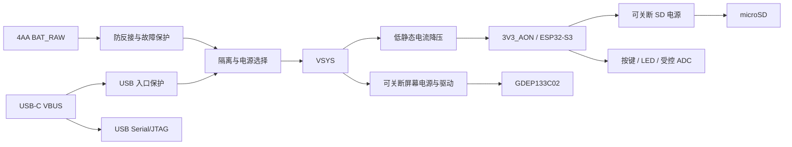

# GDEP133C02 相框 PCB 设计与实现方案

设计日期：2026-10-01。状态：方案设计；未创建正式 PCB 工程，未取得并审阅屏幕完整附件，未进行电气实测。

任务依据：[PCB 方案任务](../task/09-30-02-pcb.md)。需求基线：[总体设计](overview.md)。本文细化 PCB 的实现路径、接口和阶段门槛，供后续 agent 实施；不将待确认电路写成已验证设计。需求变更须同步总体设计、硬件接口记录和对应测试。

## 1. 范围、基线与完成条件

| 项目 | 固定需求或设计默认 |
| --- | --- |
| 屏幕 | GDEP133C02，13.3 寸，1600×1200，六色；实际后缀/版本必须核对 |
| 主控 | ESP32-S3；默认 ESP32-S3-WROOM-1-N16R8 |
| 存储与显示 | 独立 SPI microSD 与 QSPI 屏幕接口，不占用模组存储总线 |
| 交互 | 上一张、下一张，两枚按键深睡唤醒；短时状态 LED |
| 电源 | 默认 4AA 一次性碱性电池；USB-C 标准 5V 调试供电；无充电 |
| 功耗 | 电池端待机 ≤30 μA；每天 2 次完整换图，180 天，保留 30% 可用能量余量 |
| 工程与生产 | KiCad 原生工程，四层 PCB，嘉立创制造；统一使用本项目 Git |
| 首版边界 | 离线照片，原生 ESP-IDF；不加入无线传图、自动轮播、前光或机内充电 |

PCB 必须支持屏幕完整刷新、照片读取、按键唤醒、受控外设供电、电池检测、烧录调试和故障清理。半年续航是实测判定目标，不是元件选型即可保证的指标。照片格式、相册行为和错误闪灯编码沿用总体设计第 5 节，不在 PCB 文档另定义一套协议。

最终硬件完成条件为：原生源工程可恢复；ERC/DRC 与人工电路审核完成；制造文件检查通过；实物供电、显示、存储、唤醒和异常测试通过；电池端能量符合预算。文档完成与硬件完成分别记录。

## 2. 首要工作：屏幕资料闭环

### 2.1 资料获取与归档

先确认实际采购屏幕标签、后缀、FPC 标识和对应版本。资料入口如下，不能因页面型号相同就假定所有附件相互匹配：

- [GDEP133C02 产品页](https://www.good-display.com/blank7.html?productId=559)。
- [GDEP133C02 规格书入口](https://www.good-display.com/companyfile/1533.html)。
- [ESP32-133C02 参考原理图入口](https://www.good-display.com/companyfile/2036.html)。
- [参考板与程序资料入口](https://www.good-display.com/product/1223.html)。旧板页面标有 EOL，参考资料不构成购买成品板的要求。

2026-10-01 已复查规格书及原理图入口网页，未下载、解包或审核其附件。后续优先获取公开附件；缺失、受限或版本不明时列出需要用户向厂家取得的具体文件，不自行发送邮件或消息。资料只在允许归档的情况下存入 `hardware/reference/gdep133c02/`，否则记录获取路径、使用限制与校验值，不将受限内容公开提交。

每份资料登记：文件名、适用屏幕/参考板版本、资料自身版本、来源 URL、获取日期、SHA-256、许可/归档条件、已审阅范围。网页更新时间不等于附件版本。源码还需登记框架、依赖、波形/查找表来源、完整性及移植限制。

### 2.2 实施前必须形成的核对表

| 核对表 | 必填信息 | 未完成时阻塞 |
| --- | --- | --- |
| 60Pin 逐脚表 | 1–60 每脚名称、方向、电压域、功能、连接对象、未用脚处理、规格书页码及原理图对应位置 | FPC 符号、电路定型 |
| 连接器表 | 间距、接触面、插入方向、Pin 1、FPC 厚度、锁扣形式、厂家料号与机械图 | 封装、采购、结构接口 |
| 电源/时序表 | 每路电压和容差、峰值、时序、允许纹波、启动/关断/放电要求、掉电行为 | 屏幕供电、首次上电 |
| 驱动表 | 控制器数量、QSPI 数据线与控制线、逻辑电平、BUSY 极性、复位、刷新完成条件、温度及波形处理 | GPIO 冻结、固件驱动 |
| 器件表 | 专用 IC、电感、二极管、MOSFET、关键电容的料号、参数、来源、替代限制及可采购性 | BOM、原型、打板 |

对照规格书、原理图和源码交叉检查，冲突须取得适用版本解释并记录，不任选一份继续。屏幕 60Pin 不能直接按普通 SPI 屏连接；未知电压不得接上裸屏试验。若专用器件、必要波形或合法使用文件不可获得，则记录自制路线阻塞，重新讨论选屏，不擅自换型号。

### 2.3 最小驱动先于整机集成

使用 ESP32-S3 开发板、与匹配参考电路一致的自制转接/驱动原型和限流台式电源，先检查无屏电源，再接屏验证六色色块、四角、水平/垂直线和照片。在原生 ESP-IDF 下证明初始化、传输、刷新完成判断及安全关机可重复；记录波形、峰值、刷新时间和能量。开发板待机电流不能代替最终板待机验收。

允许先制作最小自制驱动板；首次完整相框 PCB 打板必须在关键驱动风险消除后进行。若厂家示例使用 Arduino，审阅和移植必要驱动逻辑，不以 Arduino 示例运行作为原生 ESP-IDF 验收。

## 3. 原理图分块与电路实现

原理图按电源入口、常供电主控、屏幕、存储、交互与检测划分层级页。以下网络名作为功能契约；屏幕实际电源轨在资料闭环后按真实名称补全。

### 3.1 电池入口与 USB 电源选择

电池使用防呆、有极性标识的连接器，电池仓通过线束连接。设置防反接和故障电流保护；器件按电池短路能力、启动峰值和线束耐流选择，不能仅用串联电阻代替保护。四节新电池最大电压按所选电池资料及实测确定，不能按标称 6V 作为最高输入。

默认采用有反向阻断的双源隔离/选择电路，电池保护后与 USB 保护后汇入 `VSYS`。实现器件可以是满足漏电预算的电源选择 IC 或独立反向阻断支路，冻结时只保留经过计算与验证的一种方案。必须保证两路源不会互相充电，也不会从电池向 USB VBUS 回灌。仅使用单个 MOSFET 时需分析体二极管，不能假设关断即双向隔离。

USB 为调试使用；若电路按较高电压选源导致电池仍供电，应在操作说明明确，并提供可断开电池的调试方式。不得依赖切换过程完全无缝：验证供电跌落、复位及屏幕恢复行为。插拔全部组合包括无电池、满电池、近截止电池、反接电池、USB 先插/后插、任一路突然移除。

USB-C 受电端两个 CC 分别配置标称 5.1 kΩ 的 Rd，不短接 CC1/CC2，不要求 PD。USB 两种插头方向均可传数据。输入电容、限流/浪涌及外设峰值须符合实际 USB 源允许电流；无电流能力检测时按适用 USB 默认供电约束设计，不能把 5V 自动视为可取任意电流。未知屏幕负载不得仅凭 USB 口能力保证刷新。

### 3.2 常供电 3.3V

`VSYS` 经低静态电流同步降压生成 `3V3_AON`，供应主控、按键上拉及必需的常供电控制逻辑。候选器件输入等级至少 8V，并覆盖实际最大输入和瞬态；输出峰值能力至少 500 mA，最终按主控、SD 和相关屏幕负载同时工作时的最大值及瞬态重新校核。500 mA 是筛选下限，不是已确认整机需求。

选择时填写：工作/绝对最大输入、低输入稳压能力、轻载效率、静态电流定义、反馈分压耗流、限流、软启动、输出电容范围、关断及反向导通行为。核算电感饱和/有效值电流、电容直流偏压后的有效容量和耐压；补偿与布局遵循所选器件参考设计。主控附近放置局部去耦，电源测量点设在模组供电脚附近。

4AA 低电量时是否仍能降压稳压取决于占空比、损耗和屏幕要求。确定截止点后测量可用电池能量；若损失过大，再评估升降压并记录变更。不得以芯片 UVLO 代替应用刷新启动阈值。

### 3.3 ESP32-S3、启动与调试

默认模组 ESP32-S3-WROOM-1-N16R8；模组电源、启动、存储占用脚和封装按[乐鑫模组规格书](https://www.espressif.com/sites/default/files/documentation/esp32-s3-wroom-1_wroom-1u_datasheet_en.pdf)核对，板级连接与布局参考[硬件设计指南](https://documentation.espressif.com/esp-hardware-design-guidelines/en/latest/esp32s3/index.html)。不按其他后缀模组替代。

预留 BOOT 按键、RESET 按键、UART TX/RX/GND 焊盘。EN 的上拉及复位延时按官方推荐和实测电源爬升确定；BOOT 不被外设意外拉低。USB D-/D+ 保留专用脚，USB ESD 和可调串联元件靠近相应连接位置。首版使用原生 USB Serial/JTAG，不增加常供电 USB-UART 芯片。

不配置常亮电源灯。外接 UART 的逻辑电压与地必须匹配，调试器不得通过 RX/TX 给关机板供电。保留供电断点用于分离模组电流与其他支路；无线功能不初始化，但仍遵守模组天线净空。

### 3.4 屏幕电源与 60Pin 连接

完整复制并审核匹配参考电路中的必要驱动功能，再优化布局及受控供电；不从产品接口名称推测内部高压。屏幕支路的输入究竟来自 `VSYS` 还是稳压后的逻辑电源，由实际参考电路输入要求决定；不允许将电池变动电压直接送入只允许固定电压的节点。

`EPD_PWR_EN` 为板级高有效请求，硬件下拉使其在复位、未烧录和深睡默认关闭。如果驱动 IC 使能极性相反，在硬件转换并保持该板级契约。默认关闭必须通过电源入口控制和器件状态实现，不能只依赖软件。需要关断的所有屏幕轨都计入支路，不能留下常开升压器。

按资料设计各轨启动、关断及放电；放电方式和电阻/开关的功耗必须计算。断电期间 SPI/QSPI、复位及 BUSY 等信号需保持允许状态，必要时使用带断电隔离的缓冲/电平转换器。串联电阻只能改善信号或限流，不能自动满足反向供电要求。掉电安全性分析必须覆盖 MCU 先复位而屏幕仍在刷新的情况。

逐脚表用于生成项目自定义 FPC 符号并与封装焊盘交叉核查，明确从哪一面观察及 Pin 1。按照连接器原厂图纸确定焊盘与锁扣空间，以实际 FPC 检查接触面；不能凭网上相似封装替代。各高压轨设标识测试点及邻近 GND，避免手持探头滑动短路。

### 3.5 microSD 可关断供电

`3V3_AON` 经高有效 `SD_PWR_EN` 控制的负载开关产生 `3V3_SD`，使能硬件默认低。负载开关按卡启动/写入峰值、压降、浪涌、关断漏电、输出放电和反向导通条件选型；卡槽附近布置去耦。卡检测可作为预留功能，不作为首版必需条件。

SPI 卡接口的必要上拉均接 `3V3_SD`，具体脚位与阻值按 SD SPI 要求核查。断电前停止访问、卸载并设置总线安全状态；特别检查 CS、MOSI、SCLK 高电平反灌，以及 MISO 上拉来源。必要时增加断电隔离器件并计入功耗。首版支持 FAT32，优先测试 8–32 GB 卡；用户休眠时换卡，读卡中拔卡作为异常测试。

### 3.6 按键、状态灯与电池检测

两枚换图按键使用可深睡唤醒的 RTC GPIO，常供电外部上拉、按下接地；板边预留两组按键线束接口，以便按机械布局使用外接按键，也可装板载键。上拉初值 100 kΩ，检查噪声、输入漏电和线束长度后确定；长按耗流及按键卡住行为纳入测试。RC 去抖可预留，不能导致唤醒失效或违背固件 30 ms 去抖策略。

LED 采用 GPIO 高有效点亮，默认低，串联限流电阻按 LED 压降和短时亮度确定；不使用以 MCU 吸电流点亮且上电默认发光的接法。故障时短闪后休眠，编码与总体设计一致。

电池采样点取保护后、选源前的电池支路，使插 USB 时仍能判断电池状态；命名为 `BAT_SENSE_SRC`，ADC 为 `BAT_ADC`。采用高侧受控分压，板级高有效 `BAT_MEAS_EN` 默认关闭；不能直接用 MCU GPIO 承受电池电压，也不能只切断分压下端使 ADC 被上端拉到高压。

计算最高电池电压、阻值公差及开关压降下的 ADC 输入，留出测量裕量；选择 ADC 衰减并校准。检查源阻抗、滤波电容和采样建立时间，以及 MCU 无电时的注入电流。关断漏电在最大输入下测量。刷新阈值由稳压压差、屏幕最低输入、实测峰值压降、温度和电池内阻共同确定，设恢复迟滞；欠压时禁止启动刷新并短时提示。

## 4. 软硬件接口与 GPIO 冻结

### 4.1 网络与状态契约

| 网络/接口 | 电源域与方向 | 复位/休眠契约 |
| --- | --- | --- |
| `EPD_PWR_EN` | MCU 输出，高有效板级请求 | 硬件默认关闭；仅在安全关机结束后撤销 |
| `SD_PWR_EN` | MCU 输出，高有效 | 硬件默认关闭；卸载后撤销 |
| `BAT_MEAS_EN` / `BAT_ADC` | MCU 输出 / ADC 输入 | 默认不采样；测量后关闭 |
| `BTN_PREV_N` / `BTN_NEXT_N` | 常供电 RTC 输入，低有效 | 上拉，按键唤醒；长按处理沿用总体设计 |
| `STATUS_LED` | MCU 输出，高有效 | 上电默认灭；反馈完成后灭 |
| `USB_DM` / `USB_DP` | USB 专用接口 | 保留给原生 USB 调试 |
| `SD_SCLK/MOSI/MISO/CS_N` | 可关断 SD 域边界 | 断电不反灌；各脚状态在映射表中锁定 |
| `EPD_SCLK/D0..D3` 与控制线 | 实际屏幕逻辑域边界 | 数量、电平、极性与安全状态由匹配资料锁定 |

GPIO 不能在 60Pin/驱动资料缺失时定一份假接线表。冻结阶段创建统一接口表，逐行记录：网络名、MCU GPIO、模组焊盘、外设管脚、SPI 控制器、方向、电压域、上下拉、启动/刷新/休眠状态、固件宏名及资料依据。该表为原理图和固件 `board` 模块的共同基准，不能分别维护相互矛盾的映射。

分配顺序：保留 USB、BOOT/RESET、UART及模组存储占用资源；给两按键分配合格 RTC 脚；分配独立通用 SPI 控制器与屏幕辅助线；分配 ADC、供电使能和 LED；最后审查绑带、复用、上电拉电平和驱动 API 限制。对每个候选脚检查实际 N16R8 模组可用性。映射完成后用最小固件编译并验证引脚能力，布板前冻结硬件版本。

### 4.2 电源操作顺序

上电/唤醒后首先保证屏幕和 SD 关闭，读取复位原因及按键，测量电池；有合格电源才使能 SD、等待稳定、初始化和挂载。按总体设计将 `.epf` 全帧读入 PSRAM，完成长度、CRC 和像素检查，再启动屏幕电源及规定的初始化/传输流程。DMA 使用经 IDF 能力检查的缓冲，避免将任意 PSRAM 指针直接用于 DMA。

刷新完成须依据已核实的 BUSY/状态定义判断；随后执行规定的休眠、关机及放电，撤销屏幕供电。成功后保存状态，卸载 SD、设置跨域信号、断 SD、关闭测量和 LED，配置按键唤醒再深睡。遇到错误或超时按同一套有界安全清理处理，不循环重试。各等待时间来自资料及原型测量，固件中记录明确上限。

硬件复位或意外掉电不保证软件清理执行。原型需验证使能默认状态、各轨衰减、隔离及重启流程；只有厂家允许的恢复方法才可用于刷新中断电测试。

## 5. 器件选型、功耗与 BOM

冻结 BOM 前，选型表每项填写厂家/完整料号、封装、关键参数与计算、资料版本、供货渠道、嘉立创/LCSC 编号、替代限制和装配方式。优先 0603 被动器件及可返修封装，FPC/模组按实际加工能力选择。关键驱动、电源和连接器不得只按封装替代；采购缺货引起变更时重新审核并更新测试。

电源 IC、选择器、保护器件、负载开关、采样开关、ESD 和电阻网络均须计算最大条件下静态消耗，不用典型值证明预算。预算统一折算到电池端，避免把 3.3V 输出侧电流直接相加为电池电流。

| 支路 | 电池端设计预算 | 核算边界 |
| --- | ---: | --- |
| 主控深睡及其转换 | 15 μA | 主控负载折算，相关轻载转换损耗 |
| 稳压器、电源选择与保护静态消耗 | 8 μA | 不重复计入上一项已统计的消耗 |
| 屏幕/SD 关断及其余漏电 | 7 μA | 分压、上拉、隔离、ESD、LED 等 |
| 合计 | ≤30 μA | 实测整板电池端为最终判据 |

按所选器件静态电流的定义明确计费边界；超预算先定位支路，不通过更改统计口径达标。4AA 串联容量 Ah 不乘四。电池可用能量需在实际负载和截止点测定，不能由标签容量直接推导。

半年判定采用总体设计的电池端能量公式：`360 × E_refresh / 3600 + 4320 × P_sleep ≤ 0.70 × E_available`，其中能量单位分别为 J 和 Wh，功率为 W。换图能量已含启动、读卡、刷新、保存与关断以及转换损耗，不再重复除以效率。电池选择与截止点冻结前不得宣称目标已达成。

## 6. KiCad 工程、布局与机械接口

### 6.1 工程基线

2026-10-01 在本机执行 `/Applications/KiCad/KiCad.app/Contents/MacOS/kicad-cli version` 得到 **10.0.6**；实施开始时复查版本，以实际创建/打开验证过的版本为基线。目前没有正式 `hardware/pcb/` 工程，历史 EasyEDA 示例不是设计输入。

后续在 `hardware/pcb/album/` 创建 `album.kicad_pro`、`album.kicad_sch`、`album.kicad_pcb`，项目符号/封装/模型、库表、README、接口与选型记录一同提交。项目资源用 `${KIPRJMOD}` 或项目内相对引用。README 记录工具版本、打开方式、检查及导出命令；不依赖个人全局库。自动备份、锁文件和 `.kicad_prl` 按实际情况忽略，不误排除设计源文件。

### 6.2 板层与布局

四层默认为 F.Cu 器件/信号、In1.Cu 连续 GND、In2.Cu 主要电源、B.Cu 信号。在选定嘉立创工艺后锁定叠层、铜厚、板厚、线宽/间距、孔径和规则，不先虚构阻抗值。大电流线宽依据峰值和允许温升计算；高压间距按实际电压及器件要求确定。

屏幕 FPC 连接器按实际出线位置优先定位；主控降压与屏幕开关电源分别布置，缩小输入、开关和回流环路，高 dv/dt 节点远离 ADC、USB、天线及屏幕控制线。QSPI 时钟/数据短而连续参考地，避免跨地缝；串联调试电阻靠近驱动端，阻值由实测确定。USB 走线按实际叠层和官方要求设置规则。去耦紧邻供电脚，关键地回路不可绕行；模组地焊盘和散热/过孔按封装要求处理。

即使不用无线，也保持乐鑫要求的天线净空；电池、屏幕背板、螺柱及铜皮一并检查。机械安装孔禁止穿过关键电路，孔周围设置与螺丝/垫片匹配的铜和器件禁布区。

### 6.3 机械接口冻结

不凭总体设计的屏幕矩形推断 FPC 或有效区偏移。结构配合前取得实际屏幕机械图和连接器模型。接口记录包含板框坐标原点、安装孔坐标/孔径、最高器件与背面高度、USB/SD/按键插拔空间、电池线束、连接器锁扣操作空间及 FPC 最小弯曲要求。

默认 PCB 放在 FPC 附近，通过独立螺柱固定；电池仓靠下，USB/SD 外缘可达，两按键通过线束适应侧边安装。具体尺寸与孔位在结构协同后冻结，不以猜测数值打板。导出带硬件版本的 PCB STEP，在 `mechanical/` 装配中检查 FPC 无拉力、无挤压、连接器可操作，换电不拆屏。

### 6.4 测试与可返修性

预留 `BAT_RAW`、保护后电池、USB VBUS、`VSYS`、模组 3.3V、SD 电源、每路屏幕轨、EN/RESET、外设使能、BUSY/CS/时钟/数据及 GND 测试点。每个高压测试点丝印标明真实轨名/电压等级，普通逻辑点不与其混排。预留整板电池输入和 MCU/SD/屏幕支路的可断开测量连接，说明短接与测量配置；正常装配不能遗留断路。

测试焊盘在装配后可探测，至少关键电源点有邻近地。板上标注硬件版本、Pin 1、极性与电池连接方向。保护器件旁和开关节点附近避免无意义的大测试焊盘，以免改变电路行为。

## 7. 分阶段实施与实物验收

| 阶段 | 后续 agent 的工作与交付 | 进入下一阶段的门槛 |
| --- | --- | --- |
| A 资料 | 取得适用附件，完成第 2 节核对表及关键器件清单 | 无未知关键电压、连接器、时序及不可得必要器件 |
| B 原型 | 自制驱动原型、原生 IDF 最小程序、波形/能量记录 | 色码/方向正确，完整刷新及安全关机可重复 |
| C 电路冻结 | 原理图、计算/选型表、GPIO/电源契约、机械接口 | ERC 和人工审核完成，功耗预算可成立 |
| D 布板生产 | PCB、DRC、STEP、制造/装配文件和预览 | 规则与制造工艺匹配，结构及装配检查通过 |
| E 板级调试 | 分支路上电、驱动/存储/按键固件、实测记录 | 所有功能及电源异常通过，剩余问题有明确处理 |
| F 续航发布 | 实际电池测试、能量预算、重复换图及恢复测试、发布包 | 能量满足半年余量，源工程可恢复，版本可追溯 |

首次上电顺序为：断开屏幕与 SD 支路 → 检查短路、方向与焊接 → 限流供电，确认保护/选源和 3.3V → 验证复位、烧录和使能默认关闭 → 单独验证 SD → 无屏测试驱动各轨与时序 → 完全断电后接屏 → 限流完成首个色块刷新。每步的限流值依据已确认支路负载制定，不能用未知的统一数值；高压未合格不得接屏。屏幕 FPC 不带电插拔。

### 7.1 必测场景与判据

| 测试 | 方法与通过条件 |
| --- | --- |
| 输入与隔离 | 第 3.1 节全部插拔组合；测两源方向电流、切换跌落和复位。USB 不给一次性电池充电，电池不回灌 VBUS；记录测量精度与反向漏电上限，不能以仪表显示零代替分析 |
| 电源瞬态 | 新电池、近截止电池、模拟内阻、SD 初始化和刷新峰值；各轨在器件及屏幕允许范围，无异常反复复位 |
| 默认状态 | 未烧录、复位、BOOT 下载、深睡与 MCU 失电时检查使能和轨电压；外设不意外启动，不经信号供电 |
| 分支路漏电 | USB 拔除后测整板及各支路；不同电池电压、装卡/不装卡、接屏状态均记录，最坏合法休眠配置 ≤30 μA |
| 屏幕 | 六色、四角、线条和照片；检查方向、边缘、控制器拼接、BUSY 和关断波形。室温至少 100 次完整换图，无死锁；不据此宣称寿命 |
| SD | FAT32 不同卡、缺卡、空目录、坏卡/文件、读卡中拔卡；固件有界清理，非法照片不启动屏幕 |
| 按键 | 单键、同时、抖动、长按、刷新中按键及卡住超过 5 秒；一次有效事件至多换一次，深睡不反复唤醒 |
| 检测与欠压 | ADC 对比校准仪表，覆盖工作电压；阈值/迟滞下不启动不可靠刷新，欠压恢复无无限启屏 |
| 断电恢复 | 在厂家允许前提下，于传输前、刷新中和状态保存时断电；恢复按确认流程完成合法刷新，不死循环 |
| 调试与机械 | USB 两方向、BOOT/RESET/UART；STEP 和实物核对接口、线束、螺丝、FPC 与天线净空，无拉力和干涉 |

电池端同步采集 V(t)、I(t)，积分完整换图能量，至少十次不同照片记录均值/最大值、耗时和峰值。待机使用适合 μA 测量的仪表，注意负担电压；刷新瞬态用电流分析仪或分流加示波器，避免平均值掩盖跌落。可编程电源和串联内阻仅作筛查，最终用指定电池、实际截止点和间歇负载测量可用能量。原型先覆盖室温，低温/高温边界依据屏幕规格及选定室内使用范围另做记录，续航结论须注明适用温度。

每项测试记录硬件/固件版本、仪器与接线、输入条件、照片/卡、电压电流波形、判据和结论。未测项标记未测，失败项阻塞相应阶段；电源或驱动器件改动后重跑受影响测试。若 4AA 不满足预算，先定位漏电与换图消耗，仍不足再提出电池方案变更，不降低换图次数代替达标。

## 8. 生产文件、恢复检查与文档验收

生产前在记录的 KiCad 版本实际打开工程，验证库和模型引用；运行 ERC/DRC，清除错误，必要豁免逐项说明依据、风险和验证，不能全局压制告警。人工检查电压域、掉电状态、保护、引脚/封装对应、连接器方向、制造能力及机械接口。文件格式合法和 CLI 导出成功不能替代电气检查或实际打开验证。

发布到 `releases/<硬件发布版本>/`，至少包含：

- Gerber（四层铜、所需阻焊/丝印、独立板框）、钻孔及金属化/非金属化说明、叠层/板厚/铜厚和特殊工艺说明；按实际工艺检查孔、槽和层映射。
- BOM、CPL、装配图、DNP 清单、极性与连接器触点说明。BOM 与 CPL 位号一致，坐标原点、单位、正反面和旋转经过嘉立创装配预览核查；模型朝向不能代替装配方向检查。参照[嘉立创 BOM 要求](https://jlcpcb.com/help/article/bill-of-materials-for-pcb-assembly)及[BOM/CPL 准备说明](https://jlcpcb.com/help/article/advice-for-bom-and-cpl-files-preparation)，下单时复核当前要求与实际库存。
- PCB STEP、ERC/DRC 报告及豁免记录、调试/烧录说明、首次上电步骤、供电限制与实测报告。
- 发布清单：源工程提交号、硬件/固件/机械匹配版本、实际工具版本、全部交付文件 SHA-256。归档后保持发布包不变，修订另建版本，按总体设计建立 Git 标签。

在独立检出目录恢复该版本，打开原生工程、执行 ERC/DRC、重新导出制造文件并核对制造内容；非确定性时间戳差异记录原因，不单靠哈希相等判断设计相同。通过 Gerber 查看器检查板框、孔位、层与铜皮，通过装配预览检查所有关键器件和底层方向。制造/装配报价采用实际文件，不填猜测价格。

本次文档验收：需求中的每项 PCB 功能均有实现路径和验证；所有尚缺的关键资料都有获取/核对步骤和阻塞关系；电源域与固件契约明确；后续工程、生产及实物验收要求完整。本文未宣称 A–F 阶段已实施，具体驱动器件、60Pin、GPIO、截止阈值、板框和工艺数值需按上述门槛收敛后冻结。
