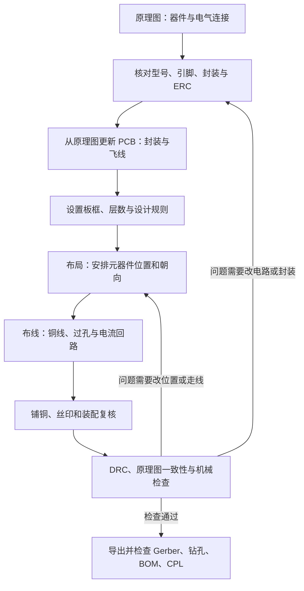

# 从原理图到 PCB 的 KiCad 新手教程

日期：2026-10-08。实例：本项目 **GDEP133C02 驱动板 v0.5-GDRC-DEBUG**，工程使用 **KiCad 10.0.6**。适合已经能读懂原理图、第一次学习 PCB 设计的读者。

原理图确定“哪些引脚必须连接”；PCB 设计确定“元器件放在哪里，铜线怎样把引脚连接起来”。从原理图更新 PCB，只是把元件、封装和连接要求带过去；后面的板框、布局、布线和检查仍需要设计。

建议一边读，一边打开[本项目 KiCad 工程](../../hardware/pcb/gdep133c02-driver/gdep133c02-driver.kicad_pro)查看。操作练习请复制完整工程文件夹到独立目录，保留本地库和模型，使用副本，避免修改正式工程。

## 1. 先看完整流程



这是学习顺序，实际工作会反复调整。例如布线太拥挤，需要返回布局；连接器方向不合适，需要重新确认机械和封装；电源回路不合理，也可能需要改变板形或电路。

完成一块 PCB 的标准不是“画面上所有飞线都消失”，而是连接正确、满足制造规则、布局适合电路工作、能够装配和测量。通电后的电源性能和显示效果还要实测。

## 2. PCB 图里的每样东西是什么

| 名称 | 你看到的东西 | 它表达什么 |
|---|---|---|
| 原理图符号 | 电阻矩形、MOS 符号等 | 器件的电气功能与引脚 |
| 封装 Footprint | 一组焊盘及周围轮廓、位号 | 实体器件焊接位置和机械占用 |
| 焊盘 Pad | 铜矩形、圆形或带孔铜环 | 器件引脚焊上去的位置 |
| 网络 Net | `GND`、`EPD_3V3` 等名字 | 应互相连通的一组引脚；同一个网络可以跨多页 |
| 飞线 Ratsnest | 细的连接提示线 | 软件提醒你这些焊盘还需要连接；不会生产为铜 |
| 走线 Track | 铜层上的线段 | 制造后真正存在的铜导体 |
| 过孔 Via | 小孔和铜环 | 通过孔壁镀铜，把不同铜层连接起来 |
| 铜区 Zone | 大面积填充区域 | 指定网络的大面积铜，例如地平面 |
| 丝印 | `R49`、`J1` 等文字和图形 | 印在板上的装配、识别提示；不导电 |
| 板框 | `Edge.Cuts` 上的闭合轮廓 | 工厂切割后的板形 |

封装不只是焊盘。它通常还包括器件外形、1 脚标记、装配层轮廓，以及表示装配空间的 Courtyard。3D 模型用于查看外形，决定电气连接的是焊盘编号和网络。

下面是当前板的顶层预览。先观察连接器、三个大电感、成组电容和排针的位置，暂时不必看懂每一条线。


*静态图只是选定层的预览，不能同时展示所有层的连接。如果阅读器不能显示 SVG，请查看[当前顶层 PCB PDF](../../hardware/pcb/gdep133c02-driver/reports/preview/board.pdf)，或在 KiCad 中逐层查看。不要拿历史 Gerber 截图判断本版 R49 是否存在。*

## 3. 原理图和 PCB 是怎样关联的

工程目录中有三类主要文件：

| 文件 | 本项目用途 |
|---|---|
| `gdep133c02-driver.kicad_pro` | 工程设置、规则等；建议从它打开工程 |
| `gdep133c02-driver.kicad_sch` | 顶层原理图入口，引用 Power、Panel、Interface 三页 |
| `gdep133c02-driver.kicad_pcb` | 一整块板的封装、焊盘、铜线、铜区、板框等 |

三张分层原理图不会自动变成三块 PCB。本项目三页的器件都放在同一块板上。

元件的对应关系不仅看名字。KiCad 还保存原理图符号的 UUID 路径，用于识别 PCB 封装对应哪个符号。保留原器件并更新，通常能保留 PCB 位置；删除后重新创建一个同位号符号，可能失去原来的关联。

以 R49 为例：

```text
原理图 R49，值 0Ω
    │ Footprint 指定 0805 封装
    ▼
PCB R49：两个实体焊盘
    ├── 焊盘 1：网络 GDRC
    └── 焊盘 2：网络 Q7_GATE
```

注意这里的两种“连接”：GDRC 和 Q7_GATE 是两个不同网络，**由装上的 R49 在电路中连通**。PCB 不应额外画一条铜线绕过 R49，把两个网络直接短接，否则拆掉 R49 也不能隔离调试。

## 4. 第一步：整理原理图并确定封装

### 4.1 开始布局前需要什么

原理图应有完整位号、明确型号或规格、正确引脚连接和封装。先运行电气规则检查 ERC，理解并解决结果，而不是为了得到零错误随意加电源标记或 NC。

NC 是有意不连接的引脚；DNP 是有意不装配的器件，两者不同。本板 J2.16 是 NC；TP1–TP26 是 DNP 铜测试点，虽然不装实体器件，它们仍保留铜焊盘及网络。

### 4.2 怎样在 KiCad 查看封装

在原理图中把鼠标放在器件上，打开“符号属性”（默认快捷键 `E`），查看 Footprint 字段。批量指定可使用“工具 → 分配封装”，逐一确认型号和焊盘图，不要只按外形相似来选。

本项目把正式封装保存到工程本地 `Driver` 库，因此原生原理图中能看到这样的名称：

| 器件 | 本地 Footprint 字段 | 重点核对 |
|---|---|---|
| R49 | `Driver:Resistor_SMD__R_0805_2012Metric` | 两个焊盘、0805 尺寸；此处 0805 为英制，器件本体约 2.0×1.25mm |
| U5 | `Driver:Package_TO_SOT_SMD__SOT-23-6` | 六脚的编号与 TPS22917DBVR 对应；不能只核对“六个焊盘” |
| FPC1 | `Driver:FPC_05FB_60PH20` | 60 个信号脚、固定焊盘、0.5mm 间距、1 脚方向、插入空间及触点配接 |

符号上的引脚 1 对应封装的焊盘 1，和它在画面上位于左边还是右边无关。MOS 还要核对 G/S/D 的实际编号；二极管要核对阴极编号；连接器要分清图纸的观察方向。

FPC1 的封装表示**连接器底座焊到板上**。屏幕排线插进底座，不是把屏幕软排线直接焊到这些焊盘上。底座的固定焊盘也需要保留，但不等于增加两个屏幕信号脚。

**这一阶段完成时：** 每个要放到 PCB 上的器件都有正确封装，能解释符号引脚如何对应焊盘，ERC 的问题已处理。ERC 不会自动证明购买型号和封装尺寸匹配。

## 5. 第二步：把原理图更新到 PCB

从工程管理器打开 PCB 编辑器，选择“工具 → 从原理图更新 PCB”（默认 `F8`）。现代 KiCad 的常规流程直接在编辑器间传递信息，不必手工导出和导入旧式网表文件。[KiCad PCB 编辑器说明](https://docs.kicad.org/10.0/en/pcbnew/pcbnew.html)

先读更新列表，再执行：确认新增、删除、封装变化、值和网络变化是否符合预期。初次做板时，很多封装会集中出现在一个待放置区域，焊盘间出现飞线。已有板更新时，可能只新增几件，并调整已有焊盘网络。

**已有 PCB 却提示添加大量已有器件时：** 先停止更新。2026-10-08 已修复本项目此前生成的 PCB 关联路径兼容问题；正常更新保持“根据参考位号重新链接”关闭。现有板可能提示大量图纸/元数据字段更新，这与“添加封装”不同。使用正式修复后的文件或重新复制练习副本，见[关联修复记录](../../hardware/pcb/gdep133c02-driver/docs/pcb-symbol-links.md)。

初次更新完成后，你有“应该放哪些器件、应该怎样连”的信息，但还没有完成元件位置和铜线设计。原理图画得整齐，PCB 也不会自动按同样的左右顺序排好。

**本项目的 R49 是一个很好的更新实例：** 新增 R49、TP25、TP26；Q7 的 1 脚和 R13 的 2 脚从 GDRC 改为 Q7_GATE；原来直接接到栅极的铜连接要拆分，才能把 R49 串进去。仅仅添加一个电阻封装，而不检查旧铜线，就可能保留错误的直连。

不要盲目启用按位号重新关联、删除无对应符号的封装等选项。本板还有 H1–H4 安装孔这种 PCB 机械对象，不属于三页原理图的装配清单，不能误删。

**这一阶段完成时：** 更新列表符合预期，器件和网络正确进入 PCB。此时允许存在待布线的飞线；下一步负责实现连接。

## 6. 第三步：确定板形、层数和规则

### 6.1 板框决定物理边界

在右侧层列表选 `Edge.Cuts`，使用图形线或矩形等工具画板框。轮廓必须闭合，无多余重叠线或意外缝隙，单位和尺寸正确。画在丝印层的矩形不会成为切割边界。

本板为 **100×80mm**。四个安装孔为 **Ø3.2mm NPTH**，相对板框左上角的孔中心为 `(5,5)`、`(95,5)`、`(5,75)`、`(95,75)` mm。NPTH 表示孔壁不镀铜，主要作机械用途。

本板在 KiCad 画布中的绝对板框坐标是左上 `(50,50)`、右下 `(150,130)` mm。这些是设计坐标，并不表示成品板从零点开始还多出 50mm。尺寸、绝对坐标和制造坐标原点是三个不同概念。

孔边还要给螺钉、垫圈和工具留空间，不能只保证孔中心落在板内。连接器需考虑排线插拔、锁扣操作、线缆弯曲和外壳边界。

### 6.2 四层是什么

在“板设置”里查看铜层和物理叠层。当前板厚设定 **1.6mm**，铜层顺序如下：

```text
元件主要装在这一面
F.Cu        顶层铜：焊盘、走线、地铜区
绝缘材料
In1.Cu      内层铜：本板以 GND 平面为主
绝缘材料
In2.Cu      内层铜：部分连接走线
绝缘材料
B.Cu        底层铜：走线、地铜区
```

四层是四层铜，不是四面都装元器件。当前 101 个 SMT 器件全部顶面装配；底层有铜线和铺铜，也不代表底面需要贴片。

| 层 | 作用 | 是否用于导电 |
|---|---|---|
| `F.Cu` / `In1.Cu` / `In2.Cu` / `B.Cu` | 实际铜线路 | 是 |
| `F.Mask` / `B.Mask` | 指定阻焊开窗，焊盘等位置露铜 | 本身不是导体 |
| `F.Paste` / `B.Paste` | 锡膏钢网的开口图形 | 不作为 PCB 铜线 |
| `F.Silkscreen` / `B.Silkscreen` | 位号、极性、接口提示 | 否 |
| `Edge.Cuts` | 板边及切割轮廓 | 否 |
| `F.Fab` / `B.Fab`、Courtyard | 装配参考与空间检查 | 否 |

### 6.3 规则先于布线

在“板设置 → 设计规则”中查看约束、网络类及预定义走线/过孔尺寸。最小允许值和设计时选用的值不同：规则允许 0.2mm，并不表示所有电源线都应该画 0.2mm。

| 本板现有参数 | 用来理解什么 |
|---|---|
| 最小线宽、铜间距 0.2mm | 当前规则底线；不是通用高压或载流设计结论 |
| 逻辑信号及部分 FPC 扇出 0.2mm | 密集焊盘附近的连接 |
| 功率核心常用 0.5mm，输入/部分供电支路 0.8mm | 不同路径按功能采用不同宽度 |
| 通孔过孔外径 0.6mm、钻孔 0.3mm | 铜环直径与孔径不是同一尺寸 |

线宽要结合电流、铜厚、所在层、长度、温升和压降选定；间距要结合电压、制造能力和使用环境核对。过孔也有电阻和载流限制。当前参数是本项目的设计记录，功率瞬态、温升等仍未实测验收，不能拿来保证任意电路。

**这一阶段完成时：** 板形、孔位、层数及规则明确，机械布局有依据，不会布完线才发现放不进外壳。

## 7. 第四步：布局——决定每个元件放在哪里

布局对电路表现的影响很大。即使最终连接完全一样，把去耦电容或采样电阻放得很远，也可能增加噪声、压降和寄生效应。

### 7.1 推荐摆放顺序

1. 先安排板框、安装孔、FPC1、J1、J2。连接器由外部线缆和结构决定位置，检查插拔方向后再锁定。
2. 按 Power、Panel、Interface 分组摆放，跨页仍按电气功能协同。例如电源输出和 FPC 相关电容需结合连接器位置安排。
3. 在每组内优先摆放关键器件，随后安排去耦、采样、反馈等外围。
4. 留出布线路径、手焊空间和探头接触位置，再微调小器件。

常用操作是移动 `M`、旋转 `R`、属性 `E`。翻面会把元件移到另一装配面并改变观察关系，不是普通旋转；本板练习应保持 SMT 在顶面。默认快捷键可以修改，macOS 的组合键与功能键行为也受系统设置影响，找不到命令时使用菜单或快捷键设置。

### 7.2 用本板理解布局为什么这样安排

| 区域 | 你应重点观察 | 理由 |
|---|---|---|
| J1、U5 与输入电容 | 输入供电路径和输入/输出电容连接长度 | 供电电流要有低阻路径，局部电容减少瞬态扰动 |
| U5 附近 C36 | CT 支路短、连接网络正确 | C36 接 SW_CT 与 BENCH_3V3；不能因为“电容常接地”误接 GND |
| L1、Q1、D1、C12、C13 | 两个开关阶段的电流回路 | 电源回路面积和寄生影响开关尖峰与噪声 |
| U1 及 RESEP 反馈 | 功率流向与采样引出位置 | 采样应反映电阻两端压差，不能混入大段功率铜线压降 |
| FPC1 与成组输出电容 | 对应网络、连接距离和扇出空间 | 密集连接需要兼顾电源旁路和可布线性 |
| R49、R13、TP25、TP26 | 栅极连接短，两个测试点可触及 | 保留调试断点，同时让探针接触不易短到相邻焊盘 |

“靠近”不只指两个器件中心距离近。应看对应焊盘之间的铜线长度，以及电流从哪个焊盘出去、从哪里回来。器件旋转 180°，有时不改变中心位置就能显著缩短实际连接。

### 7.3 用 L1 升压支路练习看回路

当前原理图的导通储能路径是：

```text
EPD_3V3 → L1 → LX → Q1 → RESEP → U1 → GND
```

Q1 关断后的能量转移路径经过：

```text
EPD_3V3 → L1 → LX → D1 → VDDP → 输出电容/负载 → GND
```

输入电容 C12 和输出电容 C13 参与局部电流闭合。布局时把这些阶段展开看，才能辨认需要缩小的回路，而不只是按原理图从左到右排器件。LX 是快速变化的开关节点，应控制铜面积、避免靠近敏感反馈；这不等于把 LX 所有连接无限缩窄，还需满足电流需求。

这些是评审布局的原则。本板已有走线并不表示其全部瞬态和 Kelvin 采样性能已通过实测。

**这一阶段完成时：** 关键功能组紧凑、连接器可用、器件间留有空间，能解释关键电流路径，飞线拥挤程度降低。不要急于为了消灭飞线，把一切连接绕得很远。

## 8. 第五步：布线——让飞线变成真实铜线

### 8.1 一条普通连接怎样画

在副本中选择铜层，把鼠标放在起点焊盘上，启动“布线”（默认 `X`）。确认状态显示的网络正确，选择合适线宽，沿允许路径向目标焊盘走；完成到目标焊盘的连接后退出工具。优先采用清楚的 45° 转折和短路径。

KiCad 交互布线器可以绕开障碍或推挤已有线，但不会替你决定哪条电源回路最重要。遇到不能通过的间隙，先确认规则和几何空间，再决定换层或调整布局，不要直接把规则调小来硬塞。

飞线只显示待连接关系，不规定必须沿那条直线布铜。一条网络有多个焊盘时，连好部分后，剩余飞线可能重新选择提示端点，这是正常现象。

### 8.2 以 R49 为完整例子

当前连接要求如下，左边是原理图的电气关系，右边是 PCB 要实现的焊盘连接：

| 网络 | 当前应连接的焊盘 |
|---|---|
| GDRC | FPC1.3、R49.1、TP25.1 |
| Q7_GATE | R49.2、Q7.1、R13.2、TP26.1 |
| EPD_3V3 | R13.1 及同网其他供电焊盘 |

```text
FPC1.3 ── GDRC 铜线 ── R49.1   [装上 0Ω 电阻]   R49.2 ── Q7_GATE 铜线 ── Q7.1
              │                                          ├── R13.2
            TP25.1                                       └── TP26.1
```

实际画法是先连接 GDRC 这组焊盘，再连接 Q7_GATE 这组焊盘，**不在两个 R49 焊盘之间布铜**。两侧网络通过 R49 的实体电阻连接。即使 0Ω 阻值接近零，KiCad 仍把两侧当成两个网络。

在 PCB 中打开 R49 属性或点击两个焊盘，核对网络；使用网络高亮查看铜线、过孔和焊盘是否都属于预期网络。隐藏无关层，沿着实际连接检查，不能只看电阻旁边的文字。

R49 到 Q7 的走线属于栅极驱动，电流主要是栅极充放电，布局应关注边沿、长度和寄生。它与 L1 主电流路径不同，不需要机械照搬主电源线宽。TP25、TP26 属于各自网络的测量分支，别为了摆得整齐而拉长驱动线路。

### 8.3 什么时候换层，过孔怎样起作用

同层两条不同网络的铜线不能互相交叉接触。空间不足时可以通过过孔换到另一铜层走，避开障碍后再回到目标焊盘所在层。

布线过程中使用“放置过孔”（默认 `V`），选择目标铜层再继续；多层板需要确认实际目标层。本板常规通孔过孔贯穿板厚，但它不会把经过的所有铜区都自动短接：不同网络的铜会按间距避让，是否连接由焊盘层设置、铜区和网络决定。

过孔不是“免费跳线”。它增加占用、寄生和制造结构，敏感信号的返回路径也要跟随层间变化考虑。已经存在电镀通孔的器件焊盘，在铜层设置允许时可以承担层间连接；SMD 焊盘本身通常只在一个表面铜层。

### 8.4 推荐布线顺序

先处理空间最受限制或电气最敏感的路径：FPC 扇出、功率开关回路、采样/反馈、关键驱动和电源分配；再完成普通信号和测试分支。遇到复杂冲突，可以返回调整布局。

不要只按“最短的先连”来做：一个随意连上的普通信号可能堵住关键功率路径。也不需要为了 SPI 画面好看而盲目蛇形等长，应先明确时序和信号完整性要求。

**这一阶段完成时：** 铜线连接正确网络，线宽符合各路径要求，必要过孔已安排；关键回路和信号返回路径经过复核。剩余 GND 飞线可能要由铺铜连接，下一节继续完成。

## 9. 第六步：铺铜与地回流

### 9.1 为什么要铺地

电流必须形成闭合回路。信号或电源的正向路径画好了，返回路径也要合理；高频返回电流分布与参考平面的几何关系有关，不能只用“所有 GND 最后都接通”判断回流质量。

本板 In1.Cu 以 GND 平面为主，顶底面也有 GND 铜区。大面积地铜有助于形成低阻抗参考和回流路径，但窄颈、切割、孤岛或信号跨越平面缺口会降低效果。


*观察不同网络的过孔周围避让、平面的连续性；图上大片铜不代表任何位置都能承担同样的返回电流。*

### 9.2 怎样建立铜区

选择目标铜层，使用“添加填充区域”，在属性中指定网络 GND、间距及焊盘连接方式，再画铜区边界。边界线定义范围，填充后才产生实际铜几何。

热焊盘连接用几条较窄铜辐条把焊盘连到大铜区，便于焊接；实心连接通常更利于电流和散热，但手焊更难加热。选择要结合器件用途，不能一律改成实心或一律采用很窄热辐条。

添加或移动器件、改线后，执行“填充所有区域”（默认 `B`），然后重新检查。铜区会按当前网络与间距重新避让。铜岛被自动去除时，应理解它是否原本有连接需要，而不是因为铜颜色不够满就强留。

注意：给大铜区赋 GND 网络，不等于所有地焊盘都必然接通；被其他铜切断、距离过远或层间未连接的焊盘仍可能未连接。需要结合 DRC、连接状态和实际铜几何确认。

**这一阶段完成时：** GND 铜区已按最新布局填充，返回路径合理，没有靠旧填充制造的假连接或意外短路。

## 10. 第七步：补丝印并检查是否能装配

现在回到实体使用场景看板：烙铁能否接近焊盘？FPC 锁扣是否有空间？测试点能否放探针？电感或连接器装上后会不会挡住其他焊盘？

丝印应保留清楚的位号、接口定义、1 脚和极性提示，不压到露铜焊盘或落在板外。R49 的两个测试点最好能快速辨认驱动侧和栅极侧；J1 的 3.3V/GND 提示应容易看见。

Courtyard 可以帮助发现装配空间重叠，但不涵盖所有线缆、锁扣和工具空间。机械图和实物尺寸仍要核对。放大查看 FPC1 的信号焊盘与固定焊盘，确认接触面、排线厚度和 Pin1 对应，不能只看丝印轮廓。

用“查看 → 3D 查看器”检查外形、方向和器件遮挡；模型缺失时不会显示完整器件，本板 FPC1、U5 等存在模型缺口，铜测试点和安装孔也不需要完整器件模型。仓库未保留过期整板 STEP；3D 看起来漂亮也不能证明连接器配接正确。

## 11. 第八步：检查 PCB，而不只是看画面

### 11.1 ERC、DRC 和原理图一致性各看什么

| 检查 | 主要回答的问题 | 无法单独证明 |
|---|---|---|
| ERC | 原理图引脚类型、电源驱动和未连接等是否符合电气规则 | 电路参数正确、屏幕一定能工作 |
| PCB DRC | 铜间距、线宽、未连接、板框等是否符合启用的规则 | 动态稳定性、温升、有效电容和显示性能 |
| 原理图一致性检查 | PCB 器件和引脚网络是否对应当前原理图 | 原理图本身设计正确 |
| 机械/装配复核 | 板形、孔位、封装、方向和空间是否可用 | 必须配合尺寸及实物确认 |

PCB 编辑器中打开“检查 → 设计规则检查”，确保铺铜是最新的，并启用与原理图的比较检查。双击结果定位具体对象，读清是哪两个对象、哪一条规则发生冲突，再修复和复查。

### 11.2 新手常见问题怎样处理

| 看到的现象 | 先查什么 | 正确处理方向 |
|---|---|---|
| 飞线或未连接残留 | 铜线端点是否真正接到焊盘；换层是否有过孔；铜区是否连通 | 完成实际连接，重新填充并复查 |
| 两条线间距不足 | 网络、线宽、周围空间和规则 | 改路径、换层或重新布局 |
| 焊盘与走线短路 | 更新网络后是否留下旧铜线 | 删除错误连接并按新网络重布 |
| 板框错误 | Edge.Cuts 端点、重复线、单位 | 修复闭合轮廓 |
| 封装缺失或不对应 | Footprint 字段、本地库解析、符号关联 | 回原理图确认封装并重新更新 |
| 器件轮廓重叠 | Courtyard 和实际本体、插拔空间 | 调整位置，不能只隐藏轮廓 |
| DRC 通过但封装看着奇怪 | 制造商引脚图、尺寸和观察方向 | 核对型号与封装，必要时重选并重布 |
| 重铺铜后问题出现或消失 | 修改后旧填充是否已失效 | 检查最新铜几何，不以旧截图为依据 |

正常设计不应该靠关闭检查或随意添加排除来获得零错误。确实需要例外时，应有明确技术依据和记录。

### 11.3 当前板的检查状态怎样读

截至当前 v0.5 记录：ERC 0、DRC 0、未连接 0、原理图一致性问题 0；317 个连接引脚与设计记录及 PCB 一致，已在 KiCad GUI 实际打开。当前还未完成实物 FPC 配接、电源波形、容量、温升、显示和安全掉电验收。

数量容易混淆：**103 个装配件＋26 个铜测试点＝129 个原理图实体**；PCB 再加 4 个安装孔，合计 133 个封装。101 个顶面 SMT 加 J1/J2 两个直插排针，才是采购装配数。封装数量不等于采购数量。

这些是现有[检查记录](../../hardware/pcb/gdep133c02-driver/reports/validation-status.json)，不是本教程重新完成通电测试的声明。

## 12. 原理图改了以后，PCB 怎样跟着改

只移动原理图上的绘图位置，且没有改变连接、器件或封装，通常不会要求 PCB 重布；但修改接法、增删器件、换封装会影响 PCB。

按下面顺序处理一次修改：

1. 在原理图修改，确认封装和连接，保存并运行 ERC。
2. 从原理图更新 PCB，先审阅变化，确认关联正确。
3. 放置新增封装；若封装改变，重新检查焊盘和机械空间。
4. 清理不再正确的旧铜线，补齐新连接；必要时调整布局。
5. 重新铺铜，运行 DRC 和原理图一致性检查，再做装配复核。
6. 检查通过后，导出一个新版本的制造文件，整套配套使用。

已有走线通常会保留，但这不保证它们在新设计中仍正确。换封装可能让焊盘移位；拆掉 0Ω 电阻可能留下两段悬空铜；新网络可能和旧线构成意外直连。对本项目 R49 的修改，就必须同时保证“两侧有连接”和“没有绕过电阻的铜短接”。

更改 PCB 的电气意图时，应更新原理图保持一致。本项目的 `design-data.json` 是辅助固定接法记录，不会自动双向同步 CAD；正式改版也应同步该记录，再完成检查与导出。

## 13. 第九步：从 PCB 生成生产文件

PCB 文件是编辑设计的源文件。工厂制板通常按每一层的 Gerber 和钻孔文件生产；采购与贴片还需要清单和位置。

| 产物 | 工厂或你用它做什么 |
|---|---|
| Gerber | 各层铜、阻焊、丝印、板框几何 |
| 钻孔文件 | 通孔和非电镀孔的位置、孔径 |
| BOM | 采购什么元件、规格、位号、数量 |
| CPL / 贴片坐标 | 元件放在哪里、朝向和装配面 |
| Paste 层 | 做锡膏钢网；单独使用 |

学习导出时，在 PCB 编辑器中用“文件 → 绘制”，选择 Gerber、输出目录和需要的层，再生成钻孔文件。钢网的 Paste 层与制板铜层用途不同。[KiCad 官方制造输出说明](https://docs.kicad.org/10.0/en/getting_started_in_kicad/getting_started_in_kicad.html#fabrication-outputs)

本板的制板包包含四个铜层、顶底阻焊、顶底丝印、板框这 **9 份 Gerber**，以及 PTH/NPTH 两份钻孔文件；顶面 Paste 放在可选钢网目录。再用 Gerber 查看器实际打开导出层和钻孔，检查板框、孔位和铜层，没有把不需要的辅助层误当生产层。

本项目还有针对嘉立创格式的导出脚本，使用新的版本目录，避免覆盖历史包。新手练习不要直接运行正式发布脚本覆盖或混用产物；先理解 GUI 输出，正式制造核对使用同一版本的审阅包。

当前 [v0.5 制造审阅包](../../hardware/pcb/gdep133c02-driver/releases/jlc-cn-review-v0.5-linkfix-2026-10-08/README.md)的完整 BOM 为 103 件；SMT BOM 和 CPL 都是 101 件；手焊 BOM 是 J1/J2。TP1–TP26 不采购，也不进入 SMT CPL。

Gerber、钻孔和坐标必须使用一致的设计坐标体系，不能只把 CPL 单独平移。元件旋转还要结合贴片平台预览核对，不能以数值能解析就认为装配方向正确。

自己手焊通常先下单裸 PCB，再按完整 BOM 买料。是否使用钢网取决于锡膏回流还是烙铁工艺。具体文件上传和下单选择见[嘉立创下单必读](../raw/嘉立创下单必读.md)。现有包仍是工程审阅包，平台匹配和实物验收要继续完成。

## 14. 三个练习：在副本里亲手走一遍

### 练习一：从原理图找到一个实际焊盘

打开副本 Power 页，找到 R49，查看值、封装及两个网络。再到 PCB 使用查找功能找 R49，逐一查看两个焊盘及网络高亮。

**完成标准：** 能指出 R49.1 接 GDRC、R49.2 接 Q7_GATE，找到 TP25/TP26、Q7.1 和 R13.2，解释为何不允许用铜直接跨接 R49 两脚。这个练习只查看，不需要改板。

### 练习二：移动一个器件，再恢复连接

在副本 PCB 中，将 R49 小幅移动到附近空位置，保持顶面且先不改变原理图。使用普通移动时，观察旧走线端点是否还接到焊盘；拖动有时会尝试保留连接，但不能以工具名称判断最终结果。

删除失效的短连接段，按 GDRC 和 Q7_GATE 分别重新布线，保留测试点和 R13 接法；重新铺铜并跑 DRC。位置变化本身通常不需要从原理图重新导入，连接和封装没有改变。

**完成标准：** 能解释哪些线需要重布，未连接和短路问题已经处理。最后撤销或丢弃练习副本，正式板保持原样。

### 练习三：改封装，再观察更新影响

另外复制一份完整工程。把原理图 R49 的 0805 封装改为一个正确两焊盘的 1206 电阻封装，仅作为观察练习，不作为正式采购变更。运行 ERC，更新 PCB，查看焊盘间距、Courtyard 和已有连接的变化，重新布局、补线、铺铜和检查。

**完成标准：** 能说明电气引脚编号没变，但实体焊盘位置及装配空间已变，因此仍需 PCB 复查。记录练习封装变化，不能继续拿原 0805 采购规格宣称练习板可装配，也不能用练习文件下单。

## 15. 学完后，你应该能自己回答这些问题

- 为什么原理图更新完成后还有飞线？飞线会被工厂生产出来吗？
- 符号的引脚 1 如何对应 PCB 焊盘 1？旋转封装是否改变编号？
- FPC1 为什么显示一排焊盘，却是插排线的底座？
- 为什么 0Ω 电阻两侧仍是两个网络？绕过 R49 的铜线有什么影响？
- 为什么先布局再布线？C12 离 Q1 很远会给回路带来什么变化？
- 四层板和双面贴片有什么区别？过孔如何换层而不短到地平面？
- 铺铜后为何还要查返回路径、未连接和最新填充？
- 哪些原理图修改需要更新 PCB？更新后为什么还要重布和 DRC？
- DRC 为零，是否能证明电源一定稳定、屏幕一定能亮？
- Gerber、BOM、CPL 各给谁用？为什么要保持同一版本？

建议先完成“找到 R49 焊盘”这一课，再看 U5 输入供电和 L1 开关回路，最后研究 FPC1 的密集连接。这样先掌握单条连接，再理解电源布局，逐步读懂整块板。

## 16. 进一步阅读与资料版本

- [元器件统计与必要性](原理图子图元器件统计与必要性.md)：按页、按功能区核对每个器件。
- [Power 原理详解](../../hardware/pcb/gdep133c02-driver/docs/power-circuit-explained.md)、[Panel 原理详解](../../hardware/pcb/gdep133c02-driver/docs/panel-circuit-explained.md)、[Interface 原理详解](../../hardware/pcb/gdep133c02-driver/docs/interface-circuit-explained.md)：理解为什么连接这些器件。
- [GDRC 调试断点说明](../../hardware/pcb/gdep133c02-driver/docs/gdrc-debug.md)：R49 和两个测试点的使用边界。
- [工程学习指南](../../hardware/pcb/gdep133c02-driver/docs/learning-guide.md)：已有工程的快速查阅练习。
- [KiCad 10.0 官方入门](https://docs.kicad.org/10.0/en/getting_started_in_kicad/getting_started_in_kicad.html)、[PCB 编辑器手册](https://docs.kicad.org/10.0/en/pcbnew/pcbnew.html)：查询菜单、工具和快捷键。

本教程以工程实际使用的 10.0.6 为准；2026-10-08 查看时，在线官方入门页面已注明基于 10.0.7，属于同一 10.0 文档系列，界面细节可能不同。快捷键以本机设置为准，菜单中文译名也可能略有差异。

这是按当前工程连接与检查记录编写的学习文档，并未修改正式原理图、PCB 或制造产物，也未新增硬件验收结论。
