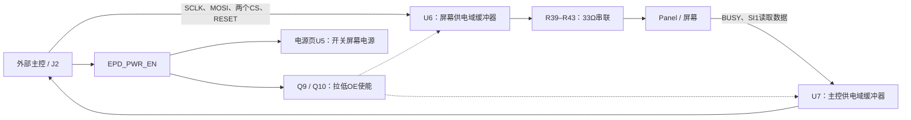

# Interface 原理图详解：主控怎样与屏幕可靠通信

日期：2026-10-02。对应 [interface.kicad_sch](../interface.kicad_sch)，请同时查看 [Interface PDF](../reports/panel-interface-redraw/interface.pdf)或[高清图](../reports/panel-interface-redraw/interface.png)。

本页有 **43 个实体对象：19 个需要装配的器件、24 个PCB铜测试点**。本文解释每一个对象，并展开信号方向、使能、默认状态、供电和取值理由。完整型号、封装、DNP与逐脚网络见附录。配套阅读：[Panel详解](panel-circuit-explained.md)、[电源页详解](power-circuit-explained.md)。

## 1. 本页解决什么问题

电源页负责给屏幕供电，Panel页负责把电源和信号送到屏幕60针连接器；Interface页在外部ESP32-S3开发板与屏幕之间提供：

1. 明确的3.3V控制接口和共地连接。
2. 主控到屏幕的五路信号缓冲，以及屏幕返回的两路缓冲。
3. 输出高阻控制，配合屏幕供电开关处理供电域不同步。
4. 信号默认状态、串联阻尼位置和测量焊盘。

接口缓冲器、默认状态和测试点是本项目的工程设计，不能全部说成商家原图已有。厂家屏幕资料及参考代码支持首版采用Standard SPI、双片选、共用复位与BUSY；本页在此基础上增加缓冲与默认处理。原理图连接已经确定，但33Ω阻尼效果、动态时序、异常掉电和最大通信速度还没有实测。



箭头表示信号方向；EPD_PWR_EN同时参与接口使能和输入电源控制，**接口能通信不意味着屏幕已经完成上电初始化**。

## 2. 先理解几个容易混淆的概念

**缓冲器**把输入逻辑状态重新驱动到输出，减轻上游驱动负担，并建立明确的输出供电域。U6/U7为非反相缓冲：使能时输入低输出低、输入高输出高。它们没有协议解析功能，也不是存储器或电源稳压器。

**高阻态Z**表示输出级暂不主动拉高或拉低，电平由外部上下拉、负载及漏电决定。高阻不等于输出低，也不等于器件与外部电路完全没有电气联系。

**低有效信号**在名称中用`_N`标记，例如RES_N拉低表示复位，CS_M_N拉低表示选中。OE_N拉低才允许输出。

**上拉／下拉电阻**提供弱默认状态；**串联电阻**位于信号传输路径，主要改变边沿与脉冲电流。二者不能互相替代。

**共地**让两端用同一电位判断高低电平。本设计没有光耦或数字隔离器，两个3.3V供电域并不构成电气隔离。

## 3. 功能区1：J2外部主控连接器

### 3.1 J2是什么，为什么这样分配管脚

J2为2×8、2.54mm间距双排排针，候选TSW-108-07-G-D。它提供七个通信信号、一个供电使能信号、七个GND脚和一个HOST_3V3脚。

| 位号 | 器件与实际连接 | 作用和理由 |
| --- | --- | --- |
| J2 | 16针主控接口，完整管脚表如下 | 将开发板与驱动板的信号、参考地和主控侧逻辑电源集中连接；多处地连接为信号提供返回路径和接线便利，实际干扰改善取决于线束／PCB布局。 |

| J2脚号 | 网络 | 方向及含义 |
| --- | --- | --- |
| 1 | HOST_SCLK | 主控输出SPI时钟，经U6到屏幕SCLK |
| 2 | GND | 共地 |
| 3 | HOST_MOSI | 主控输出数据，经U6到屏幕SI0 |
| 4 | GND | 共地 |
| 5 | HOST_MISO | 主控读取输入，来自U7缓冲后的SI1 |
| 6 | GND | 共地 |
| 7 | HOST_CS_M_N | 主控输出，选择屏幕Master控制部分 |
| 8 | GND | 共地 |
| 9 | HOST_CS_S_N | 主控输出，选择屏幕Slave控制部分 |
| 10 | GND | 共地 |
| 11 | HOST_RES_N | 主控输出，共用低有效复位 |
| 12 | GND | 共地 |
| 13 | HOST_BUSY_N | 主控输入，屏幕忙状态的非反相缓冲结果 |
| 14 | GND | 共地 |
| 15 | EPD_PWR_EN | 主控输出，控制电源页U5及本页Q9/Q10 |
| 16 | HOST_3V3 | 开发板提供的3.3V，只给主控侧U7等逻辑供电 |

**J2.16不供应屏幕刷新所需的大电流。** 屏幕电源从电源页J1输入，经U5和供电分支到EPD_3V3、AVDD。两个输入必须共地，但不能凭“都是3.3V”就把它们随意短接或用细信号线替代屏幕电源线。

接口只允许本项目约定的3.3V逻辑；即使某候选缓冲器输入能承受其他电压，也不代表整套屏幕接口支持5V。J2没有独立ESD／浪涌防护器件，33Ω电阻不是静电保护保证。本页也没有锁定ESP32具体GPIO，实际接线应核对开发板的存储、启动绑带和引脚限制。

## 4. 功能区2：U6把主控信号送到屏幕

### 4.1 U6内部通道怎样使用

U6为SN74LVC244APWR，8路非反相三态缓冲器，分为两组四路。20脚VCC接EPD_3V3，10脚GND接地；1脚和19脚分别为两组低有效OE，本板都接OE_PANEL_N。

| 通道 | U6输入脚与网络 | U6输出脚与网络 | 后续路径 |
| --- | --- | --- | --- |
| 1A1→1Y1 | 2：HOST_SCLK | 18：BUF_SCLK | R39→SCLK→FPC1.28 |
| 1A2→1Y2 | 4：HOST_MOSI | 16：BUF_MOSI | R40→SI0→FPC1.29 |
| 1A3→1Y3 | 6：HOST_CS_M_N | 14：BUF_CS_M_N | R41→CS_M_N→FPC1.27 |
| 1A4→1Y4 | 8：HOST_CS_S_N | 12：BUF_CS_S_N | R42→CS_S_N→FPC1.58 |
| 2A1→2Y1 | 11：HOST_RES_N | 9：BUF_RES_N | R43→RES_N→FPC1.24 |
| 2A2→2Y2 | 13：GND | 7：NC | 未用 |
| 2A3→2Y3 | 15：GND | 5：NC | 未用 |
| 2A4→2Y4 | 17：GND | 3：NC | 未用 |

输入A到输出Y的箭头不是放大模拟电压的运算放大器符号，而是逻辑缓冲方向。U6跟随屏幕供电域，使其输出驱动能力与屏幕电源的存在相关。与直接由持续供电的MCU驱动断电屏幕相比，这提供了可控的输出边界。

未用CMOS输入接地，避免悬空导致电平不确定和额外消耗；未用输出保持NC，不能因为“不用”就接地，否则通道被使能时可能产生输出冲突。

### 4.2 33Ω串联电阻怎样帮助通信

在快速跳变下，走线／排线表现出分布电感、电容和传播延迟。缓冲输出可能过冲、下冲或反射；源端串联电阻与驱动器输出阻抗共同影响波形。33Ω给本项目一个可调的阻尼位置，并降低部分瞬态电流。

不能把33Ω看成“3.3V降压电阻”。逻辑接收端静态电流很小时，直流压降通常很小；主要压降发生在输入电容充放电期间。若要讨论反射，常见的源端匹配目标是`Rdriver + Rseries ≈ Z0`，但本板线束／扇出阻抗及输出阻抗尚未完整量化，33Ω属于工程起点，**不是已计算验证的精确匹配值**。

例如假设接收端总电容20pF，仅33Ω对应的RC量级是0.66ns；这只是算例，实际边沿还包括驱动器、布线和探头负载。不能据此给出本板最高SPI频率。

### 4.3 默认状态为什么有些上拉、有些下拉

U6关闭为高阻时，接收端也需要确定状态：SCLK、SI0默认低，两个片选默认高，RESET默认低。本项目选择100kΩ弱拉，以较小静态负担建立默认电平。

默认低的复位将屏幕保持在复位状态，等待主控主动释放；默认高的片选避免未初始化时误选中屏幕。SCLK默认低是本项目的初始状态选择，不能由这只下拉电阻自行推导完整SPI CPOL/CPHA；软件仍应按屏幕协议设置时钟和采样边沿。

这些默认电阻放在U6的**输出侧**。它们不会越过高阻缓冲器，把J2或U6输入端也拉到确定电位。本页没有为五个HOST输入各加一个独立外部默认电阻；主控复位／断开时，即使OE已经禁用，输入端仍可能悬空并影响芯片消耗。实际主控内部上下拉、输出配置和复位行为必须一并审核，不能把“屏幕端默认安全”扩大为“所有输入都已确定”。

| 位号 | 是什么、接在哪里 | 作用及为什么这样设计 |
| --- | --- | --- |
| U6 | SN74LVC244APWR，VCC=EPD_3V3，GND=GND | 五路向屏幕非反相缓冲，OE控制输出高阻；选择带Ioff的候选器件配合屏幕断电。其余三路输入接地、输出NC。 |
| R39 | 33Ω，BUF_SCLK—SCLK | 时钟的串联阻尼位置；时钟振铃可能造成多次阈值跨越，需重点验证。 |
| R40 | 33Ω，BUF_MOSI—SI0 | 写数据路径的串联阻尼位置，改善脉冲与振铃的工程起点。 |
| R41 | 33Ω，BUF_CS_M_N—CS_M_N | Master片选的边沿／瞬态电流约束，不改变低有效逻辑。 |
| R42 | 33Ω，BUF_CS_S_N—CS_S_N | Slave片选的独立阻尼位置；两个片选不能互相短接。 |
| R43 | 33Ω，BUF_RES_N—RES_N | 复位传输的串联阻值，保留边沿／振铃调整位置；不是复位定时器。 |
| R44 | 100kΩ，SCLK—GND | U6高阻时给时钟默认低电平；软件时序仍需另行配置。 |
| R45 | 100kΩ，SI0—GND | U6高阻时避免屏幕数据输入悬空。 |
| R46 | 100kΩ，CS_M_N—VDDIO | 使屏幕供电存在时Master默认不选中；上拉到屏幕接口域，避免由主控常供电上拉向断电屏幕供电。 |
| R47 | 100kΩ，CS_S_N—VDDIO | 同理，使Slave默认不选中，保持两个控制部分的独立片选。 |
| R48 | 100kΩ，RES_N—GND | 缓冲关闭时保持低有效复位；释放复位由主控经U6驱动，100k不是完整复位延时设计。 |
| C34 | 100nF/50V，EPD_3V3—GND | U6局部供电去耦，为逻辑输出切换提供短回路电荷；50V是耐压标注，芯片供电仍为3.3V。 |

100kΩ在被主动驱动到与默认方向相反的3.3V电平时，电流约33µA，功率约109µW；同向驱动时电阻两端压差接近零。五只电阻的总消耗取决于实际信号状态，不能始终按五倍33µA计入待机。阻值更大可降低反向驱动时的电流，但也会提高漏电和噪声敏感性；100k是当前项目折中，不是所有屏幕／线束的通用值。

## 5. Q9/R37与Q10/R38：为什么要用MOS控制OE

### 5.1 单路原理

以屏幕侧为例：

```text
EPD_3V3 → R37(10kΩ) → OE_PANEL_N → U6.1、U6.19
                         │
                      Q9漏极
EPD_PWR_EN → Q9栅极       │
                      Q9源极 → GND
```

Q9为2N7002 NMOS。EPD_PWR_EN低时，Q9关闭，R37把OE拉高，U6输出高阻；EPD_PWR_EN高时，Q9导通，把OE拉低，U6通道使能。主控侧Q10/R38同样工作，但上拉电源是HOST_3V3。

这样既把“高电平允许屏幕工作”变成芯片要求的“低电平OE使能”，也让两个OE各自回到本地电源。Q9/Q10的栅极共用控制信号，不直接短接两个供电域；这是一种开漏式下拉控制，不是电气隔离。

默认关闭还依赖电源页的R30经R29给EPD_PWR_EN／SW_ON提供下拉。本页Q9/Q10没有另加栅极下拉；不能把原理图分页当成它们完全悬空，也不能在独立测试本页时忽略这个跨页依赖。

### 5.2 每个器件的作用

| 位号 | 是什么、接在哪里 | 作用及为什么这样设计 |
| --- | --- | --- |
| Q9 | 2N7002-7-F NMOS，G=EPD_PWR_EN、S=GND、D=OE_PANEL_N | 高使能信号驱动低有效OE；关闭时释放OE由本地电源上拉，导通时只需吸收上拉和输入相关电流。 |
| R37 | 10kΩ，OE_PANEL_N—EPD_3V3 | Q9关闭时禁用U6；比100k的信号默认弱拉更强，降低OE节点对漏电／扰动的敏感性，同时增加导通时静态电流。 |
| Q10 | 2N7002-7-F NMOS，G=EPD_PWR_EN、S=GND、D=OE_HOST_N | 同一使能信号控制主控侧U7，保持其OE的本地供电参考。 |
| R38 | 10kΩ，OE_HOST_N—HOST_3V3 | Q10关闭时禁用U7；主控电源仍存在、屏幕已关闭时仍能提供默认高电平。 |

两侧都在3.3V且Q9/Q10导通时，每个上拉路径约`3.3/10k=0.33mA`，两路合计约0.66mA；电阻各约1.09mW。这是使能期间的真实静态负担，不是MOS栅极持续消耗0.33mA。MOS栅极理想静态电流很小，切换时需要充放栅极电荷。

这个消耗比电源页R30的33µA更大。屏幕带电深睡且EPD_PWR_EN保持高时，它仍存在；使能拉低后，上拉与漏极节点同为高电位，电阻消耗基本消失，但U7自身仍可能由HOST_3V3供电。

2N7002阈值只是小电流下开始导通的定义，不等于3.3V时已经有数据表在更高VGS下标注的导通电阻。这里所需下拉电流较小，实际仍应核对温度和批次下的OE低电平裕量；不能借用其功率额定值代替逻辑测量。[Diodes 2N7002原厂资料](https://www.diodes.com/datasheet/download/2N7002.pdf)。

## 6. 功能区3：U7把屏幕状态和读数据送回主控

| 通道 | U7输入 | U7输出 | 作用 |
| --- | --- | --- | --- |
| 1A1→1Y1 | 2：BUSY_N | 18：HOST_BUSY_N | 主控读取屏幕忙状态，不反相 |
| 1A2→1Y2 | 4：SI1 | 16：HOST_MISO | 主控读取屏幕返回数据，不反相 |
| 其余六路 | 6/8/11/13/15/17：GND | 14/12/9/7/5/3：NC | 未用输入固定，输出不连接 |

| 位号 | 是什么、接在哪里 | 作用及设计理由 |
| --- | --- | --- |
| U7 | SN74LVC244APWR，20=HOST_3V3、10=GND、1/19=OE_HOST_N | 将屏幕返回信号驱动到主控域；与U6同型号便于统一候选选型，但信号方向和供电不同。 |
| C35 | 100nF/50V，HOST_3V3—GND | U7局部供电去耦，不是从屏幕电源给U7供电的桥接电容。 |

BUSY_N的上拉R1在Panel页；SI1是Standard SPI方案的读线。这里没有在这两路加入与R39–R43同样的33Ω电阻，也没有给SI1增加独立默认上拉／下拉。U7使能而屏幕返回端不驱动时，必须检查源端电平是否确定；不能把BUSY有R1的结论套到SI1上。

**U7高阻时，HOST_BUSY_N／HOST_MISO并不自动为高或低。** 本页没有它们的输出端默认电阻；主控输入上下拉和软件读状态应配合配置。尤其U7被禁用时读取HOST_BUSY_N为高，不能证明屏幕空闲。

## 7. Ioff、OE与两个电源域怎样配合

SN74LVC244A提供供电为0V时的输出关闭／漏电规格Ioff；OE则是在器件正常供电时控制输出是否驱动。两者配合处理“主控仍有电，屏幕没有电”等状态，但Ioff不是零漏电，也不是全电压、任意顺序的隔离保证。低有效OE的基本功能为：OE低时Y跟随A，OE高时Y为Z。未用输入应保持明确电平。[TI SN74LVC244A原厂资料，功能表及Partial Power Down章节](https://www.ti.com/lit/ds/symlink/sn74lvc244a.pdf)。

| 屏幕域EPD_3V3 | 主控域HOST_3V3 | EPD_PWR_EN | 接口应怎样理解 |
| --- | --- | --- | --- |
| 有电 | 有电 | 低 | Q9/Q10关闭，两组OE上拉，输出高阻，屏幕端默认电阻接管状态 |
| 有电 | 有电 | 高 | 两组缓冲使能；只有主控输入配置和屏幕初始化正确才允许正常通信 |
| 无电 | 有电 | 低 | U6断电，U7由R38禁用；带电主控到断电器件的漏电需按Ioff条件核对 |
| 有电 | 无电 | 低／高阻 | 默认目标为禁用；实际依赖R30及主控断电脚行为，必须验证不会反向供电 |
| 电源正在升降 | 电源正在升降或保持 | 正在切换 | 静态逻辑表不能保证动态安全；U5、OE、RESET、CS和残压需一起观察 |

EPD_PWR_EN同时使能U5和缓冲器，因此不存在本页硬件独立规定的“电源稳定后再延时使能通信”定时器。启动时先配置时钟／数据／复位低、片选高，再拉高使能，等待供电稳定，按屏幕要求复位初始化。正常关闭需完成刷新、电源关闭／深睡流程和接口状态处理，再拉低使能。[接口与电源状态约定](interface-power-state.md)记录已采用次序。

**默认关闭不等于安全故障掉电。** 主控意外复位可能立刻关闭U5并中断刷新；Ioff和下拉电阻不能代替面板要求的关断命令及残压验收。

## 8. 功能区4/5：24个测试点逐个解释

测试点都是单脚铜焊盘，候选记录为“PCB test pad”，不需要采购和焊接一个电子元件。它们在原生工程中标记DNP并排除BOM；PDF的红叉表示不装配器件，**不表示焊盘没有铜或电气网络断开**。

| 位号 | 接在哪里 | 为什么设置／可以观察什么 |
| --- | --- | --- |
| TP1 | BENCH_3V3 | 检查台式输入电压，与TP2比较可辨别输入路径／开关后的压降；不测输入电流。 |
| TP2 | VIN | U5之后的供电，观察启停、启动浪涌导致的压降，与输入对比。 |
| TP3 | AVDD | 三路电感变换器的模拟输入，检查分支压降和脉动。 |
| TP4 | EPD_3V3 | 屏幕逻辑／U6／温度传感器供电，检查它是否与功率域互相扰动。 |
| TP5 | VDDP | 正模拟输出，观察目标值、纹波、启动与残压；目标值不能仅凭名字确定。 |
| TP6 | VDDN | 负模拟输出，测量相对于板上GND的负电位及纹波。 |
| TP7 | VGH | 正栅极电源，观察电荷泵输出及开启／关闭变化。 |
| TP8 | VGL | 负栅极电源，观察负电荷泵输出及残压。 |
| TP9 | VBB_3P5V | TFT_VCOM相关负偏置输入，区分偏置电源和公共电极驱动输出。 |
| TP10 | VNCP_3P5V | 另一负偏置输入；现有R16=0Ω连接TP9对应网络，两点名义同电位但实际路径可能有压降。 |
| TP11 | TFT_VCOM | 公共电极驱动输出，观察其工作波形；不能当作普通固定3.3V电源使用。 |
| TP12 | VCC | 屏幕内部LDO／VCC1配对节点，只用于观察，不能向它强行灌入外部3.3V。 |
| TP13 | BUSY_N | 屏幕侧原始忙状态，在U7之前；可与主控读取值对照检查缓冲使能和传输。 |
| TP14 | EPD_PWR_EN | 检查主控供电使能，关联U5和Q9/Q10动作；不是直接观察OE的测试点。 |
| TP15 | RES_N | 屏幕侧复位，在U6和R43之后，检查实际复位到达情况。 |
| TP16 | GND | 一个公共参考地焊盘，为附近测量提供接入位置。 |
| TP17 | GND | 同一GND网络，增加参考地测量位置，不是另一个隔离地。 |
| TP18 | GND | 同一GND网络，用于缩短合适测量点的地连接。 |
| TP19 | GND | 同一GND网络，提供额外地焊盘；位置便利不保证回流寄生为零。 |
| TP20 | GND | 同一GND网络，可配合附近信号测量。 |
| TP21 | GND | 同一GND网络，方便板上不同区域的参考连接。 |
| TP22 | GND | 同一GND网络，不能当负电源或独立模拟地。 |
| TP23 | GND | 同一GND网络，保留额外测量接触位置。 |
| TP24 | GND | 同一GND网络，增加测试接入便利，不能由其数量推定噪声性能。 |

普通接地示波器地夹应接板上GND；不能把负电源、LX或MOS源极误当作地。测差分电压和高边采样要用适合的差分方法。探头／测试焊盘也会引入电容和支线，观察高速信号时要记录探头方法，不能把测量引起的振铃当成原电路固有结果。

本页没有为三只电流采样电阻、GDRP等所有环路节点设置独立测试点，所以不能只靠这24个焊盘完成全部电源验收。可测电压不等于可在该焊盘接大电流负载。

## 9. 怎样完整地读一次本页

以SCLK为例：`J2.1 → HOST_SCLK → U6.2 → U6.18 → BUF_SCLK → R39 → SCLK → FPC1.28`。然后沿R44到GND确认默认低，再沿U6的OE引脚到Q9/R37确认什么时候传输、什么时候高阻。

以BUSY为例：`FPC1.25 → BUSY_N → U7.2 → U7.18 → HOST_BUSY_N → J2.13`。先看Panel页R1提供的上拉，再看Q10/R38是否允许U7输出，最后判断主控读取有没有意义。屏幕BUSY低表示忙，但“高”只在供电、通信路径和时序都有效时才可用于判断状态。

建议依次回答：这条线谁驱动？缓冲器供电来自哪里？关闭时谁决定电平？默认与有效逻辑是否一致？串联电阻是否真的位于发送路径？每个答案都能从图上找到对应器件。

## 10. 已有依据与验证边界

确认的连接包括全部43个对象、8个缓冲通道的物理脚映射、两个本地OE电路、信号默认状态和测试点网络。仍需验证实际SPI边沿／速度、3.3V驱动与OE电平裕量、SI1及主控输入高阻时状态、Ioff实际适用条件、动态电源排序和异常掉电。

本次仅编写说明文档，没有改变原理图、PCB或元器件取值，没有进行通电测试。现有ERC/DRC记录见[重画验证说明](panel-interface-redraw.md)；当前重画版实际GUI打开验证缺口仍按该说明记录。

## 附录：当前43个对象的完整字段与逐脚连接

下表由当前原生页的字段和KiCad导出网表整理。料号为工程候选，不代表已经完成采购验收。NC保持有意不连接；DNP不等于NC。

| 位号 | 当前值 | 候选完整料号 | 项目封装 | DNP | 逐脚网络 |
| --- | --- | --- | --- | --- | --- |
| J2 | HOST 3V3 LOGIC | TSW-108-07-G-D | Connector_PinHeader_2.54mm__PinHeader_2x08_P2.54mm_Vertical | no | 1=HOST_SCLK<br>2=GND<br>3=HOST_MOSI<br>4=GND<br>5=HOST_MISO<br>6=GND<br>7=HOST_CS_M_N<br>8=GND<br>9=HOST_CS_S_N<br>10=GND<br>11=HOST_RES_N<br>12=GND<br>13=HOST_BUSY_N<br>14=GND<br>15=EPD_PWR_EN<br>16=HOST_3V3 |
| U6 | SN74LVC244APWR | SN74LVC244APWR | Package_SO__TSSOP-20_4.4x6.5mm_P0.65mm | no | 1=OE_PANEL_N<br>2=HOST_SCLK<br>3=NC<br>4=HOST_MOSI<br>5=NC<br>6=HOST_CS_M_N<br>7=NC<br>8=HOST_CS_S_N<br>9=BUF_RES_N<br>10=GND<br>11=HOST_RES_N<br>12=BUF_CS_S_N<br>13=GND<br>14=BUF_CS_M_N<br>15=GND<br>16=BUF_MOSI<br>17=GND<br>18=BUF_SCLK<br>19=OE_PANEL_N<br>20=EPD_3V3 |
| R39 | 33 ohm | RC0603FR-0733RL | Resistor_SMD__R_0603_1608Metric | no | 1=BUF_SCLK<br>2=SCLK |
| R40 | 33 ohm | RC0603FR-0733RL | Resistor_SMD__R_0603_1608Metric | no | 1=BUF_MOSI<br>2=SI0 |
| R41 | 33 ohm | RC0603FR-0733RL | Resistor_SMD__R_0603_1608Metric | no | 1=BUF_CS_M_N<br>2=CS_M_N |
| R42 | 33 ohm | RC0603FR-0733RL | Resistor_SMD__R_0603_1608Metric | no | 1=BUF_CS_S_N<br>2=CS_S_N |
| R43 | 33 ohm | RC0603FR-0733RL | Resistor_SMD__R_0603_1608Metric | no | 1=BUF_RES_N<br>2=RES_N |
| R44 | 100k ohm | RC0603FR-07100KL | Resistor_SMD__R_0603_1608Metric | no | 1=SCLK<br>2=GND |
| R45 | 100k ohm | RC0603FR-07100KL | Resistor_SMD__R_0603_1608Metric | no | 1=SI0<br>2=GND |
| R46 | 100k ohm | RC0603FR-07100KL | Resistor_SMD__R_0603_1608Metric | no | 1=CS_M_N<br>2=VDDIO |
| R47 | 100k ohm | RC0603FR-07100KL | Resistor_SMD__R_0603_1608Metric | no | 1=CS_S_N<br>2=VDDIO |
| R48 | 100k ohm | RC0603FR-07100KL | Resistor_SMD__R_0603_1608Metric | no | 1=RES_N<br>2=GND |
| C34 | 100nF/50V | GRM188R71H104KA93D | Capacitor_SMD__C_0603_1608Metric | no | 1=EPD_3V3<br>2=GND |
| Q9 | 2N7002-7-F | 2N7002-7-F | Package_TO_SOT_SMD__SOT-23 | no | 1=EPD_PWR_EN<br>2=GND<br>3=OE_PANEL_N |
| R37 | 10k ohm | RC0603FR-0710KL | Resistor_SMD__R_0603_1608Metric | no | 1=OE_PANEL_N<br>2=EPD_3V3 |
| Q10 | 2N7002-7-F | 2N7002-7-F | Package_TO_SOT_SMD__SOT-23 | no | 1=EPD_PWR_EN<br>2=GND<br>3=OE_HOST_N |
| R38 | 10k ohm | RC0603FR-0710KL | Resistor_SMD__R_0603_1608Metric | no | 1=OE_HOST_N<br>2=HOST_3V3 |
| U7 | SN74LVC244APWR | SN74LVC244APWR | Package_SO__TSSOP-20_4.4x6.5mm_P0.65mm | no | 1=OE_HOST_N<br>2=BUSY_N<br>3=NC<br>4=SI1<br>5=NC<br>6=GND<br>7=NC<br>8=GND<br>9=NC<br>10=GND<br>11=GND<br>12=NC<br>13=GND<br>14=NC<br>15=GND<br>16=HOST_MISO<br>17=GND<br>18=HOST_BUSY_N<br>19=OE_HOST_N<br>20=HOST_3V3 |
| C35 | 100nF/50V | GRM188R71H104KA93D | Capacitor_SMD__C_0603_1608Metric | no | 1=HOST_3V3<br>2=GND |
| TP1 | BENCH_3V3 | PCB test pad | TestPoint__TestPoint_Pad_D1.5mm | yes | 1=BENCH_3V3 |
| TP2 | VIN | PCB test pad | TestPoint__TestPoint_Pad_D1.5mm | yes | 1=VIN |
| TP3 | AVDD | PCB test pad | TestPoint__TestPoint_Pad_D1.5mm | yes | 1=AVDD |
| TP4 | EPD_3V3 | PCB test pad | TestPoint__TestPoint_Pad_D1.5mm | yes | 1=EPD_3V3 |
| TP5 | VDDP | PCB test pad | TestPoint__TestPoint_Pad_D1.5mm | yes | 1=VDDP |
| TP6 | VDDN | PCB test pad | TestPoint__TestPoint_Pad_D1.5mm | yes | 1=VDDN |
| TP7 | VGH | PCB test pad | TestPoint__TestPoint_Pad_D1.5mm | yes | 1=VGH |
| TP8 | VGL | PCB test pad | TestPoint__TestPoint_Pad_D1.5mm | yes | 1=VGL |
| TP9 | VBB_3P5V | PCB test pad | TestPoint__TestPoint_Pad_D1.5mm | yes | 1=VBB_3P5V |
| TP10 | VNCP_3P5V | PCB test pad | TestPoint__TestPoint_Pad_D1.5mm | yes | 1=VNCP_3P5V |
| TP11 | TFT_VCOM | PCB test pad | TestPoint__TestPoint_Pad_D1.5mm | yes | 1=TFT_VCOM |
| TP12 | VCC | PCB test pad | TestPoint__TestPoint_Pad_D1.5mm | yes | 1=VCC |
| TP13 | BUSY_N | PCB test pad | TestPoint__TestPoint_Pad_D1.5mm | yes | 1=BUSY_N |
| TP14 | EPD_PWR_EN | PCB test pad | TestPoint__TestPoint_Pad_D1.5mm | yes | 1=EPD_PWR_EN |
| TP15 | RES_N | PCB test pad | TestPoint__TestPoint_Pad_D1.5mm | yes | 1=RES_N |
| TP16 | GND | PCB test pad | TestPoint__TestPoint_Pad_D1.5mm | yes | 1=GND |
| TP17 | GND | PCB test pad | TestPoint__TestPoint_Pad_D1.5mm | yes | 1=GND |
| TP18 | GND | PCB test pad | TestPoint__TestPoint_Pad_D1.5mm | yes | 1=GND |
| TP19 | GND | PCB test pad | TestPoint__TestPoint_Pad_D1.5mm | yes | 1=GND |
| TP20 | GND | PCB test pad | TestPoint__TestPoint_Pad_D1.5mm | yes | 1=GND |
| TP21 | GND | PCB test pad | TestPoint__TestPoint_Pad_D1.5mm | yes | 1=GND |
| TP22 | GND | PCB test pad | TestPoint__TestPoint_Pad_D1.5mm | yes | 1=GND |
| TP23 | GND | PCB test pad | TestPoint__TestPoint_Pad_D1.5mm | yes | 1=GND |
| TP24 | GND | PCB test pad | TestPoint__TestPoint_Pad_D1.5mm | yes | 1=GND |

覆盖核对：正文逐个解释43个对象，与当前原生页的位号集合完全一致，无缺项、无重复项。附录管脚连接来自现有KiCad导出网表。
