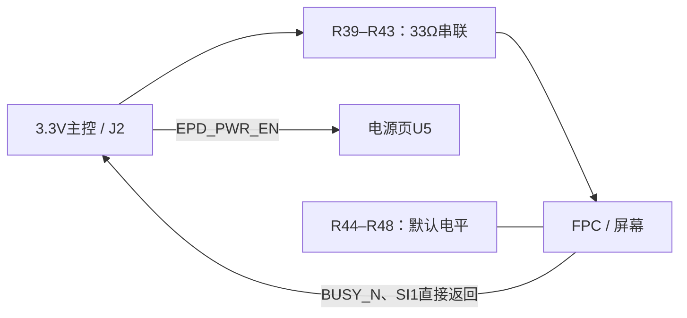

# Interface 原理详解：v0.5直连接口（本页接法不变）

2026-10-07。对应[interface.kicad_sch](../interface.kicad_sch)及[当前原理图PDF](../reports/schematic.pdf)。本页11个装配元件，加24个仅铜焊盘的测试点。U6/U7、Q9/Q10、R37/R38、C34/C35已删除。

## 1. 信号怎样走

原来的缓冲器提供各供电域驱动和掉电隔离；现在删除这些芯片，使采购和焊接简单。**33Ω电阻没有电平转换或掉电隔离能力。** 接口只允许3.3V主控、共地、短排线，依赖软件管理上电和断电。

## 2. J2连接器逐脚解释

J2为2×8、2.54mm排针，便于手工焊接和用短排线连接开发板。奇数脚传信号，偶数2–14脚为地；16脚现在NC，不能再给它接HOST_3V3。J1才是屏幕稳压3.3V供电入口。

| J2脚 | 网络 | 用途 |
|---|---|---|
| 1 | HOST_SCLK | 主控输出SPI时钟，经R39到SCLK |
| 3 | HOST_MOSI | 主控写数据，经R40到SI0 |
| 5 | SI1 | 屏幕读数据直接到主控输入 |
| 7 | HOST_CS_M_N | Master低有效片选，经R41 |
| 9 | HOST_CS_S_N | Slave低有效片选，经R42 |
| 11 | HOST_RES_N | 低有效RESET，经R43 |
| 13 | BUSY_N | 屏幕忙状态直接到主控输入 |
| 15 | EPD_PWR_EN | 电源开关ON，R30默认下拉 |
| 2、4、6、8、10、12、14 | GND | 主控与驱动板共同参考地 |
| 16 | NC | 无电气连接，留空 |

不能把J2当成5V兼容口。BUSY和SI1是主控输入，禁止配置成推挽输出；不能用断电时的BUSY读值判断刷新完成。

## 3. 五只33Ω串联电阻

R39=时钟，R40=写数据，R41=Master片选，R42=Slave片选，R43=复位。它们串在信号路径中，配合源端阻抗减缓边沿振铃、尖峰和反射。33Ω沿用当前工程值，不保证所有线长、频率均最优。建议连接线不超过10cm，首次调试从低SPI频率开始，之后结合波形提高。

电流主要在信号翻转、给输入电容充电时流过；稳态输入阻抗高，所以电阻不会像电源限流器那样持续产生大压降。它们不能阻止高电平从主控经屏幕保护结构反灌电源。

## 4. 五只100k默认电平电阻

| 元件 | 接法 | 原理与理由 |
|---|---|---|
| R44 | SCLK—GND | MCU高阻时让时钟默认低，避免悬空 |
| R45 | SI0—GND | MCU高阻时让写数据默认低 |
| R46 | CS_M_N—EPD_3V3 | 屏幕有电、MCU高阻时片选默认不选中 |
| R47 | CS_S_N—EPD_3V3 | 同上，用于Slave |
| R48 | RES_N—GND | MCU高阻时保持复位 |

100k是弱上拉／下拉，正常GPIO可以覆盖它。与3.3V相反状态时每只约耗33µA。屏幕断电后两个片选上拉失去电源，不能让主控为了“片选不选中”继续输出高电平。停SPI、完成关机命令后必须把所有主控输出信号置低，再关闭U5。

BUSY的2k上拉R1位于Panel页，从EPD_3V3供电；它与这里的100k弱默认电阻用途不同。SI1输入不要使能主控内部上拉，否则关屏后仍可能反灌。

## 5. 测试点是什么

TP1–TP24是PCB铜焊盘，全部DNP，不购买24个测试点元件，也不计入103个装配件。它们让探针接触输入、控制、功率轨和反馈等节点。测正负高压时以GND为参考，确认仪表范围；LX和采样节点的测试引线会影响波形，应尽量缩短回路。

## 6. 软件必须承担的约束

遵循[完整接口与供电状态约定](interface-power-state.md)：主控先上电、最后断电；关屏时所有主控输出低、输入无内部上拉；完成正常POF/深睡后再关U5；禁止热插拔。本页没有硬件隔离，对异常复位、失电和错误GPIO配置不提供安全掉电保证。本轮不交付固件。

## 附录：11个装配件及24个铜测试点

| 位号 | 当前值 | 完整候选料号 | 本地封装 | 逐脚网络 |
|---|---|---|---|---|
| R39 | 33 ohm | RC0603FR-0733RL | Driver:Resistor_SMD__R_0603_1608Metric | 1=HOST_SCLK 2=SCLK |
| R40 | 33 ohm | RC0603FR-0733RL | Driver:Resistor_SMD__R_0603_1608Metric | 1=HOST_MOSI 2=SI0 |
| R41 | 33 ohm | RC0603FR-0733RL | Driver:Resistor_SMD__R_0603_1608Metric | 1=HOST_CS_M_N 2=CS_M_N |
| R42 | 33 ohm | RC0603FR-0733RL | Driver:Resistor_SMD__R_0603_1608Metric | 1=HOST_CS_S_N 2=CS_S_N |
| R43 | 33 ohm | RC0603FR-0733RL | Driver:Resistor_SMD__R_0603_1608Metric | 1=HOST_RES_N 2=RES_N |
| R44 | 100k ohm | RC0603FR-07100KL | Driver:Resistor_SMD__R_0603_1608Metric | 1=SCLK 2=GND |
| R45 | 100k ohm | RC0603FR-07100KL | Driver:Resistor_SMD__R_0603_1608Metric | 1=SI0 2=GND |
| R46 | 100k ohm | RC0603FR-07100KL | Driver:Resistor_SMD__R_0603_1608Metric | 1=CS_M_N 2=EPD_3V3 |
| R47 | 100k ohm | RC0603FR-07100KL | Driver:Resistor_SMD__R_0603_1608Metric | 1=CS_S_N 2=EPD_3V3 |
| R48 | 100k ohm | RC0603FR-07100KL | Driver:Resistor_SMD__R_0603_1608Metric | 1=RES_N 2=GND |
| J2 | HOST 3V3 LOGIC | TSW-108-07-G-D | Driver:Connector_PinHeader_2.54mm__PinHeader_2x08_P2.54mm_Vertical | 1=HOST_SCLK 2=GND 3=HOST_MOSI 4=GND 5=SI1 6=GND 7=HOST_CS_M_N 8=GND 9=HOST_CS_S_N 10=GND 11=HOST_RES_N 12=GND 13=BUSY_N 14=GND 15=EPD_PWR_EN 16=NC |

测试点清单（DNP，铜焊盘，无采购项）：

| 位号 | 当前值 | 完整候选料号 | 本地封装 | 逐脚网络 |
|---|---|---|---|---|
| TP1 | BENCH_3V3 | PCB test pad | Driver:TestPoint__TestPoint_Pad_D1.5mm | 1=BENCH_3V3 |
| TP2 | EPD_3V3 | PCB test pad | Driver:TestPoint__TestPoint_Pad_D1.5mm | 1=EPD_3V3 |
| TP3 | EPD_3V3 | PCB test pad | Driver:TestPoint__TestPoint_Pad_D1.5mm | 1=EPD_3V3 |
| TP4 | EPD_3V3 | PCB test pad | Driver:TestPoint__TestPoint_Pad_D1.5mm | 1=EPD_3V3 |
| TP5 | VDDP | PCB test pad | Driver:TestPoint__TestPoint_Pad_D1.5mm | 1=VDDP |
| TP6 | VDDN | PCB test pad | Driver:TestPoint__TestPoint_Pad_D1.5mm | 1=VDDN |
| TP7 | VGH | PCB test pad | Driver:TestPoint__TestPoint_Pad_D1.5mm | 1=VGH |
| TP8 | VGL | PCB test pad | Driver:TestPoint__TestPoint_Pad_D1.5mm | 1=VGL |
| TP9 | VBB_3P5V | PCB test pad | Driver:TestPoint__TestPoint_Pad_D1.5mm | 1=VBB_3P5V |
| TP10 | VNCP_3P5V | PCB test pad | Driver:TestPoint__TestPoint_Pad_D1.5mm | 1=VBB_3P5V |
| TP11 | TFT_VCOM | PCB test pad | Driver:TestPoint__TestPoint_Pad_D1.5mm | 1=TFT_VCOM |
| TP12 | VCC | PCB test pad | Driver:TestPoint__TestPoint_Pad_D1.5mm | 1=VCC |
| TP13 | BUSY_N | PCB test pad | Driver:TestPoint__TestPoint_Pad_D1.5mm | 1=BUSY_N |
| TP14 | EPD_PWR_EN | PCB test pad | Driver:TestPoint__TestPoint_Pad_D1.5mm | 1=EPD_PWR_EN |
| TP15 | RES_N | PCB test pad | Driver:TestPoint__TestPoint_Pad_D1.5mm | 1=RES_N |
| TP16 | GND | PCB test pad | Driver:TestPoint__TestPoint_Pad_D1.5mm | 1=GND |
| TP17 | GND | PCB test pad | Driver:TestPoint__TestPoint_Pad_D1.5mm | 1=GND |
| TP18 | GND | PCB test pad | Driver:TestPoint__TestPoint_Pad_D1.5mm | 1=GND |
| TP19 | GND | PCB test pad | Driver:TestPoint__TestPoint_Pad_D1.5mm | 1=GND |
| TP20 | GND | PCB test pad | Driver:TestPoint__TestPoint_Pad_D1.5mm | 1=GND |
| TP21 | GND | PCB test pad | Driver:TestPoint__TestPoint_Pad_D1.5mm | 1=GND |
| TP22 | GND | PCB test pad | Driver:TestPoint__TestPoint_Pad_D1.5mm | 1=GND |
| TP23 | GND | PCB test pad | Driver:TestPoint__TestPoint_Pad_D1.5mm | 1=GND |
| TP24 | GND | PCB test pad | Driver:TestPoint__TestPoint_Pad_D1.5mm | 1=GND |

当前整板v0.5另外在Power页增加TP25/TP26，合计26个铜测试点；Interface页仍为24个。P4调试接法见[GDRC调试说明](gdrc-debug.md)。
