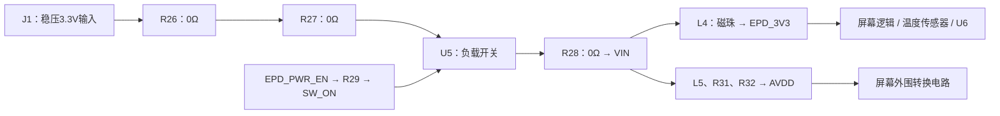
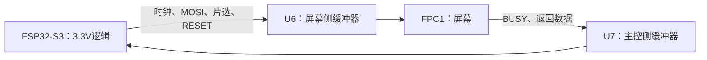

# 用这块屏幕驱动板学习 KiCad

编写日期：2026-10-02。面向第一次接触原理图和 PCB 的学习者，使用本工程验证过的 KiCad 10.0.6。先完成阅读练习，再在副本里修改。

学完应能做到：解释这块板如何供电和通信，找到某个引脚在 PCB 上的对应焊盘，检查一次改动，并判断制造文件与工程状态是否一致。

## 1. 已经完成了什么

| 成果 | 你可以学到什么 | 位置 |
| --- | --- | --- |
| 屏幕资料归档与采用决策 | 如何把厂家资料变成明确接法 | 项目根目录 `docs/design/pcb.md`、`hardware/reference/gdep133c02/` |
| 原生 KiCad 工程及三张分层原理图 | 器件、引脚、网络与电源域 | 工程根目录 `.kicad_pro`、`.kicad_sch`、power/panel/interface 三页 |
| 项目符号、封装和可取得的模型 | 电气符号如何对应实物焊盘 | `lib/`、`models/`、两个库表 |
| 100×80mm 四层 PCB | 放置、走线、过孔、地平面、安装孔 | `.kicad_pcb` |
| CAD 问题修复与检查记录 | 区分未连接、短路、间距和一致性问题 | `reports/`、[修复记录](cad-repair.md) |
| 制造审阅文件 | 板厂和装配厂各需要什么 | `releases/cad-review-2026-10-01/` |

2026-10-01 的验证结果是 ERC 0 违规；DRC 0 违规、0 未连接、0 原理图一致性问题；无忽略检查和豁免。原理图和 PCB 已实际打开验证。这些是保存的检查结果，本教程没有重新改动或验证硬件。

还没有完成：整机电池/SD/USB设计、ESP32 固件、生产下单和装配、接屏显示、全轨波形、温升、安全掉电实测。连接器实物方向、电容有效容量及采样电阻功率仍有待验收项，见[工程说明](../README.md)。

## 2. 第一课：打开工程，理解文件（约30分钟）

在 KiCad 中打开工程根目录的 `gdep133c02-driver.kicad_pro`。通过工程管理器进入原理图和 PCB 编辑器，保留整套项目文件；项目设置和库引用也是设计的一部分。[KiCad 10 官方入门](https://docs.kicad.org/10.0/en/getting_started_in_kicad/getting_started_in_kicad.html)介绍了这一流程。

先认识这些文件，不需要运行脚本：

| 文件 | 含义 |
| --- | --- |
| `.kicad_pro` | 工程设置，例如网络类和设计规则 |
| `.kicad_sch` | 原理图：元件之间应该怎样连接 |
| `.kicad_pcb` | PCB：元件实际位置、焊盘、铜线和板框 |
| `.kicad_dru` | 项目的自定义设计规则 |
| `sym-lib-table` / `fp-lib-table` | 指向项目符号库和封装库 |
| `design-data.json` | 录入来源记录，不是后续修改的自动同步入口 |

顶层原理图有三个分层页：

- `power`：输入开关、滤波和屏幕外围电源转换。
- `interface`：外部 ESP32 接口、缓冲器和默认状态。
- `panel`：60针 FPC、绑带、温度传感器和屏幕相关连接。

2026-10-02，三张分层页已重画为导线式功能电路：电源页展开功率回路，Panel页展开连接器配对与电容、温度传感器，Interface页展开缓冲通道及使能电路。连接器／IC仍保留必要的器件边框；先看型号、引脚编号和局部导线，再看跨页标签。阅读[电源页说明](power-redraw.md)及[Panel / Interface说明](panel-interface-redraw.md)。本次CLI检查与PDF检视已完成，当前重画版的实际GUI打开复查因工具拒绝访问而待完成。

**练习：**分别找到 J1、J2、U5、U6、U7、FPC1；记下它们所在的页和用途。完成标准：你能说出哪个接口接台式电源、哪个接 ESP32、哪个接屏幕。

## 3. 第二课：读懂“器件—引脚—网络”（约45分钟）

先学六个词：

| 名词 | 这块板上的例子 |
| --- | --- |
| 位号 | `R30` 是某一只电阻的身份，`100kΩ` 是它的阻值 |
| 引脚 | U5的 `A2` 是具体物理端点；不是随意编号 |
| 网络 | `SW_IN` 表示一个电气连接集合，可连接多个器件 |
| 符号 | 原理图中表达器件电气引脚的图形 |
| 封装 | PCB上与实物引脚对应的焊盘和机械边界 |
| NC / DNP | NC表示有意不连接引脚；DNP表示有意不装器件 |

本工程使用全局网络标签连接分层页。同名全局标签属于同一网络，不需要画一条贯穿所有页面的长线。其他工程可能使用局部或层次标签，不能一概把所有同名文字当成连接。

`CS_M_N`、`RES_N`中的 `_N` 是本工程的低有效命名惯例：拉低表示有效。名称只是提示，最终仍以器件资料和实际连接为准。

不要只靠位号字母判断器件：**U1/U2/U3实际上是0.2Ω采样电阻**，不是控制IC；L4实际上是磁珠，L1/L2/L3才是15µH电感。查看值、MPN和数据手册才能确认。

**练习：**找到 R30，确认它一端为 `SW_ON`、另一端为 `GND`。再找 U5的B2脚，确认也是 `SW_ON`。你应能解释：即使没有直接画在一起，这三个端点仍属于正确的连接关系。

## 4. 第三课：沿电源路径读电路（约60分钟）

不要一次看完所有器件。先沿一条路径读：

对应网络顺序为：

`BENCH_3V3 → EPD_VDD → SW_IN → SW_OUT → VIN`。

U5控制供电通断，本板输入要求已稳压到3.3V。不能因为有“电源开关”就认为它能把5V或电池电压变成3.3V。J1 Pin1是正极、Pin2是GND；J2 Pin16的 `HOST_3V3` 供主控侧缓冲器，不承担屏幕刷新供电。

R29把 `EPD_PWR_EN`接到开关ON，R30把ON下拉到地。主控未驱动时，设计的默认状态是关闭；默认关闭不保证刷新途中意外复位仍能安全关机。

再读一个电感支路：L1连接 `AVDD`与 `LX`；Q1的栅极为 `GDRP`、漏极为 `LX`、源极为 `RESEP`；U1连接 `RESEP`与GND，D1连接LX与VDDP。它们构成由屏幕相关引脚参与控制的外围转换支路，不能把Q1看成简单直流导线。先识别开关节点、采样节点和输出，再结合参考图理解工作周期。

0.2Ω采样电阻的基本关系：

`采样电压 = 电流 × 0.2Ω`；`平均电阻功耗 = RMS电流² × 0.2Ω`。

例如1A对应0.2V、0.2W。这个数字是教学计算，不是本电路实际测量；支路峰值、占空比、温度和脉冲额定仍须审核。[选型审核记录](design-review.md)列出了现有0.25W候选电阻的限制。

**练习：**找到U5的输入A2与输出A1，写出两侧网络；指出R30为什么不能串联在主供电路径上。完成标准：能解释“供电输入、供电开关、控制信号”三者的区别。

## 5. 第四课：读接口与屏幕连接（约60分钟）

SPI让主控通过时钟、数据和片选与屏幕通信。本板外部接线以[J2引脚表](host-interface.csv)为准，具体ESP32 GPIO尚未分配。

U6由 `EPD_3V3`供电，U7由 `HOST_3V3`供电。Q9/Q10参与OE控制；OE名称带 `_N`，低电平使能输出。缓冲器及供电域的设计意图是管理两侧通断电时的接口状态；效果仍需实测。

看一个具体信号：J2 Pin1是 `HOST_SCLK`，进入U6 Pin2，U6 Pin18输出为 `BUF_SCLK`，经过接口网络到 `SCLK`，最后对应FPC1 Pin28。沿途名称改变，是因为有器件将网络分隔，不是丢失连接。

屏幕采用的绑带与固定连接：

- FPC Pin22/23为BS0/BS1，经R24/R25的0Ω电阻接VDD。
- Pin26的D/C接GND。
- Pin40的DRVN2不接外部支路；Pin11/15/57亦有意不连接。
- Pin41与Pin56经R16的0Ω电阻连接。
- U4为温度传感器，跟随屏幕侧供电。

这些是已采用的项目基线，不意味着厂家所有版本的板都这样连接。[接口电源状态说明](interface-power-state.md)记录了初始化与正常关闭约定。本轮未交付固件，也没有证明异常断电安全。

**练习：**把 `HOST_SCLK` 从J2一路追到FPC1；再反向追 `HOST_BUSY_N`。完成标准：能指出哪个缓冲器负责发送方向，哪个负责返回方向，以及二者各自的供电来源。

## 6. 第五课：把原理图对应到 PCB（约60分钟）

在PCB编辑器中找到相同位号，查看一个焊盘的编号及网络。用网络高亮工具观察连接；菜单位置和快捷键以本机显示为准。

先找R30，再找FPC1 Pin28。分别对照原理图：**符号引脚编号应匹配封装焊盘编号，焊盘网络应匹配原理图网络。** 方框位置相似不是依据。

依次显示以下层，避免一开始把所有图层都叠起来：

| 层 | 本板用途 |
| --- | --- |
| F.Cu | 顶层铜：焊盘、走线和GND铺铜 |
| In1.Cu | 内层GND平面，没有信号走线 |
| In2.Cu | 内层走线 |
| B.Cu | 底层走线和GND铺铜 |
| F.Silkscreen | 元件位号等印字，不是导线 |
| F.Mask / F.Paste | 阻焊开窗 / 钢网锡膏开口 |
| F.Fab / F.Courtyard | 装配参考 / 元件占用边界 |
| Edge.Cuts | 板厂加工的板框 |

走线是铜，过孔把铜层连接起来；本板使用0.6mm外径、0.3mm钻孔的通孔过孔。0.3mm指钻孔，不能把它误当成铜盘外径。四个安装孔为3.2mm NPTH，不用于电气连接。

本板最小线宽和铜间距为0.2mm。输入主路径优选0.8mm，电源核心优选0.5mm，但FPC扇出仍有0.2mm段。不能仅看网络类名称就认为整条电源网络都足够宽；实际压降和温升还与长度、铜厚、过孔及电流有关。

FPC信号焊盘0.30×1.20mm、间距0.5mm；固定脚2.0×1.8mm，尺寸依据见[FPC核对记录](fpc-footprint-review.md)。焊盘正确仍需核对实物Pin1和接触面。

**练习：**只显示In1.Cu，观察地平面；再显示顶层，找到FPC细间距扇出和一段宽供电线。完成标准：能分清走线、过孔、铜区、丝印和板框，能解释为何地平面有避让孔。

## 7. 第六课：理解检查，不把零违规当成通电证明（约45分钟）

| 检查 | 解决什么问题 | 不能证明什么 |
| --- | --- | --- |
| ERC | 按引脚类型和原理图规则检查连接 | 实际功率余量、波形和显示效果 |
| DRC | 按PCB规则检查间距、短路、未连接等 | 实物封装一定匹配、环路一定稳定 |
| 原理图一致性 | 对比原理图与PCB的器件/网络等信息 | 两者共同采用的设计一定正确 |
| 实际打开 | 检查编辑器能加载项目和资源 | 板子已经工作 |
| 电气实测 | 检查真实供电、时序、温升和显示 | 尚未测试的场景也会通过 |

先阅读 `reports/drc-restart-check.json` 与最终 `reports/drc.json`，观察前后区别；不需要人为破坏正式工程来重现238条违规。[修复记录](cad-repair.md)说明了主要修复类别。

可在原理图的“检查”菜单运行ERC，在PCB的“检查 → 设计规则检查”中运行DRC并重新填充铜区。如果通过工程关联运行，检查PCB和原理图一致性；独立PCB窗口不能完成时，不把“未运行”写成“0”。详细功能见[KiCad PCB编辑器手册](https://docs.kicad.org/10.0/en/pcbnew/pcbnew.html)。

读报告时关注检查日期、源文件、违规数量和排除项。本工程的 `check-provenance.json` 保存被检查的原生源哈希；改过文件后，旧报告不能继续证明新版本通过。

**练习：**用自己的话解释：“0未连接”和“0违规”为什么是两个指标？为什么0违规的板仍可能烧坏采样电阻？

## 8. 第七课：认识制造文件（约30分钟）

进入 `releases/cad-review-2026-10-01/`，对照下面的表，不必上传到板厂：

| 文件 | 用途 |
| --- | --- |
| Gerber | 每层铜、阻焊、丝印以及板框图形 |
| PTH / NPTH `.drl` | 镀通孔 / 非金属化孔的加工位置与尺寸 |
| `bom.csv` | 器件值、料号、数量及对应位号 |
| `cpl-jlc-review.csv` | 贴片器件中心坐标、面别和旋转 |
| STEP | 结构空间审阅；本板U5和FPC缺少精确实体 |

当前BOM有129个装配器件，CPL有127个贴片器件；两只THT排针需手工装配，所以数量不同。测试焊盘不是要购买的零件。DNP亦应在装配输出中排除。

先用Gerber查看器或 `reports/preview/gerber-*.png` 对照顶层、内层地平面和孔位。核对四个安装孔、四铜层以及FPC区域；不要只查看KiCad原生PCB就推断导出文件一定一样。

**练习：**在BOM中找U1，核对0.2Ω、MPN与封装；在CPL中找FPC1，核对面别和旋转。能解释“BOM有料号”为什么还需要装配预览和实物方向检查。

## 9. 最后练习：独立完成一次小改动（约60分钟）

先把整个工程目录复制到项目内的独立练习目录，例如 `hardware/pcb/practice/gdep133c02-driver/`，保留同名工程及项目库。只复制 `.kicad_pcb` 会遗漏设置和依赖。确认窗口路径属于副本再编辑；正式设计保持可复查。

练习内容：将副本中一处位号丝印移到附近空白处，不移动焊盘，不改网络。

1. 修改并保存。
2. 重新填充铜区，运行DRC；若丝印碰到焊盘开窗或其他文字，定位后调整。
3. 对比修改前后：板框、器件和铜连接应一致，丝印位置不同。
4. 导出一次对应层的Gerber，在查看器里确认丝印位置确实改变。
5. 写一段记录：改了什么、为什么改、运行了什么检查、结果是什么。

掌握后，再单独做“原理图修改 → 检查ERC → 从原理图更新PCB → 布线 → DRC”的练习。先审阅更新列表，不直接覆盖正式工程；不要一开始改电源拓扑、采样电阻或屏幕绑带。

不要运行历史初始化脚本 `build_design.py`、`generate_kicad.py`、`import_routes.py`，它们不是日常编辑入口。正式复查脚本 `export_review.py`会刷新输出、重新检查并保存填充后的PCB；需要了解其作用、关闭编辑器并使用匹配的KiCad环境后再运行。

## 10. 自测与参考答案

| 问题 | 参考答案 |
| --- | --- |
| U5能把5V输入变成3.3V吗？ | 不能，本板以稳压3.3V输入为前提，U5承担通断控制。 |
| J2 Pin16能代替J1供屏幕刷新吗？ | 不能，HOST_3V3供主控侧缓冲器，屏幕供电来自J1。 |
| U1是什么？ | 0.2Ω采样电阻；不能从U位号推断它是IC。 |
| FPC Pin40不连接是遗漏吗？ | 在已采用基线中有意不接，检查时应区分NC和遗漏。 |
| 0.6/0.3mm过孔表示什么？ | 铜盘外径0.6mm、钻孔0.3mm。 |
| 名义33.3µF就保证工作中有33.3µF吗？ | 不保证，陶瓷电容的实际容量受偏压等因素影响，仍待审核。 |
| ERC/DRC通过后能直接接屏吗？ | 不能据此省略实物匹配、功率和上电验收。 |

如果能不看答案完成这些问题，并在副本里完成小改动、检查和导出，你已经掌握了接手本工程的基本方法。后续按 `design-review.md` 中的待验收项继续学习器件选型与电源测试。
