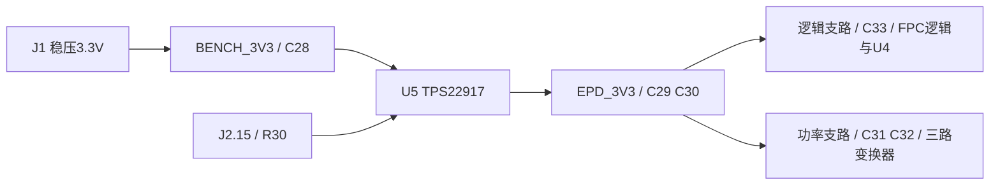

# P1直供改版 v0.4

2026-10-07，KiCad 10.0.6。按用户要求删除L4、L5，原理图用导线、PCB用铜线接通，不装0Ω替代件。原VIN、AVDD、EPD_3V3三个网络合并为EPD_3V3。屏幕AVDD、VDD、VDDIO等引脚名称保持原厂定义；U5的VIN功能脚接BENCH_3V3，不能把芯片脚名理解成板上仍有VIN网络。

## 供电路径与保留器件

P1现在10件：J1、U5、R30、C28、C29、C30、C31、C32、C33、C36。C36仍为1nF C0G，连接U5的CT与输入BENCH_3V3；QOD仍与输出直接相连。输入与输出域没有合并，关闭U5仍可切断屏幕3.3V供电。高压轨、内部VCC、SW_CT、采样与反馈均保持独立。

两条铜线支路从输出储能附近分配，功率级供电不经过逻辑末端细线。原磁珠位置直接布铜，逻辑连接0.5mm、功率连接0.8mm；输出主干0.8mm，U5近引脚保留0.5mm逃线。既有FPC扇出细线保持原设计，不能把0.8mm理解成全板每一段都如此。重新铺铜后检查通过。

磁珠删除后，高频隔离减弱。C28–C33、三路变换器本地去耦全部保留。上电后需测BENCH_3V3和逻辑/功率两个位置的EPD_3V3，观察启动浪涌、刷新压降、纹波、复位及SPI错误；共用网络不代表不同位置的瞬态电压完全相同。现有主控先上电、最后断电、关屏前GPIO低/无上拉约束继续适用，无固件改动。

## 数量与检查

| 项目 | v0.3 | v0.4 |
|---|---:|---:|
| P1装配件 | 12 | 10 |
| 电源页装配件 | 56 | 54 |
| 全板装配件 | 104 | 102 |
| 顶面SMT | 102 | 100 |
| 手工直插排针 | 2 | 2 |
| DNP铜测试点 | 24 | 24 |
| 原理图实体位号 | 128 | 126 |
| PCB封装（含4安装孔） | 132 | 130 |
| 连接引脚 | 317 | 313 |

TP2、TP3和TP4现在同属EPD_3V3，保留不同位置以便测量。TP2/TP3的显示值也改为EPD_3V3，避免把旧网名当成独立电源。移除合并输出上多余的#FLG02，U5的power_out已提供电源驱动声明；不改变U5引脚类型、不新增检查豁免。

正式未修改的KiCad CLI检查：ERC0；DRC违规0、未连接0、原理图一致性问题0。设计记录、网表与PCB逐脚一致，共313个连接引脚。原生pcbnew重新铺铜并保存后检查，来源哈希见[检查溯源](../reports/check-provenance.json)。中间DRC使用临时命令行鼠标位置shim规避macOS报告生成崩溃；最终报告与导出均使用未修改CLI。

本次电脑控制工具访问KiCad仍返回`Computer Use was not approved to use KiCad`，实际GUI打开待完成，见[访问记录](../reports/p1-direct-v0.4/gui-open-check.md)。这与CLI检查分别记录；尚未实测屏幕、噪声、浪涌、热和安全掉电，制造产物仍是审阅包。

## 当前文件

- [原理图PDF](../reports/schematic.pdf)、[电源页高清图](../reports/p1-direct-v0.4/schematic-page-2.png)
- [子图统计与必要性](../../../../docs/design/原理图子图元器件统计与必要性.md)
- [v0.4嘉立创制造审阅包](../releases/jlc-cn-review-v0.4-2026-10-07/README.md)

旧release不修改；本次改版前原生源文件保存在`reports/p1-direct-v0.4/before/`，变更映射见同级`change-map.json`。旧v0.3文件不能与v0.4的BOM/坐标混用。
