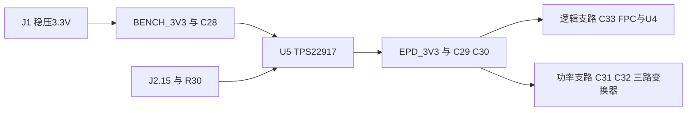

# P1：当前3.3V输入与共网分支供电

P1共10个装配件：J1、U5、R30、C28、C29、C30、C31、C32、C33、C36。

L4/L5已删除，逻辑与功率使用EPD_3V3同一电气网络，经铜线分支供电。屏幕AVDD、VDD、VDDIO是原厂引脚名称，均接该网络，不表示板上还有三路不同3.3V电源。U5输入为BENCH_3V3，输入与输出域未合并；关闭U5仍可切断屏幕供电。

C36为1nF C0G，接U5的CT与输入BENCH_3V3；QOD直接接输出。保留C28–C33以及三路变换器本地去耦。功率供电不应经逻辑末端细线；现有主干和部分功率连接0.8mm，近引脚/逻辑连接常用0.5mm，FPC扇出仍有0.2mm细线，不能把某一宽度理解为全网每段宽度。

TP2/TP3/TP4同属EPD_3V3，只是不同测量位置。取消磁珠隔离后，高频噪声更容易在支路之间传播；需测输入、逻辑端和功率端的启动浪涌、刷新压降、纹波、复位及SPI可靠性。同网不代表各位置瞬态电压完全相同。

全板当前103个装配件，P4另有调试断点。最新检查见[验证状态](../reports/validation-status.json)，图面见[原理图PDF](../reports/schematic.pdf)、[电源页高清图](../reports/preview/schematic-power.png)。ERC/DRC及GUI已通过，噪声、浪涌、温升与掉电仍须实物验证。
