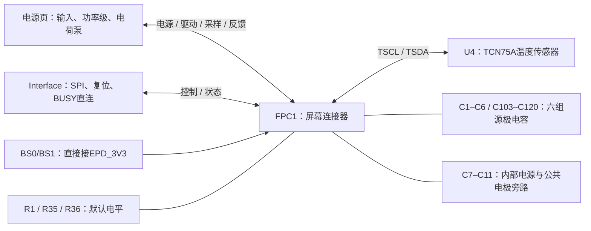

# Panel 原理图详解：60针屏幕接口、温度检测与电容网络

日期：2026-10-07，v0.5（Panel接法不变）。对应 [panel.kicad_sch](../panel.kicad_sch)，建议同时查看 [Panel PDF](../reports/schematic.pdf)或[高清图](../reports/preview/schematic-panel.png)。

本页有 **37个器件位置**：一个60针连接器、一个温度传感器、5只电阻和30只电容；均为装配件。本文逐个解释其作用与设计理由。完整型号、封装、DNP、连接及FPC逐脚表在附录。配套阅读：[Interface详解](interface-circuit-explained.md)、[电源页详解](power-circuit-explained.md)。

## 1. 本页承担什么工作

Panel页是驱动板与屏幕的连接边界。它不独立生成VDDP/VDDN/VGH/VGL；这些由电源页的外围功率级与屏幕内控制器共同产生。它负责把：

- 正确的供电送到屏幕对应管脚。
- 栅极驱动、采样和反馈信号送到外部功率级。
- Standard SPI与状态／复位接到Interface页。
- 屏幕内部源极电源的输出／输入引脚配对，并提供外部电容。
- 温度传感器接到屏幕专用串行接口，提供其参考设计所需的温度信息通路。



连接事实以当前原生页和导出网表为准；主要拓扑／参考值来自商家的 [ESP32-133C02 V1.0外围图](../../../reference/gdep133c02/ESP32-133C02-screen-peripheral-V1.0.pdf)。模式绑带与D/C、DRVN2按已采用方案处理；SI2/SI3下拉、电容33µF替代组合等项目改动会明确说明。并非全部取值都有本项目的完整计算或实测。

## 2. 功能区1：FPC1连接器与内部供电节点

### 2.1 FPC1是什么

| 位号 | 是什么、接在哪里 | 作用与设计理由 |
| --- | --- | --- |
| FPC1 | FPC-05FB-60PH20候选，60针、0.5mm间距连接器 | 连接屏幕柔性排线，把本板信号／电源送到屏幕；其功能只负责电气和机械连接，不是控制芯片。实际Pin1、接触面、插入方向和排线厚度仍需实物配接核对。 |

现在的符号为了清楚阅读，把电源与反馈放左侧，逻辑和电容网络放右侧。**符号左右排列不是实物针脚排列。** 要接屏幕，必须按引脚数字、封装及原厂机械图判断；不能按原理图哪个脚画在左边判断排线朝向。[连接器封装审核](fpc-footprint-review.md)。

### 2.2 电源输入、内部输出不能混接

| 引脚／网络 | 来源／用途 | 为什么单独保留 |
| --- | --- | --- |
| 9 AVDD | EPD_3V3功率铜线分支，正常约3.3V；与逻辑供电同网 | 供应DC/DC相关电路，负载及噪声不同于逻辑供电 |
| 10 VDD | 电源页逻辑分支经R33 | 屏幕控制电路的供电引脚 |
| 19 VDDIO | 电源页逻辑分支经R34 | 接口电平供电；片选和BUSY上拉随此域 |
| 12 VCC、18 VCC1 | 内部LDO／内部电路供电节点，按参考图相连 | 需要C7外部去耦；不是另一个外部3.3V输入 |
| 13/14 VDDP | 电源页正模拟输出 | 两脚接同一VDDP，不能因有两脚另做两组电源 |
| 16/17 VDDN | 电源页负模拟输出 | 两脚接同一VDDN，负电位相对于共同GND |
| 59 VGH、60 VGL | 电源页正／负栅极泵输出 | 用于TFT栅极驱动，不能接MCU逻辑引脚 |
| 41 VNCP_3P5V、56 VBB_3P5V | 电源页负偏置支路，直接共用VBB_3P5V网络 | 本采用方案共用负偏置；它们不是55脚TFT_VCOM输出 |
| 8、35 GND | 真正的地管脚 | 提供供电与信号参考及回流 |
| 26 D/C# | 当前网络名为GND，按所选Standard SPI方案接地 | 它本来是数据／命令控制输入，**不是新增的电源地脚**；符号上的GND表示当前接法 |

屏幕规格书给出VGH典型27V、VGL典型−20V，表示相应工作要求，不是本板已经测得的电压。VDDP、VDDN和其他内部波形目标不能从网络名字推定。[屏幕规格书，第6–11页](../../../../docs/raw/GDEP133C02.pdf)。

### 2.3 为什么Pin12、18要配对并放C7

当前连接是`FPC1.12 ↔ VCC ↔ FPC1.18`，C7从VCC到GND。规格书12脚为LDO输出，18脚为VCC1内部电路供电节点；按参考拓扑配对让该内部供电节点得到对应电源，并由电容旁路瞬态。

这里不能把两个看起来叫VCC的脚随意接到VDDIO，也不能当作通用LDO输出给板外负载供电。控制器内部电源驱动能力和稳定性要求不同于外部3.3V电源。

| 位号 | 是什么、接在哪里 | 作用及取值理由 |
| --- | --- | --- |
| C7 | 10µF/50V陶瓷，VCC—GND | 屏幕内部供电节点的外部储能／去耦。10µF沿用参考要求，50V是候选耐压；不能在未知内部LDO稳定性条件下随意缩减容量或改介质。 |

### 2.4 这页怎样与外部电源控制环路连接

2/4/6脚分别将RESEC/RESEN/RESEP采样送入屏幕，3/5/7脚分别输出GDRC/GDRN/GDRP；33脚DRVP、34脚FBP、37脚DRVN、38脚FBN、39脚REG_VGN参与电荷泵控制与反馈。它们属于功率控制接口，不能拿到J2当普通通信线。

GDRC的N/P沟道说明矛盾及参考Q7采用PMOS的情况，沿用[电源页详解](power-circuit-explained.md)和[设计审核](design-review.md)的边界；本页只是连接这些引脚，不消除该匹配验证问题。

11/15/57脚为规格书NC，不连接、不互连、不接地；40脚DRVN2本来是驱动输出，本方案选择不接外部支路。这两种“未连接”的理由不同。不能用“所有NC都接地”作为通用处理。

## 3. 功能区2：SPI模式绑带、BUSY上拉、未用线处理

### 3.1 BS0/BS1为什么直接接高电平

FPC1.22 BS0与FPC1.23 BS1直接接EPD_3V3。原R24/R25的0Ω硬连接已改成铜线，因此H/H Standard 4-wire SPI模式没有改变。26脚D/C仍直接接地，31/32脚SI2/SI3仍各有100k下拉。商家参考图的接地绑带与采用规格书存在历史差异，当前沿用已确认的H/H方案；不代表所有屏幕版本通用。

### 3.2 BUSY为什么有2kΩ上拉

R1把BUSY_N拉向EPD_3V3，让线路有明确的高电平来源；屏幕拉低时表示忙，主控应按有效时序等待，不能打断操作。资料没有充分定义全部输出结构，因此“画了上拉”本身不能证明BUSY一定是开漏；可以确定的是，它是当前参考电路的上拉负载。[屏幕规格书，第8页](../../../../docs/raw/GDEP133C02.pdf)。

若BUSY被拉到近0V且VDDIO为3.3V，R1电流约`3.3/2k=1.65mA`，功率约5.45mW；R1比100k默认电阻更强，上升速度和漏电裕量通常更有利，但拉低时负担更大。原厂为什么精确选择2k，现有资料没有完整推导；这里保留参考值并要求核对低电平／输出灌电流。

BUSY高只能在屏幕供电有效、主控输入配置正确时作为状态信息。断电或接线错误也可能让主控读到高，不能仅凭高电平判定完成刷新。

### 3.3 SI2/SI3为什么只弱下拉

首版未用这两条数据输入，R35/R36用100k将其弱拉低，避免悬空。弱拉保留将来改版处理空间，不能把它当作当前已支持Quad模式的证据。这是项目选择，不是厂家明确要求所有版本必须如此。

| 位号 | 是什么、接在哪里 | 作用及设计理由 |
| --- | --- | --- |
| R1 | 2kΩ，BUSY_N—VDDIO | 给忙状态线提供参考域内上拉，沿用厂家阻值；若接到主控常供电，会改变屏幕断电时反灌路径。 |
| R35 | 100kΩ，SI2—GND | 首版未用输入弱下拉，保持确定电平，工程增加。 |
| R36 | 100kΩ，SI3—GND | 同理处理另一未用输入，不与SI2直接短接。 |

BS脚通过0Ω到VDD时正常几乎没有静态电阻耗电，因为模式输入本身只有有限输入电流；它与“100k到地被主动拉高”产生33µA的情形不同。0Ω仍有实际阻抗和额定电流，不是保护器件。

## 4. 功能区3：TCN75A温度检测

### 4.1 为什么电子纸要知道温度

颗粒运动和显示响应随温度变化，控制器通常需要配合温度使用适当显示驱动策略。参考电路因此使用外部温度传感器U4。

**硬件提供温度信息通路，不等于已经证明控制器读温正确或补偿正确。** 还需适配初始化、传感器地址与面板波形。U4测的是它自身芯片附近的温度，布局靠近发热功率器件时可能偏离屏幕实际温度；不能把“有温度传感器”当作直接测到整块面板温度。

### 4.2 谁在访问U4

本板连接如下：

```text
FPC1.20 TSCL ─── U4.2 SCL
          └── R20(4.7kΩ) ── EPD_3V3
FPC1.21 TSDA ─── U4.1 SDA
          └── R21(4.7kΩ) ── EPD_3V3
EPD_3V3 ─── U4.8 VDD；C27 → GND
GND ─── U4.4 GND、U4.5 A2、U4.6 A1、U4.7 A0
```

TSCL／TSDA连接的是屏幕专用温度串行接口，**没有直接连接外部主控J2的I²C**。本板当前不允许把另一个主控总线未经分析并到这里，否则会改变总线驱动、地址和时序关系。

U4三个地址脚都为0，7位地址为`1001000₂=0x48`；含读写位的总线地址字节分别为写0x90、读0x91。软件API如果要求7位地址应填0x48，不能把0x90直接塞进去。

### 4.3 上拉电阻为什么必需，为什么是4.7kΩ

U4的SDA是双向串行数据脚，需要上拉；ALERT是开漏输出。TSCL也按参考电路设置上拉，为总线释放时提供高电平。总线拉低时电阻提供有限电流，释放后电阻给总线电容充电。

以3.3V、线路接近0V估算，单只4.7k电阻拉低电流约0.70mA。上升时间与上拉及总线电容相关，理想RC从30%到70%的上升时间约`tr≈0.8473RpCb`；例如假设Cb=100pF，则4.7k对应约0.40µs。这里100pF只是算例，**不是本板测得的电容或已通过的总线速度**。更小电阻提高上升速度但增加灌电流，更大电阻省电但边沿更慢；4.7k沿用参考折中。

TCN75A工作2.7–5.5V，3.3V处在其供电范围。地址编码、SDA、ALERT功能与配置依据 [Microchip本地规格书，第7–9页及配置章节](../../../reference/gdep133c02/TCN75A-DS21935C.pdf)。器件支持温度阈值／告警模式配置，但本项目未交付完整固件，不声称这些模式已启用。

### 4.4 未用ALERT为什么可以不接

U4.3 ALERT是开漏告警输出。当前并未连接屏幕或主控，不使用告警中断，所以删除R22上拉及原DNP R23，U4.3标记NC。开漏输出悬空不会影响I²C温度读数；需要告警时必须重新设计接收线路。

| 位号 | 功能与保留理由 |
|---|---|
| U4 | TCN75AVOA713、SOIC-8温度传感器；1=TSDA、2=TSCL、3=NC、4–7=GND、8=EPD_3V3，地址绑带不变 |
| R20、R21 | 各4.7kΩ，TSCL/TSDA到EPD_3V3；为开漏I²C信号提供高电平 |
| C27 | 100nF/50V，EPD_3V3到GND；传感器本地去耦 |

## 5. 功能区4：六组源极电源为何要配对、并联电容

### 5.1 “源极电源”不是另一套主控电源

屏幕内部的像素TFT有栅极和源极相关驱动路径：VGH/VGL帮助控制选通，源极驱动电压提供写入像素所需的电位。屏幕规格书把42–44、48–50定义为源极缓冲输出，把45–47、51–53定义为相应源极电压引脚。外围图将对应输出／输入配对，并为每个节点放一组外部电容。

| 网络 | 输出脚 | 对应输入脚 | 当前电容组 |
| --- | --- | --- | --- |
| VSPH | 42 VSPH | 45 VSPHI | C1+C103+C104+C105 |
| VSPL | 43 VSPL | 46 VSPLI | C2+C106+C107+C108 |
| VSPL2 | 44 VSPL2 | 47 VSPL2I | C3+C109+C110+C111 |
| VSNH | 48 VSNH | 53 VSNHI | C4+C112+C113+C114 |
| VSNL | 49 VSNL | 52 VSNLI | C5+C115+C116+C117 |
| VSNL2 | 50 VSNL2 | 51 VSNL2I | C6+C118+C119+C120 |

**尤其注意负侧的配对不是简单按相邻脚顺序连接。** 48配53、49配52、50配51；它们仍是六个独立网络，不能合并电容或互相短接。

将对应输出与输入连接，是采用厂家外围图的回接拓扑，而不是任意短接两个电源输出。内部详细驱动／补偿模型未公开在现有资料中，本文不虚构内部晶体管结构或精确轨电压。网络名中的H/L也不能单独决定全部工作阶段的电压。

### 5.2 电容怎样维持源极电压

负载从某节点取走电荷时，电容提供局部能量，使电压变化减小。短时间内忽略控制器补充电流和寄生，近似有：

```text
ΔV ≈ ΔQ / C = I × Δt / C
```

例如仅作算例，10mA持续100µs，从有效33µF电容取电，电压变化约30mV。真实屏幕电流、补充路径和有效容量不同，不能把这个算例当成本板纹波指标。

输出电容也可能是内部驱动器稳定性条件的一部分。容量、公差、ESR／ESL及布局均会影响响应；不是“电容越大越好”，也不是“总µF相同就一定等效”。

### 5.3 为什么变成三只10µF加一只3.3µF

原参考每组33µF，本项目当前候选实现为：

```text
10µF + 10µF + 10µF + 3.3µF = 名义33.3µF
```

这是已有的候选工程改动，用多个陶瓷电容实现接近参考的标称容量；它的出处是这个工程替代决定，不能称为厂家明确推荐的改法。原位号C1–C6各保留一只10µF，新增C103–C120补足其余三只。

各组原位号电容并不是“原来的33µF仍装着又额外加三只”，否则会算错。每只电容两端都与本组同名电源／GND相连；负电源组也使用无极性陶瓷候选，不能直接按正电源接法换成有极性电容。

MLCC直流偏压可能使有效容量小于标称；必须按**每个完整料号、实际轨电压、温度与公差**求组合有效容量，并复核驱动器稳定性。[Murata直流偏压说明](https://www.murata.com/en-us/support/faqs/capacitor/ceramiccapacitor/char/0005)。目前并联组合仍未通过有效容量／环路验收，若不满足要求，应重新选型并同步封装／布局，而不是仅改文字。

### 5.4 24只电容逐个解释

所有下表电容另一端均接GND，当前耐压候选50V。三只10µF共同承担储能，3.3µF补到接近参考的名义容量；它们有相同总体作用，但分属不同节点，不能互换网络。

| 位号 | 当前值与网络 | 作用及为什么保留这只 |
| --- | --- | --- |
| C1 | 10µF，VSPH—GND | VSPH组第一只储能电容，保留原位号；不再是单只33µF。 |
| C103 | 10µF，VSPH—GND | VSPH组第二只10µF，与C1并联增加本组容量。 |
| C104 | 10µF，VSPH—GND | VSPH组第三只10µF，将三只名义容量加到30µF。 |
| C105 | 3.3µF，VSPH—GND | 补足VSPH组的3.3µF，使名义总计33.3µF。 |
| C2 | 10µF，VSPL—GND | VSPL组第一只储能电容，保留原位号。 |
| C106 | 10µF，VSPL—GND | VSPL组第二只10µF，只服务VSPL网络。 |
| C107 | 10µF，VSPL—GND | VSPL组第三只10µF，与前两只并联。 |
| C108 | 3.3µF，VSPL—GND | 补足VSPL组到名义33.3µF。 |
| C3 | 10µF，VSPL2—GND | VSPL2组第一只储能电容，保留原位号。 |
| C109 | 10µF，VSPL2—GND | VSPL2组第二只10µF，增加局部储能。 |
| C110 | 10µF，VSPL2—GND | VSPL2组第三只10µF，与同组电容并联。 |
| C111 | 3.3µF，VSPL2—GND | 补足VSPL2组到名义33.3µF。 |
| C4 | 10µF，VSNH—GND | VSNH组第一只负侧储能电容，保留原位号。 |
| C112 | 10µF，VSNH—GND | VSNH组第二只10µF，无极性陶瓷候选适用于负向偏压。 |
| C113 | 10µF，VSNH—GND | VSNH组第三只10µF，支持该负侧源极节点。 |
| C114 | 3.3µF，VSNH—GND | 补足VSNH组到名义33.3µF。 |
| C5 | 10µF，VSNL—GND | VSNL组第一只负侧储能电容，保留原位号。 |
| C115 | 10µF，VSNL—GND | VSNL组第二只10µF，增加本组储能。 |
| C116 | 10µF，VSNL—GND | VSNL组第三只10µF，不与VSNH／VSNL2跨网并联。 |
| C117 | 3.3µF，VSNL—GND | 补足VSNL组到名义33.3µF。 |
| C6 | 10µF，VSNL2—GND | VSNL2组第一只负侧储能电容，保留原位号。 |
| C118 | 10µF，VSNL2—GND | VSNL2组第二只10µF，增加本组容量。 |
| C119 | 10µF，VSNL2—GND | VSNL2组第三只10µF，支持这组独立节点。 |
| C120 | 3.3µF，VSNL2—GND | 补足VSNL2组到名义33.3µF。 |

“50V”是电容两端的额定耐压，不是屏幕每路都输出50V。反向／负向电位仍应按两端电压的绝对幅值和瞬态核对；MLCC没有电解电容那样的固定正负端，但不能因此忽略额定值。

## 6. 公共电极／边框驱动的四只电容

### 6.1 为什么这些节点不能当普通供电

FPL_VCOM、TFT_VCOM、VCOMBD_M/S是屏幕内部驱动输出。显示效果取决于像素电极与公共电极之间的电位差及其时间变化，而不只取决于某个电极对板上GND的电压。VCOMBD按规格书为Master／Slave的VCOMBD驱动输出；其精确物理边框映射和波形不能仅凭名称自行扩大解释。

这些节点上的电容按参考图提供旁路／局部电荷缓冲，并构成驱动器的外部负载。电容会影响动态输出，所以不能把它们当作可以随意加大的普通电源滤波电容；也不能将几个名字都含VCOM的节点短在一起。

| 位号 | 是什么、接在哪里 | 作用及取值理由 |
| --- | --- | --- |
| C8 | 4.7µF/50V，TFT_VCOM—GND，FPC1.55 | TFT公共电极相关输出的外部旁路／储能，沿用参考4.7µF；它不生成VCOM目标值，也不是负偏置输入C20。 |
| C9 | 470nF/50V，FPL_VCOM—GND，FPC1.54 | FPL公共电极驱动输出的外部电容，沿用参考值；不能因C8更大就把它也改成4.7µF。 |
| C10 | 470nF/50V，VCOMBD_M—GND，FPC1.1 | Master侧VCOMBD驱动输出旁路／动态负载，独立于Slave侧。 |
| C11 | 470nF/50V，VCOMBD_S—GND，FPC1.36 | Slave侧相应输出的电容，与C10同值但不同网络。 |

这四个参考值的完整内部补偿／波形设计依据未在现有资料提供，因此本文解释连接和电荷作用，不能宣称已经推导出为何精确为470nF或4.7µF。实际还应验证显示波形、有效容量、驱动峰值电流和温升。

电源页的VBB_3P5V／VNCP_3P5V给公共电极相关电路提供负偏置；本页的TFT_VCOM／FPL_VCOM则是驱动输出。**供电输入与驱动输出是不同角色**，不能为减少网络数量而合并。

## 7. 本页与初始化、刷新、掉电的关系

上电后，VDD／VDDIO、AVDD建立，BS脚有确定模式，Interface默认使片选不选中并保持复位，U4获得供电。软件再按面板要求复位和初始化，控制器驱动电源页外围，源极与VCOM等节点形成工作波形。

温度数据是否被正确读取、Master／Slave图像区域是否映射正确、BUSY的置忙／释放是否可靠，都需要固件与到货屏幕共同验证。连接有依据不能代替显示实测。

关闭U5后，逻辑供电逐渐衰减，各组电容仍储存电荷；本页没有专门给每组源极输出设置明确的独立泄放电阻。不能用“电容接地”理解成电荷立刻流到地，也不能把温度传感器断电等同所有高压已清空。

正常关断按[接口状态约定](interface-power-state.md)执行刷新完成、电源关闭／深睡、接口处理和输入断电；异常断电仍需多轨电压衰减、残压与恢复验收。保持原厂内部VCOM设置及所选初始化方案，不根据本文随意调整VCOM或波形参数。

## 8. 读图顺序与仍需验证的项目

先从FPC1.9/10/19找输入供电，再对照12/18和C7看内部供电配对。随后找到22/23/26，确认所选模式。沿20/21到U4，看上拉和地址脚；沿25经Interface直连到J2，理解BUSY路径。最后对照42–53六组配对以及54/55/1/36独立电容。

每条线都问：这是输入还是输出？参考电位是哪一个？它由电源页生成还是屏幕内部生成？电容是储能／旁路还是跨两节点搬运电荷？本页所有电容均一端接GND，与电源页飞跨电容的连接用途不同。

| 项目 | 目前依据 | 实物／波形还要回答什么 |
| --- | --- | --- |
| 60针连接 | 规格书、参考图、采用方案及网表 | 版本是否匹配，Pin1／接触面／排线厚度是否正确 |
| SPI模式与D/C | 已采用H/H Standard SPI和26脚接地 | 初始化、读写、双片选及区域方向是否正确 |
| BUSY | 2k上拉、直接到主控、低表示忙 | 低电平负载、置忙延迟、有界等待和断电时误读 |
| 温度通路 | TCN75A、0x48地址、TSCL／TSDA连接 | 实际读温、地址／模式、边沿及局部温度代表性 |
| 六组电容 | 名义33.3µF、参考配对关系 | 有效容量、驱动稳定性及最坏负载 |
| VCOM相关电容 | 厂家参考值和独立输出节点 | 实际波形、瞬态电流、显示效果及残压 |
| 外部电源接口 | 对应GDR／RESE／DRV／FB连接 | 功率环路实际匹配，尤其GDRC与Q7控制极性 |

本次对应当前v0.5 CAD和BOM，尚未生产放行，没有通电测试。检查与GUI状态见[验证状态](../reports/validation-status.json)。

## 附录A：37个器件的当前型号与逐脚连接

| 位号 | 当前值 | 完整候选料号 | 本地封装 | 逐脚网络 |
|---|---|---|---|---|
| U4 | TCN75AVOA713 | TCN75AVOA713 | Driver:Package_SO__SOIC-8_3.9x4.9mm_P1.27mm | 1=TSDA<br>2=TSCL<br>3=NC<br>4=GND<br>5=GND<br>6=GND<br>7=GND<br>8=EPD_3V3 |
| R20 | 4.7k ohm | RC0603FR-074K7L | Driver:Resistor_SMD__R_0603_1608Metric | 1=TSCL<br>2=EPD_3V3 |
| R21 | 4.7k ohm | RC0603FR-074K7L | Driver:Resistor_SMD__R_0603_1608Metric | 1=TSDA<br>2=EPD_3V3 |
| C27 | 100nF/50V | GRM188R71H104KA93D | Driver:Capacitor_SMD__C_0603_1608Metric | 1=EPD_3V3<br>2=GND |
| R1 | 2k ohm | RC0603FR-072KL | Driver:Resistor_SMD__R_0603_1608Metric | 1=BUSY_N<br>2=EPD_3V3 |
| R35 | 100k ohm | RC0603FR-07100KL | Driver:Resistor_SMD__R_0603_1608Metric | 1=SI2<br>2=GND |
| R36 | 100k ohm | RC0603FR-07100KL | Driver:Resistor_SMD__R_0603_1608Metric | 1=SI3<br>2=GND |
| C1 | 10uF/50V | GRM32ER71H106KA12L | Driver:Capacitor_SMD__C_1210_3225Metric | 1=VSPH<br>2=GND |
| C103 | 10uF/50V | GRM32ER71H106KA12L | Driver:Capacitor_SMD__C_1210_3225Metric | 1=VSPH<br>2=GND |
| C104 | 10uF/50V | GRM32ER71H106KA12L | Driver:Capacitor_SMD__C_1210_3225Metric | 1=VSPH<br>2=GND |
| C105 | 3.3uF/50V | GRM32DR71H335KA88L | Driver:Capacitor_SMD__C_1210_3225Metric | 1=VSPH<br>2=GND |
| C2 | 10uF/50V | GRM32ER71H106KA12L | Driver:Capacitor_SMD__C_1210_3225Metric | 1=VSPL<br>2=GND |
| C106 | 10uF/50V | GRM32ER71H106KA12L | Driver:Capacitor_SMD__C_1210_3225Metric | 1=VSPL<br>2=GND |
| C107 | 10uF/50V | GRM32ER71H106KA12L | Driver:Capacitor_SMD__C_1210_3225Metric | 1=VSPL<br>2=GND |
| C108 | 3.3uF/50V | GRM32DR71H335KA88L | Driver:Capacitor_SMD__C_1210_3225Metric | 1=VSPL<br>2=GND |
| C3 | 10uF/50V | GRM32ER71H106KA12L | Driver:Capacitor_SMD__C_1210_3225Metric | 1=VSPL2<br>2=GND |
| C109 | 10uF/50V | GRM32ER71H106KA12L | Driver:Capacitor_SMD__C_1210_3225Metric | 1=VSPL2<br>2=GND |
| C110 | 10uF/50V | GRM32ER71H106KA12L | Driver:Capacitor_SMD__C_1210_3225Metric | 1=VSPL2<br>2=GND |
| C111 | 3.3uF/50V | GRM32DR71H335KA88L | Driver:Capacitor_SMD__C_1210_3225Metric | 1=VSPL2<br>2=GND |
| C4 | 10uF/50V | GRM32ER71H106KA12L | Driver:Capacitor_SMD__C_1210_3225Metric | 1=VSNH<br>2=GND |
| C112 | 10uF/50V | GRM32ER71H106KA12L | Driver:Capacitor_SMD__C_1210_3225Metric | 1=VSNH<br>2=GND |
| C113 | 10uF/50V | GRM32ER71H106KA12L | Driver:Capacitor_SMD__C_1210_3225Metric | 1=VSNH<br>2=GND |
| C114 | 3.3uF/50V | GRM32DR71H335KA88L | Driver:Capacitor_SMD__C_1210_3225Metric | 1=VSNH<br>2=GND |
| C5 | 10uF/50V | GRM32ER71H106KA12L | Driver:Capacitor_SMD__C_1210_3225Metric | 1=VSNL<br>2=GND |
| C115 | 10uF/50V | GRM32ER71H106KA12L | Driver:Capacitor_SMD__C_1210_3225Metric | 1=VSNL<br>2=GND |
| C116 | 10uF/50V | GRM32ER71H106KA12L | Driver:Capacitor_SMD__C_1210_3225Metric | 1=VSNL<br>2=GND |
| C117 | 3.3uF/50V | GRM32DR71H335KA88L | Driver:Capacitor_SMD__C_1210_3225Metric | 1=VSNL<br>2=GND |
| C6 | 10uF/50V | GRM32ER71H106KA12L | Driver:Capacitor_SMD__C_1210_3225Metric | 1=VSNL2<br>2=GND |
| C118 | 10uF/50V | GRM32ER71H106KA12L | Driver:Capacitor_SMD__C_1210_3225Metric | 1=VSNL2<br>2=GND |
| C119 | 10uF/50V | GRM32ER71H106KA12L | Driver:Capacitor_SMD__C_1210_3225Metric | 1=VSNL2<br>2=GND |
| C120 | 3.3uF/50V | GRM32DR71H335KA88L | Driver:Capacitor_SMD__C_1210_3225Metric | 1=VSNL2<br>2=GND |
| C7 | 10uF/50V | GRM32ER71H106KA12L | Driver:Capacitor_SMD__C_1210_3225Metric | 1=VCC<br>2=GND |
| C8 | 4.7uF/50V | GRM32ER71H475KA88L | Driver:Capacitor_SMD__C_1210_3225Metric | 1=TFT_VCOM<br>2=GND |
| C9 | 470nF/50V | GRM21BR71H474KA88L | Driver:Capacitor_SMD__C_0805_2012Metric | 1=FPL_VCOM<br>2=GND |
| C10 | 470nF/50V | GRM21BR71H474KA88L | Driver:Capacitor_SMD__C_0805_2012Metric | 1=VCOMBD_M<br>2=GND |
| C11 | 470nF/50V | GRM21BR71H474KA88L | Driver:Capacitor_SMD__C_0805_2012Metric | 1=VCOMBD_S<br>2=GND |
| FPC1 | FPC-05FB-60PH20 | FPC-05FB-60PH20 | Driver:FPC_05FB_60PH20 | 1=VCOMBD_M<br>2=RESEC<br>3=GDRC<br>4=RESEN<br>5=GDRN<br>6=RESEP<br>7=GDRP<br>8=GND<br>9=EPD_3V3<br>10=EPD_3V3<br>11=NC<br>12=VCC<br>13=VDDP<br>14=VDDP<br>15=NC<br>16=VDDN<br>17=VDDN<br>18=VCC<br>19=EPD_3V3<br>20=TSCL<br>21=TSDA<br>22=EPD_3V3<br>23=EPD_3V3<br>24=RES_N<br>25=BUSY_N<br>26=GND<br>27=CS_M_N<br>28=SCLK<br>29=SI0<br>30=SI1<br>31=SI2<br>32=SI3<br>33=DRVP<br>34=FBP<br>35=GND<br>36=VCOMBD_S<br>37=DRVN<br>38=FBN<br>39=REG_VGN<br>40=NC<br>41=VBB_3P5V<br>42=VSPH<br>43=VSPL<br>44=VSPL2<br>45=VSPH<br>46=VSPL<br>47=VSPL2<br>48=VSNH<br>49=VSNL<br>50=VSNL2<br>51=VSNL2<br>52=VSNL<br>53=VSNH<br>54=FPL_VCOM<br>55=TFT_VCOM<br>56=VBB_3P5V<br>57=NC<br>58=CS_S_N<br>59=VGH<br>60=VGL |

## 附录B：FPC1全部60脚

| 引脚 | 器件引脚名称 | 当前网络 |
|---|---|---|
| 1 | VCOMBD_M | VCOMBD_M |
| 2 | RESEC | RESEC |
| 3 | GDRC | GDRC |
| 4 | RESEN | RESEN |
| 5 | GDRN | GDRN |
| 6 | RESEP | RESEP |
| 7 | GDRP | GDRP |
| 8 | GND | GND |
| 9 | AVDD | EPD_3V3 |
| 10 | VDD | EPD_3V3 |
| 11 | NC | NC |
| 12 | VCC | VCC |
| 13 | VDDP | VDDP |
| 14 | VDDP | VDDP |
| 15 | NC | NC |
| 16 | VDDN | VDDN |
| 17 | VDDN | VDDN |
| 18 | VCC1 | VCC |
| 19 | VDDIO | EPD_3V3 |
| 20 | TSCL | TSCL |
| 21 | TSDA | TSDA |
| 22 | BS0 | EPD_3V3 |
| 23 | BS1 | EPD_3V3 |
| 24 | RES# | RES_N |
| 25 | BUSY_N | BUSY_N |
| 26 | D/C# | GND |
| 27 | CSB_M | CS_M_N |
| 28 | SCL | SCLK |
| 29 | SI0 | SI0 |
| 30 | SI1 | SI1 |
| 31 | SI2 | SI2 |
| 32 | SI3 | SI3 |
| 33 | DRVP_Gate | DRVP |
| 34 | FBP | FBP |
| 35 | GND | GND |
| 36 | VCOMBD_S | VCOMBD_S |
| 37 | DRVN | DRVN |
| 38 | FBN | FBN |
| 39 | REG_VGN | REG_VGN |
| 40 | DRVN2 | NC |
| 41 | VNCP_3P5V | VBB_3P5V |
| 42 | VSPH | VSPH |
| 43 | VSPL | VSPL |
| 44 | VSPL2 | VSPL2 |
| 45 | VSPHI | VSPH |
| 46 | VSPLI | VSPL |
| 47 | VSPL2I | VSPL2 |
| 48 | VSNH | VSNH |
| 49 | VSNL | VSNL |
| 50 | VSNL2 | VSNL2 |
| 51 | VSNL2I | VSNL2 |
| 52 | VSNLI | VSNL |
| 53 | VSNHI | VSNH |
| 54 | FPL_VCOM | FPL_VCOM |
| 55 | TFT_VCOM | TFT_VCOM |
| 56 | VBB_3P5V | VBB_3P5V |
| 57 | NC | NC |
| 58 | CSB_S | CS_S_N |
| 59 | VGH | VGH |
| 60 | VGL | VGL |

BS0/BS1是引脚名称；在新版网表中它们与VDD/VDDIO统一属于EPD_3V3网络。41/56脚同属VBB_3P5V。FPC仍使用可插拔连接器，连接器本体焊在PCB上，屏幕软排线不直接焊在焊盘上。接触面、插入方向与实际屏幕仍须配接核对。
