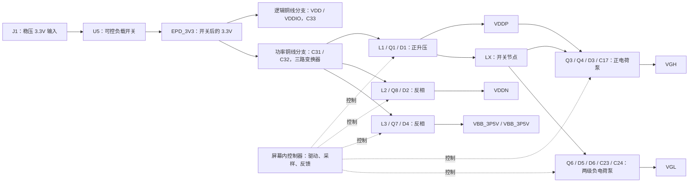

# 电源页原理详解：从 3.3V 到屏幕需要的正负电源

日期：2026-10-07，v0.4 直供手焊版。对应当前 [power.kicad_sch](../power.kicad_sch)，建议同时打开[电源页 PDF](../reports/schematic.pdf)或[高清图](../reports/p1-direct-v0.4/schematic-page-2.png)。

本文按图中的六个功能区解释全部 **54 个实体元器件**。每个器件的值、候选料号、封装和逐脚网络另列在文末清单，便于对照 KiCad。电源符号、网络标签和 PWR_FLAG 是绘图／电气检查对象，不是要购买的器件。

## 1. 先说明这张图的设计依据

外围电源拓扑及大部分阻容值来自商家提供的 [ESP32-133C02 V1.0 参考图](../../../reference/gdep133c02/ESP32-133C02-screen-peripheral-V1.0.pdf)。本项目增加台式 3.3V 输入接口，补全候选料号和原生 KiCad 工程，并采用此前确认的屏幕接法。本文的实际连接以当前原生原理图及其 KiCad 导出网表为准。

下面把“为什么”分成三个层次：

- **连接事实**：哪两个节点相连，哪种器件导通时形成什么回路，可以直接从图和网表确认。
- **原理解释**：根据器件特性解释这个拓扑为什么能升压、反相、采样或反馈；近似公式会注明适用条件。
- **参数选择**：15µH、470nF、各反馈阻值等沿用参考设计，现有资料没有完整的频率、负载、内部参考值及环路计算。可以解释取值的影响，不能声称这些值已经经过本项目优化或实测。

当前 ERC/DRC 通过说明 CAD 连接和规则检查通过；并不证明电压、波形、温升或掉电次序已经验收。本文不改变电路，也不将制造审阅包转为生产放行。具体工程状态见 [design-review.md](design-review.md)。

## 2. 总体结构：能量从哪里来，谁在控制



实线表示能量／泵驱动来源，虚线是控制关系；这张图是功能示意，不是可以代替原理图的接线图。

**屏幕内部有电源控制器，板上是它的外部功率级。** MCU 通过接口页的 SPI 给屏幕控制器发指令，并通过 `EPD_PWR_EN` 开关输入供电。`GDRP/GDRN/GDRC/DRVP/DRVN` 则由屏幕控制器输出，不能把它们当成 MCU 自由选择的普通 PWM。`RESEP/RESEN/RESEC/FBP/FBN` 将电流或电压信息送回控制器。[屏幕规格书第 6–9 页](../../../../docs/raw/GDEP133C02.pdf)给出这些引脚的功能。

| 网络／信号 | 在本图中的意思 | 阅读时要注意 |
| --- | --- | --- |
| BENCH_3V3 | U5前面的稳压3.3V输入 | 原分段0Ω已删除，输入节点合并 |
| EPD_3V3（屏幕VDD/VDDIO引脚） | 开关后的逻辑／功率共同供电 | 本项目都来自同一 3.3V；没有升压或电平转换 |
| VDDP / VDDN | 正／负模拟电源 | 正负都是相对 GND 而言；绝对目标值由控制器设置决定 |
| VGH / VGL | 正／负栅极驱动电源 | 用于屏幕内部 TFT 栅极驱动，不是 MCU GPIO 电压 |
| VBB_3P5V（屏幕41/56脚） | 两路负模拟偏置电源引脚，本方案直接相连 | 名称含 3P5V，仍是负电源；不是 TFT_VCOM 电极输出 |
| TFT_VCOM / FPL_VCOM | 面板公共电极驱动输出，在面板页 | 不要与这里的偏置供电直接混同 |
| LX | Q1 漏极、电感与二极管的开关节点 | 有脉动、尖峰、振铃，不能当作平稳直流电源 |
| GDRP / GDRN / GDRC | 三个电感功率级的栅极驱动 | 对应 NMOS、PMOS及参考图采用的 PMOS；GDRC 资料矛盾见第 7 节 |
| RESEP / RESEN / RESEC | 电流采样输入 | RESEP 是低边采样；另两路是靠近 EPD_3V3 的高边节点 |
| DRVP / DRVN | 正／负栅极泵控制 | 正泵经 Q4、Q3控制基准节点；负泵经 Q6控制钳位节点 |
| FBP / FBN、REG_VGN | 电压反馈、负泵内部参考输出 | REG_VGN 不是 GND；两个反馈公式不同 |

## 3. 读懂电路需要的几个基础概念

### 3.1 电容保持两端电压，电感保持电流

电容满足 `i = C × dv/dt`，储能为 `E = ½CV²`。短时间内它倾向于保持**两端的电压差**，而不是让某一个端子永远等于某个对地电压。电荷泵正是利用这一点：一端被开关波形抬高／拉低，另一端也随之移动。

电感满足 `v = L × di/dt`，储能为 `E = ½LI²`。开关断开时，它会改变端子电压来维持原来的电流方向，直到找到二极管／电容／负载组成的回路。因此低压电源能通过电感得到更高的电压，或者得到负电压。

地不是“电流消失的地方”。分析时必须把回路闭合，包括供电电容和负载。下面的箭头均指**传统电流方向**。

### 3.2 MOS 管看的是栅源电压，不是栅极对地电压

`VGS = VG − VS`。NMOS 的栅极比源极高到足够程度才低阻导通；PMOS 的栅极比源极低到足够程度才低阻导通。MOS 的阈值电压只表示开始出现小电流，不表示已经达到低导通电阻。

Q1 的源极在 RESEP，Q8/Q7 的源极在高边采样节点。看驱动波形必须同时看源极。MOS 的体二极管、最大 VGS、最大 VDS 和实际驱动电压也会影响断电及尖峰行为。

### 3.3 二极管与双二极管的方向

A 是阳极，K 是阴极；普通正向电流从 A 到 K。肖特基二极管有较低正向压降，适合这里的整流和电荷泵，但压降随电流、温度变化，反向漏电也要考虑。

D3/D5/D6 的 BAT54S 内部是两只串联二极管：**1 脚 A → 3 脚 COM → 2 脚 K**。每一级要按这个方向单独判断。BAT54S 的 S 后缀不是两个独立二极管，也不是共阳极／共阴极版本。[Diodes BAT54 系列资料](https://www.diodes.com/datasheet/download/BAT54.pdf)。

### 3.4 0Ω电阻有设计用途

它通常是可焊接的连接／拆分位置，让不同阶段的供电与信号有独立网络名称，便于隔离和改版。它有实际电阻、额定电流及寄生参数，不能无限通流；也不是保险丝。拆掉它可以断开支路，但测电流或替换阻值必须知道这条支路是否包含脉冲电流和反馈信号。

## 4. 功能区1：输入开关、滤波和供电分配（10个器件）

### 4.1 主路径与两个低压节点

```text
J1.1 → BENCH_3V3 → U5.1 VIN
U5.6 VOUT → EPD_3V3 → 逻辑铜线支路 → C33/FPC逻辑/接口/U4
                     └→ 功率铜线支路 → C31/C32/三路变换器
J2.15 EPD_PWR_EN → U5.3 ON；R30从ON接GND
U5.4 CT → C36 → BENCH_3V3；U5.5 QOD直接接EPD_3V3
J1.2、U5.2 → GND
```

这里只用一台外部稳压3.3V电源。BENCH_3V3是开关前，EPD_3V3是开关后。L4/L5已删除，两条支路直接用铜线连接；原VIN/AVDD/EPD_3V3标签合并，屏幕AVDD引脚名称不变。逻辑与功率从输出储能区域分支，功率电流不经过逻辑末端细线。去掉磁珠后高频隔离减弱，保留全部去耦并验证刷新噪声、复位和通信。

### 4.2 U5为什么更换，C36怎样控制启动

U5采用 **TPS22917DBVR，SOT-23-6**，六个可见引脚比原四球WLCSP更适合手焊。VIN接3.3V输入，VOUT接负载；ON高时导通，低时关闭。QOD直接接VOUT，使关闭时通过芯片内部放电通道释放低压输出电容。内部电阻使这不是把输出硬短接到地。它不能证明各高压轨已经安全放完电。

**C36=1nF，接CT与芯片VIN之间，不能改接CT与GND。** 它调整输出上升斜率，使大电容的充电电流较缓。选用0805、50V、C0G、±5%的C0805C102J5GACTU，容量稳定且易焊。毫秒级启动是设计预期，实际EPD_3V3稳定时间和浪涌须测量后确定。依据：[TI TPS22917手册](https://www.ti.com/lit/ds/symlink/tps22917.pdf)、[KEMET电容规格](https://search.kemet.com/download/specsheet/C0805C102J5GACTU)。

TPS22917最大连续开关电流2A，没有自动限流功能。C29/C30/C31/C32名义合计209.4µF；估算充电电流可用 `I≈C×ΔV/Δt`，但负载、走线阻抗、容量偏压、台式电源限流和斜率公差都会改变实际波形，不能从1nF直接承诺一个峰值电流。启动、稳态压降和温升仍须验收。

### 4.3 逐个器件解释

| 位号 | 是什么、接在哪里 | 作用及保留理由 |
|---|---|---|
| J1 | 1接BENCH_3V3、2接GND的两针排针 | 外部稳压3.3V入口，适合台式限流电源 |
| C28 | 2.2µF/50V，BENCH_3V3—GND | 开关输入去耦，缩短瞬态供电回路 |
| U5 | TPS22917DBVR，SOT-23-6 | GPIO控制屏幕域电源，提供可调斜率和输出放电 |
| R30 | 100kΩ，EPD_PWR_EN—GND | MCU高阻时默认关闭；拉高时耗电约33µA，拉低时没有这笔静态电流 |
| C36 | 1nF/50V C0G，BENCH_3V3—SW_CT | 调整U5启动斜率，降低大电容充电浪涌 |
| C29、C30 | 各4.7µF/50V，EPD_3V3—GND | 输出去耦，两只按分布位置支持局部电流 |
| C31、C32 | 各100µF/6.3V，EPD_3V3—GND | 功率级储能，名义200µF；耐压、有效容量及启动负担需要核对 |
| C33 | 100nF/50V，EPD_3V3—GND | 逻辑高频去耦；大电容不能替代短回路的小电容 |

全部去耦保留；只减少两只磁珠。输入开关、储能电容、采样与反馈均保留。主干0.8mm、逻辑分支至少0.5mm，U5近引脚保留0.5mm逃线；电流与温升仍需实测。

## 5. 功能区 2：VDDP 正电源升压（7 个器件）

规格书第21页上电时序图明确标注**VDDP为+16～+19V**，这是P2输出电压的资料依据；第11页典型+27V属于VGH。实际设定值及容差须核对屏幕控制器配置并实测。15µH是厂家参考电路的推荐取值，不是一个将3.3V固定变成某个电压的变比。当前缺少实际开关频率、最大输出负载、采样限流阈值和环路补偿参数，尚未独立完成参数定型。

### 5.1 开关周期里的两个回路

**Q1 导通：** 屏幕输出 GDRP，将 Q1 的栅源电压拉高。电流沿 `EPD_3V3 → L1 → LX → Q1 → RESEP → U1 → GND` 增长，L1 储能。LX 被拉到靠近地的低电位；正常升压状态下 D1 截止，负载暂由 C13 供电。

**Q1 关断：** L1 电流不能骤然消失，LX 电压上升，直到 D1 正向导通。电流沿 `EPD_3V3 → L1 → LX → D1 → VDDP → C13/负载 → GND` 流动，把储能和输入能量送往输出。

理想连续导通模式、稳态、忽略损耗时：`VDDP ≈ EPD_3V3 / (1−D)`，D 为 Q1 导通占空比。实际还受峰值电流、二极管压降、MOS导通损耗、电感损耗以及内部控制限制；轻载断续模式不能直接照此计算。

电感导通期间的纹波量级为 `ΔIL ≈ EPD_3V3 × ton / L1`。这解释了为什么需要知道开关频率及占空比，才能判断 15µH 和峰值电流是否合适。

### 5.2 逐个器件解释

| 位号 | 是什么、接在哪里 | 作用与设计理由 |
| --- | --- | --- |
| L1 | 15µH 功率电感，EPD_3V3—LX | 储存并释放磁场能量，是升压的核心。15µH沿用参考值；候选 MSS1246-153MLC 要按实际峰值、RMS、温升核对。 |
| Q1 | DMN3065LW-7 NMOS，G=GDRP、S=RESEP、D=LX | 低边开关，周期性将 LX 经采样电阻拉向地。源极接近地，NMOS适合这种驱动位置；驱动能力仍要核对实际 VGS。 |
| U1 | 0.2Ω WSL1206 采样电阻，RESEP—GND | 把开关电流变为控制器可感知的小电压，`VRESEP≈IQ1×0.2Ω`。保留 U 位号，但它不是 IC。 |
| R2 | 1MΩ，GDRP—GND | 驱动高阻时给栅极提供泄放／默认低电平，减少悬空误导通；1MΩ不能当成能快速关断大栅极电荷的强驱动。 |
| D1 | MBR230S1F-7 肖特基，A=LX、K=VDDP | Q1关断时把电感电流送入输出，导通时阻止输出向 LX 放电；低正向压降有助于效率。 |
| C12 | 4.7µF/50V，EPD_3V3—GND | 靠近功率级的输入去耦，缩短脉冲电流回路；与远处 C31/C32配合而非相互替代。 |
| C13 | 10µF/50V，VDDP—GND | 输出储能和平滑纹波，在 D1不送电时支持负载；有效容量、纹波电流及高压裕量需要审核。 |

本支路不是完全隔离的电源：即使 Q1 不开关，只要 EPD_3V3 存在，仍有 `EPD_3V3 → L1 → D1 → VDDP` 的单向通路，输出可能被充到接近输入减去二极管压降。因此“停止 GDRP”不等于“VDDP立即为零”。

D1 候选器件的额定反向电压为 30V、平均整流电流为 2A，不能据此宣称所有工作状态都安全；应核对 VDDP上限和 LX振铃。其厂商页还列有 EOL 变更记录，后续采购应核查完整订购料号／替代型号。[Diodes MBR230S1F](https://www.diodes.com/part/view/MBR230S1F)。

## 6. 功能区 3：VDDN 负电源反相变换（7 个器件）

### 6.1 为什么这个电感能生成负电压

L2的一端接地，另一端接 SW_N；它不是 L1那种输入到开关节点的接法。Q8是位于正供电侧的 PMOS。

**Q8导通：** GDRN 使栅极低于源极，电流沿 `EPD_3V3 → U2 → RESEN → Q8 → SW_N → L2 → GND` 增长。电感电流方向为 SW_N 到 GND。

**Q8关断：** 电感仍试图沿原方向流动，因此 SW_N被拉到负电位。D2在 `VDDN → SW_N` 方向导通；闭合回路为 `GND → C15/负载 → VDDN → VDDN → D2 → SW_N → L2 → GND`。它从输出节点抽走电荷，使 VDDN 相对地变负。对电容而言，电流由其地端流向负电压端，正好形成负输出所需的充电方向。

理想连续导通稳态：`VDDN ≈ −EPD_3V3 × D / (1−D)`。开关关断时的耐压需求通常涉及 `EPD_3V3 + |VDDN|`，再加尖峰裕量；不能只用 3.3V输入判断 Q8和 D2耐压。

### 6.2 逐个器件解释

| 位号 | 是什么、接在哪里 | 作用与设计理由 |
| --- | --- | --- |
| L2 | 15µH，SW_N—GND | 导通时储能，关断时把 SW_N拉负；数值和候选系列与 L1一致，但电流需求必须独立审核。 |
| Q8 | DMP3068L-7 PMOS，G=GDRN、S=RESEN、D=SW_N | 高边开关，用栅极相对源极下降来导通；符合规格书 GDRN 的 P沟道驱动定义。[原厂资料](https://www.diodes.com/datasheet/download/DMP3068L.pdf)。 |
| U2 | 0.2Ω，EPD_3V3—RESEN | 高边电流采样。导通时 `EPD_3V3−VRESEN≈IQ8×0.2Ω`；RESEN本身仍接近正输入电压，不是接近地的小电压。 |
| R3 | 1MΩ，EPD_3V3—GDRN | 驱动高阻时将 PMOS栅极拉回高电位，使其默认关闭；采样无电流时源极也接近 EPD_3V3。 |
| D2 | MBR230S1F-7，A=VDDN、K=SW_N | SW_N拉负时提供电感续流和抽取输出电荷的路径；方向与正升压支路的“送电到正输出”不同。 |
| C14 | 4.7µF/50V，EPD_3V3—GND | 高边开关附近输入去耦，为导通脉冲提供局部电流。 |
| C15 | 10µF/50V，VDDN—GND | 负输出储能和平滑纹波；当前为无极性陶瓷电容，可以承受两端负方向的直流偏压。换成有极性电容时其正端应朝地侧，且仍须重新审核。 |

这种负输出不是“把正电源接口交换一下”，而是实实在在地建立了低于板上 GND的电位。对采样测量尤其要注意：U2的压差方向、共模电压及采样走线均与 U1不同。

## 7. 功能区 4：VCOM 所需负偏置供电（7 个器件）

### 7.1 与 VDDN 的共同原理和不同职责

本区同样是高边 PMOS、电感到地、负向整流的反相拓扑：导通时 `EPD_3V3 → U3 → Q7 → SW_VCOM → L3 → GND` 储能；关断时 `GND → C20/负载 → VBB_3P5V → D4 → SW_VCOM → L3 → GND` 续流，建立负电压。41/56脚直接共用同一个VBB_3P5V网络。

**这是 TFT_VCOM相关电路所需的负偏置供电，不是公共电极波形本身。** 规格书把 41脚 VNCP_3P5V、56脚 VBB_3P5V定义为负偏置输入，把 55脚 TFT_VCOM定义为驱动输出。网络名不等于控制器会在所有工作阶段精确输出 −3.500V。[屏幕规格书第 8–9 页](../../../../docs/raw/GDEP133C02.pdf)。

### 7.2 逐个器件解释

| 位号 | 是什么、接在哪里 | 作用与设计理由 |
| --- | --- | --- |
| L3 | 15µH，SW_VCOM—GND | 此负偏置支路的储能电感；保留参考值，不把 VDDN的实测／估算电流套用过来。 |
| Q7 | PJA3433 PMOS，G=GDRC、S=RESEC、D=SW_VCOM | 参考电路采用的高边 P沟道开关，导通需要负 VGS；控制极性矛盾必须按下文理解。 |
| U3 | 0.2Ω，EPD_3V3—RESEC | 高边电流采样，`EPD_3V3−VRESEC≈IQ7×0.2Ω`；让 RESEC得到支路电流信息。 |
| R13 | 1MΩ，EPD_3V3—GDRC | 驱动释放时把栅极拉到输入侧，趋向关闭 PMOS。 |
| D4 | B0530W-7-F，A=VBB_3P5V、K=SW_VCOM | 负偏置续流／整流二极管。参考图选择小于 D1/D2的器件；不能由此推断本板实测负载一定小。 |
| C19 | 4.7µF/50V，EPD_3V3—GND | 本功率级输入脉冲去耦。 |
| C20 | 10µF/50V，VBB_3P5V—GND | 负偏置储能，降低负载和开关造成的电压波动。 |

D4为 30V、0.5A等级肖特基，厂商对电容负载还给出电流降额条件。实际必须检查峰值、平均电流、结温和反向尖峰，不能用标称 0.5A代替校核。[Diodes B0530W规格书](https://www.diodes.com/datasheet/download/B0530W.pdf)。

**资料矛盾保持透明：** 屏幕规格书将 GDRC写为 N沟道驱动，商家参考图却使用 PJA3433；其原厂资料为 P沟道 MOS。本项目此前采用的是参考图的器件与拓扑，所以本文按 PMOS解释，并没有从纸面资料证明内部驱动已经与它匹配。必须确认上电／工作／关断时 GDRC相对 Q7源极的波形。若并非所需的负 VGS，不能通过“改一下文字”解决，也不能未经重新分析就只换成 NMOS。[Panjit PJA3433原厂资料](https://www.panjit.com.cn/upload/datasheet/PJA3433.pdf)。

## 8. 功能区 5：VGH 正栅极电荷泵（11 个器件）

### 8.1 为什么已经有 VDDP，还需要这一支路

模拟电源和栅极驱动电源承担不同功能。电荷泵利用已有 LX的周期跳变，通过飞跨电容和二极管转移电荷，让 VGH可以高于作为基准的正电位。这里“飞跨”是指电容两端都可能改变对地电位，不是一端固定接地的普通滤波电容。

关键路径：`LX → R10 → PUMP_P_AC → C17 → PUMP_P_MID`。D3的第一只二极管从 PUMP_P_LOW到 PUMP_P_MID，第二只从 PUMP_P_MID到 VGH。Q3/Q4控制 PUMP_P_LOW，FBP反馈检测 VGH。

### 8.2 Q3/Q4：把控制信号变成高压侧基准的调节

Q3是 PNP，发射极接 VDDP。其基极接近发射极时关闭；基极低于发射极足够多时导通，从 VDDP向 PUMP_P_LOW送电。

DRVP使 Q4导通时，Q4从 Q3基极抽取电流，路径是 `BASE_P → Q4 → SOURCE_VGP → R12 → GND`，让 Q3导通，给 C18及泵基准节点充电。Q4关断时，R11把基极拉回 VDDP，Q3关闭；C18上的电荷不会因此瞬间清空。

注意 **R12在 Q4源极到地之间**，不是串在 Q3基极的一只普通基极电阻。电流增加会使 SOURCE_VGP电位上升，从而减小 Q4的 VGS，形成源极退化并限制基极吸入电流。实际大小由 DRVP电平、Q4特性、Q3和 R12共同决定，不能简单当作 `VDDP/1.5kΩ`。

这个组合的工程目的可解释为：让控制器驱动 NMOS，通过它控制位于 VDDP高电位的 PNP供电通路。精确调节策略仍在屏幕内部，现有外围图没有完整内部环路模型。

### 8.3 二极管与 C17 如何抬高输出

在 PUMP_P_LOW近似稳定、LX存在足够摆幅的情况下：

1. LX低相位使 PUMP_P_AC较低，D3第一只二极管向 PUMP_P_MID充电，把该节点钳到约 `PUMP_P_LOW−VF`，建立 C17两端的电压差。
2. LX升高，C17短时保持两端电压差，PUMP_P_MID随之抬高。
3. 当 PUMP_P_MID超过 VGH一个正向压降，D3第二只二极管导通，将电荷送入 C16和负载。
4. LX回落时，输出二极管截止，C16保持输出电压，下一周期补充电荷。

忽略负载和寄生的拓扑量级近似是 `VGH ≈ PUMP_P_LOW + ΔVLX − 2VF`。这里的 ΔVLX是 LX高低相位之差；PUMP_P_LOW受控，因此不能直接宣布“VGH永远等于两倍 VDDP”。控制器还会根据 FBP调节泵基准／工作状态。

### 8.4 逐个器件解释

| 位号 | 是什么、接在哪里 | 作用与设计理由 |
| --- | --- | --- |
| Q3 | MMBT3906-7-F PNP，E=VDDP、B=BASE_P、C=PUMP_P_LOW | 高电位供电／调节管，为正泵基准提供电荷；用 PNP可通过拉低基极来控制来自 VDDP的电流。 |
| Q4 | DMN3065LW-7 NMOS，G=DRVP、D=BASE_P、S=SOURCE_VGP | 把控制器驱动转为 Q3基极吸入电流，实现高电位侧控制；与 Q1同型号但工作作用不同。 |
| R11 | 100kΩ，VDDP—BASE_P | Q4关闭时把 Q3基极拉回发射极，使 PNP默认关闭；也提供基极泄放路径。 |
| R12 | 1.5kΩ，SOURCE_VGP—GND | Q4源极退化／电流约束，避免用强 NMOS直接把 PNP基极硬拉到地；数值沿用参考，实际控制范围待验证。 |
| D3 | BAT54S，两只串联肖特基 | 第一只给飞跨节点建立基准，第二只向正输出整流；使输出电荷不会在回落相位沿原路径被抽回。 |
| C16 | 4.7µF/50V，VGH—GND | 正栅极电源输出储能，降低泵周期纹波。 |
| C17 | 470nF/50V，PUMP_P_MID—PUMP_P_AC | 飞跨电容，利用 LX摆幅搬运电荷。容量影响单周期可转移电荷和泵的等效输出阻抗。 |
| C18 | 220nF/50V，PUMP_P_LOW—GND | 稳定受 Q3控制的泵基准节点，为短时泵电流提供局部电荷；不是 VGH最终输出滤波电容。 |
| R7 | 4.3kΩ，FBP—GND | 正输出反馈分压的下臂，给 FBP提供对地比例信号。 |
| R8 | 110kΩ，VGH—FBP | 正输出反馈分压的上臂，与 R7决定检测比例；不是靠电阻本身把输出稳住。 |
| R10 | 2.2Ω，LX—PUMP_P_AC | 飞跨电容驱动中的小串联阻值，限制充放电脉冲、提供阻尼并隔开部分瞬态；实际振铃改善需波形确认。 |

### 8.5 正反馈分压的计算

忽略 FBP输入电流：

```text
VFBP = VGH × 4.3k / (110k + 4.3k)
     ≈ 0.03762 × VGH
VGH ≈ 26.58 × VFBP
```

如果控制器将 FBP调节到某内部目标值 `VFBP_target`，才有 `VGH≈26.58×VFBP_target`。现有资料没有在这里完整给出该目标值与寄存器条件，**不能随手代入常见的 1.2V就认定输出是 31.9V**。

分压支路也消耗电流：`Idiv≈VGH/114.3kΩ`。降低阻值会增加静态消耗，增大阻值会提高输入漏电、噪声和寄生影响；参考设计用这组阻值折中，但具体稳定性没有在本项目证明。

## 9. 功能区 6：VGL 两级负栅极电荷泵（12 个器件）

### 9.1 先把两组二极管按方向展开

```text
D6：PUMP_N_MID → PUMP_N_DOWN → PUMP_N_LOW
D5：VGL        → PUMP_N_UP   → PUMP_N_MID
     A(1)          COM(3)        K(2)

LX → R19 → PUMP_N_AC
               ├→ C24 → PUMP_N_DOWN
               └→ C23 → PUMP_N_UP
```

电荷的整体整流方向从 VGL一侧，经中间节点，流向 Q6控制的基准节点。对负输出而言，这种“从输出抽走正电荷”的过程使输出变得更负。

C23和 C24的驱动端共用同一个 LX波形，**不是两路互补时钟**。D6/C24形成靠近基准的第一级，D5/C23形成更负的第二级，C22储存中间电位，C21储存最终输出。

### 9.2 Q6和每一周期的作用

Q6为 NPN，发射极接地，集电极接 PUMP_N_LOW。DRVN给出足够基极电流时，Q6导通，把基准节点拉到接近地；控制释放时，Q6关闭，C26及泵网络继续决定该节点电位。它与控制器反馈配合调节负泵。

在 Q6导通、基准接近地的简化工作阶段：

1. LX高相位抬高 PUMP_N_DOWN，D6的 `COM→K` 二极管导通，将 DOWN钳位在基准加一个正向压降附近，建立 C24电压。
2. LX回落，C24保持电压差，DOWN被拉负。D6的 `A→COM` 二极管开始从 MID节点抽取电荷，把 MID建立为负电位；C22保存这个一级负输出。
3. D5以 MID为新基准：高相位通过 `COM→K` 建立 C23的电压差，低相位通过 `A→COM` 从 VGL抽取电荷。
4. VGL变得比 MID更负，C21维持最终负电压。

忽略负载、认为钳位基准稳定及二极管压降相同的粗略拓扑近似：

```text
VMID ≈ VLOW − ΔVLX + 2VF
VVGL ≈ VMID − ΔVLX + 2VF
     ≈ VLOW − 2ΔVLX + 4VF
```

它用于理解为什么两级能产生更负的电位，不能预测实际输出值。实际有电荷共享、同时导通、驱动阻抗、控制器调节与负载；启动时各电容尚未建立稳态，也不能直接套用这个表达式。

### 9.3 逐个器件解释

| 位号 | 是什么、接在哪里 | 作用与设计理由 |
| --- | --- | --- |
| Q6 | MMBT3904-7-F NPN，B=DRVN、E=GND、C=PUMP_N_LOW | 控制负泵基准节点的下拉／钳位电流；用 NPN可从控制器的基极驱动控制集电极电流。 |
| D5 | BAT54S，A=VGL、COM=PUMP_N_UP、K=PUMP_N_MID | 第二级负泵的两只整流二极管，以 MID为基准生成更负的 VGL。 |
| D6 | BAT54S，A=PUMP_N_MID、COM=PUMP_N_DOWN、K=PUMP_N_LOW | 第一级负泵的两只整流二极管，以 Q6控制节点为基准建立 MID负电位。 |
| C21 | 4.7µF/50V，VGL—GND | 最终负栅极电源储能，供负载并平滑泵纹波。 |
| C22 | 1µF/50V，PUMP_N_MID—GND | 两级之间的储能电容，使第二级有相对稳定的负基准；并非与 C21重复连接。 |
| C23 | 470nF/50V，PUMP_N_UP—PUMP_N_AC | 第二级飞跨电容，把 LX跳变转换成 UP节点的负向摆动。 |
| C24 | 470nF/50V，PUMP_N_DOWN—PUMP_N_AC | 第一级飞跨电容，向 MID节点建立负电位；与 C23同值、同驱动，但位置和职责不同。 |
| C25 | 1µF/50V，REG_VGN—GND | 给屏幕内部参考电压输出去耦，稳定反馈基准；电容本身不生成 REG_VGN。 |
| C26 | 47nF/50V，PUMP_N_LOW—GND | Q6钳位节点的小容量储能／去耦，减小局部瞬态变化；容量更小会影响响应速度和纹波，不能称为最终输出滤波。 |
| R17 | 400kΩ，VGL—FBN | 从负输出向反馈节点引入检测信息，是跨两个电位的反馈网络一臂。 |
| R18 | 16kΩ，FBN—REG_VGN | 将内部参考输出引入反馈，与 R17设置负压检测关系；其另一端不是地。 |
| R19 | 2.2Ω，LX—PUMP_N_AC | 两个飞跨电容共用的驱动串联阻值，约束充放电脉冲并提供阻尼；脉冲总负担与正泵 R10不同。 |

参考图 Q6的基极直接连 DRVN，没有外部串联基极电阻。规格书将 DRVN称为外部 BJT驱动，但未在现有资料中给出足够的内部输出结构与电流限制。**不能据此宣称直接连接一定有合适基极电流**，也不能脱离控制器规格任意增加电阻；应检查 DRVN输出能力、Q6基极／集电极电流、饱和与发热。

### 9.4 负反馈不能套正分压公式

对 FBN列电流方程，忽略反馈输入电流：

```text
(VFBN − VVGL)/400k + (VFBN − VREG_VGN)/16k = 0
VFBN = (16 × VVGL + 400 × VREG_VGN)/416
     = (VVGL + 25 × VREG_VGN)/26
VVGL = 26 × VFBN − 25 × VREG_VGN
```

输出需要同时知道 FBN控制目标及 REG_VGN参考输出。把 R18错误看成接地，或假定 REG_VGN=0，会得到错误结论。400k/16k决定的是这种带参考电位的检测比例，并不是“电阻降压直接生成 VGL”。

## 10. 数值选择背后的共同考虑

### 10.1 为什么使用 0.2Ω采样：检测电压与损耗的折中

电流越大，采样电压越大，更易检测；但电阻也会消耗功率并改变源极电位。`Vsense=IR`，`P=Irms²R`。

例如 0.5A对应 0.1V、恒定电流下 0.05W；1A对应 0.2V、0.2W。这是算例，不是本板工作电流。开关电流有波形，必须用 RMS计算热功率，用峰值核对瞬态／控制器阈值。三路不能用台式电源读数替代各自波形。

当前候选 WSL1206在规定条件下额定 0.25W（70°C），0.2Ω对应理想连续 RMS上限约 `√(0.25/0.2)=1.12A`；按 50%额定功率预算约 0.79A。环境温度、焊盘散热和脉冲条件还会改变可用范围。[Vishay原厂资料归档](sources/vishay-wsl.pdf)。

采样走线应分别从电阻两端取得电位，避免把大电流铜线压降算进检测信号，即 Kelvin采样原则。现有板的实际误差仍需审核；把网络接对不意味着采样已经精确。

### 10.2 为什么用 15µH功率电感，不用普通小磁珠

功率电感要在所需电流下储存能量，关键是感量、直流电阻、饱和电流与温升。电感太小，在相同电压和导通时间下纹波／峰值更大；太大则改变动态响应、体积及损耗。15µH是厂家参考值，不能在未知内部控制参数时随意改倍数。

MSS1246-153候选的 DCR最大 54.1mΩ，25°C、10%感量下降定义下电流 4.58A，20°C温升条件 Irms 2.85A。不同“电流指标”定义不同，不能都叫最大允许电流。L1/L2/L3实际峰值仍未测得。[Coilcraft原厂资料归档](sources/coilcraft-mss1246.pdf)。

### 10.3 为什么很多电容耐压 50V，两个大电容却是 6.3V

耐压按电容**两端差值**选择。C31/C32在 3.3V模拟输入侧；C13/C15/C16/C20/C21等连接高压／负压输出，需要更高耐压候选。飞跨电容则应检查整个周期两端的最大差值，不能只看某一端对地电压。

50V只是候选器件额定值，不能保证所有波形都低于限制。MLCC在直流偏压下有效容量可能下降，温度、公差、老化、ESR/ESL也会影响性能。例如“两只100µF并联”只保证名义标注合计200µF；不能保证3.3V下有效容量就是200µF。

本图的 4.7µF、10µF负责局部／输出储能，100nF针对更短时间的扰动，470nF飞跨电容负责转移电荷。用途取决于连接和频率，不是只由容量大小决定。面板页 C1–C6的33µF替代组合不在本页54器件内，其有效容量问题另见设计审核。

### 10.4 为什么飞跨电容前有 2.2Ω

C17/C23/C24每次被 LX驱动时都会有充放电脉冲；电阻能降低脉冲尖峰并提供阻尼，但会增加损耗和等效输出阻抗。对单个470nF电容，`2.2Ω×470nF≈1.03µs`，仅是这两个标称值的 RC量级，**不等于整个泵的周期、稳定时间或控制环路时间常数**。实际路径还包括 LX源阻抗、二极管、其他电容及负载；R19同时驱动两个飞跨支路。

### 10.5 为什么正泵用 PNP＋NMOS，负泵用 NPN

正泵基准需要从 VDDP这个高电位取得电荷，所以使用高侧 PNP，配合 NMOS抽基极电流。负泵基准需要向 GND泄放／钳位，因此使用低侧 NPN。两者反映的是所需电流方向和控制参考位置，不能仅因为“一个生成正、一个生成负”就交换三极管类型。

二极管、MOS和三极管的耐压都按实际端间电压及尖峰审核。比如双二极管的反向应力是每个结的两端电位差；并不是看到 VGH对地很高，就一定等于每个二极管承受同样的反向电压。

## 11. 上电、刷新与关断：整张图怎样协同

### 11.1 默认关闭／接入台式电源

控制源高阻时，R30使 U5默认关闭；输入侧 BENCH_3V3仍可有3.3V，不能把“屏幕关闭”理解为所有节点均断电。接口页直连GPIO状态也必须与屏幕供电域匹配，防止信号引脚反向供电。

### 11.2 开启屏幕电源

MCU拉高 EPD_PWR_EN，U5向后级充电。逻辑／模拟输入建立后，屏幕还需要正确的复位、初始化和电源命令；高压不是 U5一导通就全部自动稳定。控制器分别驱动三路电感变换器，并通过 LX及 DRVP/DRVN让栅极泵工作。多路电源共享输入和部分驱动来源，启动负载互相影响。

### 11.3 刷新期间

高压输出供内部驱动电路，输出电容支持瞬时负载；控制器通过电流检测／电压反馈补充能量。VGH/VGL依赖 LX摆幅和泵路径，因此不能把它们视为与 VDDP完全独立的模块。显示过程的电源目标和切换次序由面板控制策略决定，本文不自行规定寄存器值。

### 11.4 正常关断和突然失电

正常关断应遵循已采用的 [接口与供电状态约定](interface-power-state.md)：结束刷新并确认屏幕允许的状态，执行正确的电源关闭／待机流程，处理接口信号，再关闭 U5。具体 BUSY极性、命令和时间条件以约定及适配的面板资料为准，不能仅用固定等待若干毫秒替代。

U5内部输出放电主要作用于它直接连接的下游低压域；电感／磁珠／铜线后的电容可经导通路径参与，但**各高压输出隔着二极管或晶体管，不能保证都被这个放电电阻直接清空**。C13/C15/C16/C20/C21仍可能储存正负电荷。R7/R8形成部分正输出泄放路径，其他支路也有控制器／负载／漏电路径，但这些不能证明已经满足面板安全放电条件。

MCU复位使 R30把 U5关掉，只实现默认供电关闭；它不等于完成正常电源关闭命令。突然断电的轨电压衰减顺序、接口反灌和残压需要实测。本文没有把该硬件认定为具有完整故障安全掉电机制。

## 12. 对照图学习与验证的办法

第一遍只沿 J1到 EPD_3V3、VDD、VDDIO找供电路径。第二遍只看三个电感支路，每次画出 MOS导通／关断两个闭合回路。第三遍把 BAT54S拆成两只二极管，给飞跨电容标出高／低相位电压方向。最后看 RESE和 FB，分别回答“检测的是电流还是电压”“参考电位在哪里”。

| 需要理解／验证的问题 | 观察对象 | 能回答什么 |
| --- | --- | --- |
| 输入开关是否适合大电容启动 | EPD_PWR_EN、BENCH_3V3、EPD_3V3各支路及输入电流 | 浪涌、压降、带载上升时间，不能仅看 U5标称2A |
| Q1升压过程是否正确 | GDRP相对 RESEP、LX、VDDP、U1压差 | 栅源驱动、开关尖峰、电流检测、输出是否稳定 |
| 两路负变换器是否正确 | Q8/Q7栅源波形、SW_N/SW_VCOM、采样压差、负输出 | PMOS极性、峰值应力，尤其 GDRC矛盾 |
| 正电荷泵是否搬运电荷 | LX、PUMP_P_AC/MID/LOW、VGH、FBP | 基准调节、整流方向、反馈比例 |
| 两级负泵是否按预期工作 | LX、DOWN/MID/UP、VGL、FBN、REG_VGN、Q6驱动 | 一级／二级负电位、参考输出和实际反馈关系 |
| 器件余量是否足够 | 三路电流波形、器件温升、各端间电压 | 采样电阻功率、电感饱和、器件耐压及损耗 |
| 关闭是否满足面板要求 | 全部电源轨、BUSY、使能、接口信号 | 正常／异常掉电的残压与时序 |

这是理解目标，不是未经审核即可通电的验收规程。测栅源或高边采样压差应使用合适的差分测量；普通接地示波器的地夹只能接板上 GND，接到 LX、RESEN等节点会改变电路甚至短路。所有测试记录应注明探头方法、带宽、输入限流、固件／面板版本及工作阶段。

## 13. 这份分析确定了什么，哪些不能从图上确定

确定的内容包括：54个元器件的身份和连接、三个电感变换器的拓扑、两个电荷泵的整流路径、两个反馈网络的数学关系、默认开关行为和各器件在回路中的用途。

目前不能从这张图单独得到：所有电源目标值及容差、控制器开关频率／峰值阈值／补偿参数、实际有效电容、动态稳定性、GDRC与 Q7实际驱动匹配、共用电源的刷新噪声、启动浪涌是否超出预算、温升和安全掉电达标情况。沿用厂家参考设计解释了这些值的出处，不能代替这些项目的验收。

## 附录A：54个器件的当前型号、封装及引脚

| 位号 | 当前值 | 完整候选料号 | 本地封装 | 逐脚网络 |
|---|---|---|---|---|
| J1 | 3V3 BENCH ONLY | TSW-102-07-G-S | Driver:Connector_PinHeader_2.54mm__PinHeader_1x02_P2.54mm_Vertical | 1=BENCH_3V3<br>2=GND |
| C28 | 2.2uF/50V | GRM32ER71H225KA88L | Driver:Capacitor_SMD__C_1210_3225Metric | 1=BENCH_3V3<br>2=GND |
| U5 | TPS22917DBVR | TPS22917DBVR | Driver:Package_TO_SOT_SMD__SOT-23-6 | 1=BENCH_3V3<br>2=GND<br>3=EPD_PWR_EN<br>4=SW_CT<br>5=EPD_3V3<br>6=EPD_3V3 |
| R30 | 100k ohm | RC0603FR-07100KL | Driver:Resistor_SMD__R_0603_1608Metric | 1=EPD_PWR_EN<br>2=GND |
| C29 | 4.7uF/50V | GRM32ER71H475KA88L | Driver:Capacitor_SMD__C_1210_3225Metric | 1=EPD_3V3<br>2=GND |
| C30 | 4.7uF/50V | GRM32ER71H475KA88L | Driver:Capacitor_SMD__C_1210_3225Metric | 1=EPD_3V3<br>2=GND |
| C31 | 100uF/6.3V | GRM32ER60J107ME20L | Driver:Capacitor_SMD__C_1210_3225Metric | 1=EPD_3V3<br>2=GND |
| C32 | 100uF/6.3V | GRM32ER60J107ME20L | Driver:Capacitor_SMD__C_1210_3225Metric | 1=EPD_3V3<br>2=GND |
| C33 | 100nF/50V | GRM188R71H104KA93D | Driver:Capacitor_SMD__C_0603_1608Metric | 1=EPD_3V3<br>2=GND |
| L1 | 15uH | MSS1246-153MLC | Driver:Inductor_SMD__L_Coilcraft_MSS1246T-XXX | 1=EPD_3V3<br>2=LX |
| L2 | 15uH | MSS1246-153MLC | Driver:Inductor_SMD__L_Coilcraft_MSS1246T-XXX | 1=SW_N<br>2=GND |
| L3 | 15uH | MSS1246-153MLC | Driver:Inductor_SMD__L_Coilcraft_MSS1246T-XXX | 1=SW_VCOM<br>2=GND |
| Q1 | DMN3065LW-7 | DMN3065LW-7 | Driver:Package_TO_SOT_SMD__SOT-323_SC-70 | 1=GDRP<br>2=RESEP<br>3=LX |
| Q8 | DMP3068L-7 | DMP3068L-7 | Driver:Package_TO_SOT_SMD__SOT-23 | 1=GDRN<br>2=RESEN<br>3=SW_N |
| Q7 | PJA3433_R1_00001 | PJA3433_R1_00001 | Driver:Package_TO_SOT_SMD__SOT-23 | 1=GDRC<br>2=RESEC<br>3=SW_VCOM |
| U1 | 0.2 ohm | WSL1206R2000FEA | Driver:Resistor_SMD__R_1206_3216Metric | 1=RESEP<br>2=GND |
| U2 | 0.2 ohm | WSL1206R2000FEA | Driver:Resistor_SMD__R_1206_3216Metric | 1=EPD_3V3<br>2=RESEN |
| U3 | 0.2 ohm | WSL1206R2000FEA | Driver:Resistor_SMD__R_1206_3216Metric | 1=EPD_3V3<br>2=RESEC |
| R2 | 1M ohm | RC0603FR-071ML | Driver:Resistor_SMD__R_0603_1608Metric | 1=GDRP<br>2=GND |
| R3 | 1M ohm | RC0603FR-071ML | Driver:Resistor_SMD__R_0603_1608Metric | 1=EPD_3V3<br>2=GDRN |
| R13 | 1M ohm | RC0603FR-071ML | Driver:Resistor_SMD__R_0603_1608Metric | 1=EPD_3V3<br>2=GDRC |
| D1 | MBR230S1F-7 | MBR230S1F-7 | Driver:Diode_SMD__D_SOD-123F | 1=VDDP<br>2=LX |
| D2 | MBR230S1F-7 | MBR230S1F-7 | Driver:Diode_SMD__D_SOD-123F | 1=SW_N<br>2=VDDN |
| D4 | B0530W-7-F | B0530W-7-F | Driver:Diode_SMD__D_SOD-123 | 1=SW_VCOM<br>2=VBB_3P5V |
| C12 | 4.7uF/50V | GRM32ER71H475KA88L | Driver:Capacitor_SMD__C_1210_3225Metric | 1=EPD_3V3<br>2=GND |
| C13 | 10uF/50V | GRM32ER71H106KA12L | Driver:Capacitor_SMD__C_1210_3225Metric | 1=VDDP<br>2=GND |
| C14 | 4.7uF/50V | GRM32ER71H475KA88L | Driver:Capacitor_SMD__C_1210_3225Metric | 1=EPD_3V3<br>2=GND |
| C15 | 10uF/50V | GRM32ER71H106KA12L | Driver:Capacitor_SMD__C_1210_3225Metric | 1=VDDN<br>2=GND |
| C19 | 4.7uF/50V | GRM32ER71H475KA88L | Driver:Capacitor_SMD__C_1210_3225Metric | 1=EPD_3V3<br>2=GND |
| C20 | 10uF/50V | GRM32ER71H106KA12L | Driver:Capacitor_SMD__C_1210_3225Metric | 1=VBB_3P5V<br>2=GND |
| Q3 | MMBT3906-7-F | MMBT3906-7-F | Driver:Package_TO_SOT_SMD__SOT-23 | 1=BASE_P<br>2=VDDP<br>3=PUMP_P_LOW |
| Q4 | DMN3065LW-7 | DMN3065LW-7 | Driver:Package_TO_SOT_SMD__SOT-323_SC-70 | 1=DRVP<br>2=SOURCE_VGP<br>3=BASE_P |
| R11 | 100k ohm | RC0603FR-07100KL | Driver:Resistor_SMD__R_0603_1608Metric | 1=VDDP<br>2=BASE_P |
| R12 | 1.5k ohm | RC0603FR-071K5L | Driver:Resistor_SMD__R_0603_1608Metric | 1=SOURCE_VGP<br>2=GND |
| D3 | BAT54S-7-F | BAT54S-7-F | Driver:Package_TO_SOT_SMD__SOT-23 | 1=PUMP_P_LOW<br>2=VGH<br>3=PUMP_P_MID |
| C16 | 4.7uF/50V | GRM32ER71H475KA88L | Driver:Capacitor_SMD__C_1210_3225Metric | 1=VGH<br>2=GND |
| C17 | 470nF/50V | GRM21BR71H474KA88L | Driver:Capacitor_SMD__C_0805_2012Metric | 1=PUMP_P_MID<br>2=PUMP_P_AC |
| C18 | 220nF/50V | GRM21BR71H224KA01L | Driver:Capacitor_SMD__C_0805_2012Metric | 1=PUMP_P_LOW<br>2=GND |
| R7 | 4.3k ohm | RC0603FR-074K3L | Driver:Resistor_SMD__R_0603_1608Metric | 1=GND<br>2=FBP |
| R8 | 110k ohm | RC0603FR-07110KL | Driver:Resistor_SMD__R_0603_1608Metric | 1=FBP<br>2=VGH |
| R10 | 2.2 ohm | RC0603FR-072R2L | Driver:Resistor_SMD__R_0603_1608Metric | 1=PUMP_P_AC<br>2=LX |
| Q6 | MMBT3904-7-F | MMBT3904-7-F | Driver:Package_TO_SOT_SMD__SOT-23 | 1=DRVN<br>2=GND<br>3=PUMP_N_LOW |
| D5 | BAT54S-7-F | BAT54S-7-F | Driver:Package_TO_SOT_SMD__SOT-23 | 1=VGL<br>2=PUMP_N_MID<br>3=PUMP_N_UP |
| D6 | BAT54S-7-F | BAT54S-7-F | Driver:Package_TO_SOT_SMD__SOT-23 | 1=PUMP_N_MID<br>2=PUMP_N_LOW<br>3=PUMP_N_DOWN |
| C21 | 4.7uF/50V | GRM32ER71H475KA88L | Driver:Capacitor_SMD__C_1210_3225Metric | 1=VGL<br>2=GND |
| C22 | 1uF/50V | GRM21BR71H105KA12L | Driver:Capacitor_SMD__C_0805_2012Metric | 1=PUMP_N_MID<br>2=GND |
| C23 | 470nF/50V | GRM21BR71H474KA88L | Driver:Capacitor_SMD__C_0805_2012Metric | 1=PUMP_N_UP<br>2=PUMP_N_AC |
| C24 | 470nF/50V | GRM21BR71H474KA88L | Driver:Capacitor_SMD__C_0805_2012Metric | 1=PUMP_N_DOWN<br>2=PUMP_N_AC |
| C25 | 1uF/50V | GRM21BR71H105KA12L | Driver:Capacitor_SMD__C_0805_2012Metric | 1=REG_VGN<br>2=GND |
| C26 | 47nF/50V | GRM188R71H473KA61D | Driver:Capacitor_SMD__C_0603_1608Metric | 1=PUMP_N_LOW<br>2=GND |
| R17 | 400k ohm | RC0603FR-07400KL | Driver:Resistor_SMD__R_0603_1608Metric | 1=VGL<br>2=FBN |
| R18 | 16k ohm | RC0603FR-0716KL | Driver:Resistor_SMD__R_0603_1608Metric | 1=FBN<br>2=REG_VGN |
| R19 | 2.2 ohm | RC0603FR-072R2L | Driver:Resistor_SMD__R_0603_1608Metric | 1=PUMP_N_AC<br>2=LX |
| C36 | 1nF/50V C0G | C0805C102J5GACTU | Driver:Capacitor_SMD__C_0805_2012Metric | 1=BENCH_3V3<br>2=SW_CT |

元件位号保持原有习惯；U1–U3仍是0.2Ω采样电阻。所有原0Ω连接位已经删除，无法再通过拆下这些电阻隔离支路。0Ω用途的解释属于通用背景。上下电必须遵循[新版接口约定](interface-power-state.md)。
